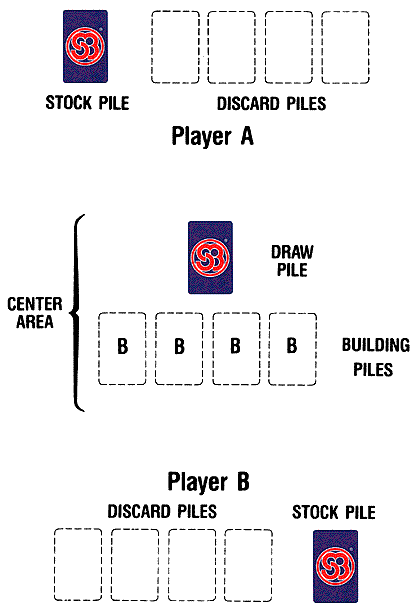

---
tags:
  - posts
id:
title: It begins
feature_image: images/it-begins/sboart72.gif
description: I was in Framingham, MA over the weekend for a little reunion with some of the boys from Rice (second year in a row). Somehow, over a game…
date: 2002-07-08
full-date: 2002-07-08T17:28:00.000-04:00
slug: it-begins
type: post
draft: false
status: done
---

I was in [Framingham, MA](https://web.archive.org/web/20030118005035/http://maps.yahoo.com/py/maps.py?BFCat=&Pyt=Tmap&newFL=Use+Address+Below&addr=&csz=framingham%2C+mass&Country=us&Get%A0Map=Get+Map) over the weekend for a little reunion with some of the boys from Rice (second year in a row). Somehow, over a game of [Skip-bo](https://web.archive.org/web/20030118005035/http://directory.google.com/Top/Games/Card_Games/Special_Decks/Skip-Bo/), the topic of web logs came up.

We talked a little bit about what they were and what they represented (ex. democratizing the medium, etc.).

The big question in my mind was, "Just how honest and forthcoming can I be in a public forum?" I've already noticed that the web logs that I read are somewhat unrevealing. These are not journals that are kept locked away in a desk drawer.

With a few exceptions, the "journals" end up being a listing of interesting nuggets found while surfing the internet, reading books, or watching television.

Sometimes, you'll read about a major change in someones life (getting married, a layoff, etc.), but most of the time people write about ordinary things: something their friends said the night before, vacation notes, or what they had for breakfast.

Nevertheless, this is still extremely compelling and is enough to get me to check back constantly.

I would argue that it is actually very difficult to conciously and continually write compelling and creative pieces every single hour of every single day. You get a gem here and there, but all-in-all, most of it will turn out to be junk.

Regardless, this throw-away writing reveals much about a person's personality and ideas.

So I resolved to my friends that I would try an experiment- I'll put up a web log and see what I learn from first-hand experience.

This is a pretty good time to do it, I think. Having recently had a dramatic switch in careers, I'm an explorer in unchartered territory. I recently entered the non-profit sector after working as a software engineer. I'd love to share my experiences during this change.

I am also finally working on realizing some major art and technology projects which has led me to meet some interesting people and make some curious discoveries.

My parents have recently decided to build a new house in Austin. At the end of July, I'll be moving into the new house with two of my brothers.

Hopefully these sorts of transitions will provide some fodder for the experiment.

Well, let's see how long this lasts.
