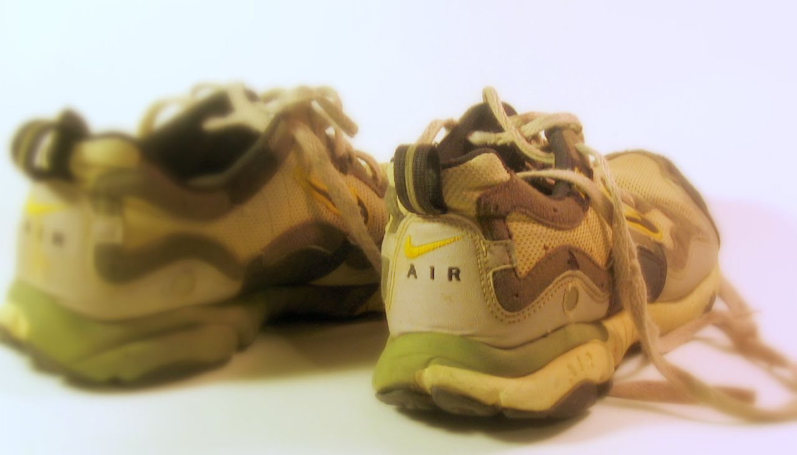
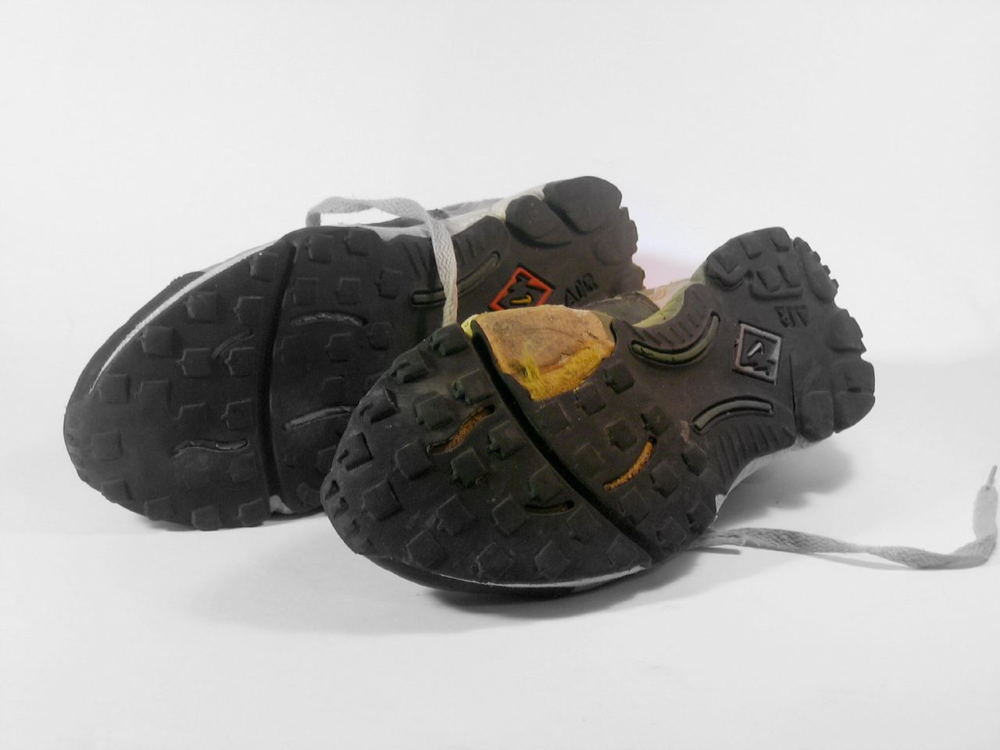
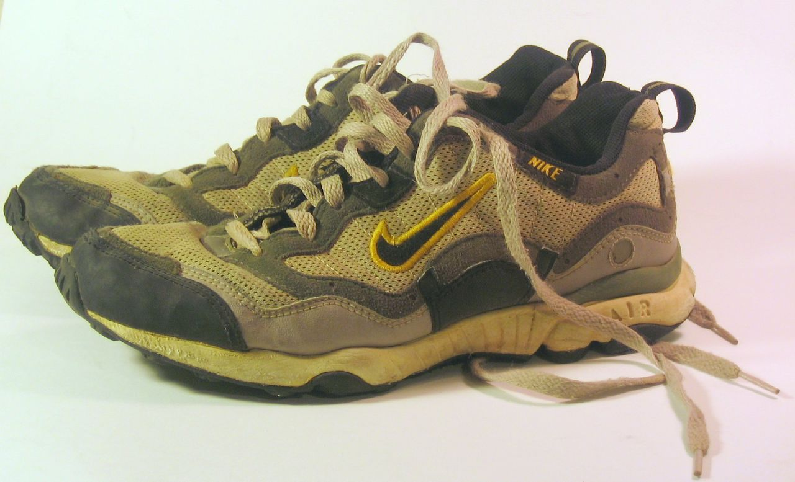

---
tags:
  - posts
id:
title: "Objects of My Life: Marathon Shoes"
feature_image:
description: I ran and completed the Houston marathon a few years back in a little over 5.5 hours. It was barely too slow to count as an “official”…
date: 2005-10-03
full-date: 2005-10-03T10:53:57.000Z
slug: objects-of-my-life-marathon-shoes
type: post
draft: false
status: done
---

I ran and completed the Houston marathon a few years back in a little over 5.5 hours. It was barely too slow to count as an “official” finish, but the blisters and delerium I felt were my proof.

I spent many an early Sunday morning training, while all my friends were sleeping, jogging around the Montrose neighborhood, down to Memorial park and back… building up my mileage, one unqualified step at a time. Those were wonderful “me” times.

Wendy, Alex, and Mike all woke up with me that early Sunday morning to cheer me on. They were at the corner of Brown, my residential college as I passed by, cocky.

They were guiltily standing by with McDonald’s that I didn’t even notice as I lagged behind the main pack down Memorial Drive, my bravado having been beaten out of me by that unrelenting course.

That’s when Alex Bain joined me to run through the final six, horrific miles. He told me I was talking to myself, spitting, and crying.

I barely remember any of that… I had no business out there. I realized this as the woman pulling along a respirator passed by.

However, I do remember the euphoria of rounding the corner and the sudden burst of sprinting energy. Then I knew… somehow… somehow I did it. And I did belong out there with my arms raised high.

It’s like being completely dead and alive at the exact same time.

I bought these shoes the summer before and used them through all my training and during the marathon itself.

