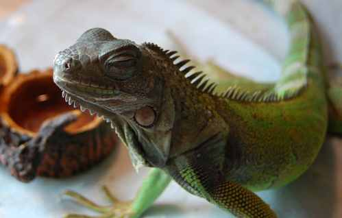

---
tags:
  - posts
id: 65ac4ceb0e7c79000119ac0c
title: Iggy Loves his Bio-Mist
feature_image:
description: This is my iguana (about 10″ Snout to Vent, so about 2 years old) after he was spritzed with Bio-Mist, an aloe vera and cactus juice…
date: 2007-03-28
full-date: 2007-03-28T06:16:24.000Z
slug: iggy-loves-his-bio-mist
type: post
draft: true
status:
---

This is my iguana (about 10″ Snout to Vent, so about 2 years old) after he was spritzed with Bio-Mist, an aloe vera and cactus juice concoction that helps his skin. He’s molting now, so this is a look of pure joy.

Sometimes I wish I was an iguana.
