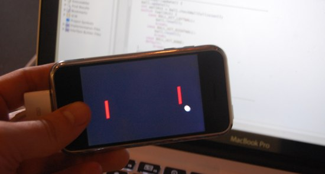

---
tags:
  - posts
id: 65ac4ceb0e7c79000119abeb
title: art&code workshop on OF and iPhone
feature_image:
description: I’m currently in Pittsburgh at the Art&Code Mobile event.
date: 2009-11-06
full-date: 2009-11-06T18:05:30.000Z
slug: artandcode-workshop-on-of-and-iphone/
type: post
draft: false
---

I’m currently in Pittsburgh at the [Art&Code Mobile](artandcode.ning.com/) event.

We arrived last night and came straight from the airport to attend the [Rossum’s](http://www.cs.cmu.edu/~garthz/Rossum's/) meetup. The group is an Art and Robotics collective that meet regularly to host speakers, collaborate on projects, and promote their work.

This morning, I particpated in the [OpenFrameworks](http://www.openframeworks.cc) and iPhone workshop taught by [memo akten](http://www.memo.tv/) and [Zach Gage](http://www.stfj.net/)

The project we were working on was, essentially, pong for the iPhone. It was a great starter project for those that needed an intro to OF because it exposed the basic structure of an OF program (memo and zach did a great, patient job of going through the IDE and the file placement idiosyncrasies of OF). The class proved that OF can be quite cross-platform right out of the box. There are some obvious exceptions (ex. multitouch isn’t available on all platforms). These unique features are handled as addons to the basic OF project.

As expected, the most difficult part of getting an iPhone OF project to work is the whole provisioning / signing process. Luckily, I’ve done quite a bit of iPhone work before, so this was somewhat smooth for me (once I made sure that the correct SDK was selected in XCode — that messed me up a bit).

I didn’t realize that iPhone OF creates ‘legitimate’ iPhone apps that are acceptable for app store submission (and sale). What’s especially exciting about working with something like OF for iPhone is that the platform encourages building art / toy / pretty apps… so the scope of interestingly designed applications that can be offered is small enough that you could iterate through many experiments with ease. That being said, in my experience, since OF can also be essentially use any library that compiles (c++ or objective-c on OS X), you can use it as a framework for more complex applications.

Tonight, I’m spending evening at [HackPGH](http://www.hackpittsburgh.org) – very cool do-oriented space. somebody’s soldering near me, somebody’s crocheting. I’ll be trying to build an iPhone toy using OF.

Special thanks to [Matt Mets](http://www.cibomahto.com/) for letting me couch surf at his apartment this weekend.

Good times.
