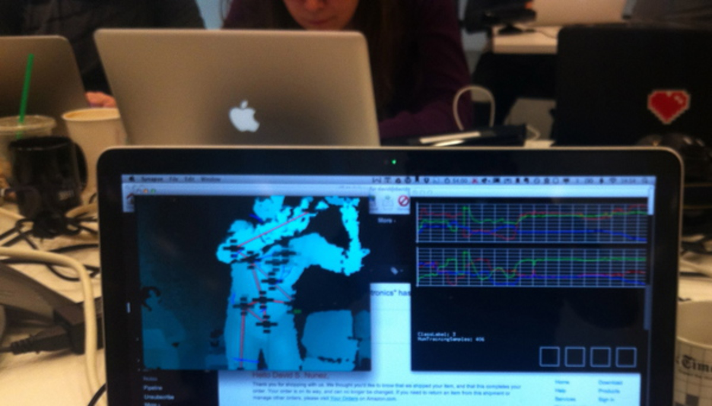

---
tags:
  - posts
id: 65ac4ceb0e7c79000119abdf
title: Week Notes 1825 - First week at MIT
feature_image:
description: I’m reviving a practice of writing weekly summaries called Weeknotes, inspired by Berg’s weeknotes. A friend sends out daily messages he…
date: 2012-09-09
full-date: 2012-09-09T12:50:00.000Z
slug: week-notes-1825-first-week-at-mit
type: post
draft: false
---

_I’m reviving a practice of writing weekly summaries called Weeknotes, inspired by [Berg’s weeknotes](http://berglondon.com/blog/tag/weeknotes/). A [friend](https://twitter.com/aresnick) sends out daily messages he calls “wilts” (short for “what I learned today”); he uses those posts to share what’s on his mind or to present interesting problems or ideas. I’m hoping my weeknotes posts function like “wi\*w”… what I wondered/tinkered/learned/built/shared every week._

To say this past week was a blur is an understatement.

There were a few welcome events, including an Architecture school reception (the media lab is in the architecture school, but while there are a few legit architects running around, we come from all sorts of disciplines). 

My group took me and the other new student out for BBQ and mexican martinis; it’s nice to finally get to be “part of the family” rather than the hired plumber.

Still knocking out administrivia — paperwork, gym card activations, medical forms, etc. Almost done with that stuff. It’s striking how a place like MIT still makes me wander around campus with physical forms to deliver. Hoops to jump through, I guess.

It’s taking a bit of adjustment to get used to “false hurriedness” of academia. Everything feels fast, but when I take a step back, I’m realizing how luxuriously slow this environment actually is compared to the real world. (famous last words)

The Media Lab is a bit of a strange place, though. There’s more of a maker culture here where innovation through building project-based results is incentivized. “Demo or Die” and “We Did it Here First” syndrome runs rampant. So get it done, first, then get it right, maybe later. I think it fits my temperament, actually. I’d rather make stuff than talk about making stuff. I’ll need to learn to love both, though, and to do both at a caliber I’ve never experienced to thrive here.

I sat in a “High Graduate” level class at MIT CSAIL (a computer science / math class around folding algorithms (ex. origami or robot linkages)). I had some _de ja vous_ moments as it brought me right back to some of my more geekier days as an undergrad. I tweeted, “MIT CS/Math class reminded me of maladjusted classmates from undergrad. nerd universality is both comforting & terrific in its horror #metoo”

On the other end of the spectrum, I also sat in an undergraduate class in the Brain and Cognitive science department (“Course 9” in MIT-speak). I felt **really** old. I’ll have to be very choosy on which lectures to hear and I don’t intend to do any the busy work designed to help undergrads learn to read, write, and talk. It’s MIT, after all… attracts a special breed of student.

I should say, classes aren’t a “thing” at the Media Lab. In fact the academic folks explicitly say that 50% of our time is on classes, 50% of our time should be spent on research and projects for our groups. We’re only required to take 5 classes over two years, and the Media Lab classes are notoriously less about rigorous problem sets and lectures as they are about innovative projects and discussions. Do the work, actively engage with the material, explore deeply, think big and outside the box, and you’ll be fine. Presumably, I should be taking classes that vigorously enchant my brain vs. classes that I “have” to take to fill requirements.

So for this semester, I’m taking my advisor’s Human/Robot Interaction class and have signed up for Hiroshi Ishii’s ([Tangible Interfaces](http://tangible.media.mit.edu/)) class. I’m auditing (or “listening” in MIT-speak) to a class on Infant and Early Childhood cognition, the aforementioned Origami algorithms class, and, hopefully, a class on data-based projects (ex. stats, visualizations, etc) taught by a powerhouse of 4 professors at the Media Lab who specialize in big data analysis and storytelling.

I’m also sitting in on a special class that promises to refresh some basic making skills (ex. electronics & fabrication) — some stuff I’ve touched before (like arduinos and sensors and servos), but a lot of topics will be brand new (almost all of the fab stuff). My motivation here is to get my hands dirty with physical projects in a structured environment among other learners — mostly just to get those rusty gears turning.

So what I just described is a too heavy load, actually. The expectation is that I’ll start dropping classes as the workload increases. MIT has a liberal drop deadline which lets me get through most of a class before needing to drop it.

I feel rather fortunate, actually, that I’m already trying to figure out ways to connect my robot group work with class work. Helps to kill multiple birds w/ the same big stones.

The risk right now is to get too “locked into” a particular thread of work while missing the opportunity to broaden my perspective. I’ve been warned again and again by more senior students to make sure I’m getting what **I** need out of this rather than just getting caught up in a torrent of work that may be pushing me in directions that don’t lead where I want.

It’s been fun reading some of the HRI papers. I’m realizing just how much fun this area will be for me and am excited by how I managed to stumble into an exciting field where I might actually stand a chance of helping make an impact.

### Wondering

* What are the best tools for academic info workflow? How are the requirements different from what I needed when I was working in industry?
* What’s going to be the best note taking / digesting mode for me?
* What are the open questions in social robotics?
* What work has been done with multiple robots interacting with multiple humans in a learning environment?

### Tinkering

* Attended a Machine Learning and Gesture recognition workshop this past saturday. The [toolkit](http://www.nickgillian.com/wiki/pmwiki.php?n=GRT.GestureRecognitionToolkit) is amazing. Using just a few training examples, the system can pretty reasonably recognize gestures from sensors / kinects. This runs counter to a lot of typical machine learning examples which require **many** training examples to get reasonable results.
* Have been playing around with my automated logging for quantified self… I’m running into some data collection friction. I’ve played with [Folding Text](http://www.foldingtext.com/) as a running log app w/ timers. It works reasonably well, but requires me to type things like “ate breakfast for 30 minutes” and presents times in a way that make it hard to do the reverse math on time entries. I really want to finish my nagger app that reminds me to collect data (like photos of food I eat).
* For note taking, I’m using tools like [NVAlt](http://brettterpstra.com/project/nvalt/), [dropbox](http://www.dropbox.com), [DevonThink](http://www.devontechnologies.com/products/devonthink/overview.html), and [git](http://git-scm.com/) to organize my jots and thoughts, but I’m very quickly wanting to break the mold of “big block of text” editors for note taking and writing. I’ve been tinkering with some [live coding](http://www.pawfal.org/fluxus/) tools and I’m inspired enough to want to build a more dynamic text collection tool (For me, the act of note taking / data collecting / analyzing is very close to the act of code composition ad performance).

### Building

* Working on a prototype system of apps that help measure and map the models of semantic relationships in early child development.
* Preparing to deploy a collection of tablets to rural schools in Georgia filled w/ learning apps and data collection systems — this is an extension of the work I was doing for Cynthia for OLPC
* I may or may not be clearing off final client’s todos. (Technically, I haven’t signed the IP agreement w/ MIT, but I am not allowed to work on client projects while a student at the Media Lab.)

### Learning

* Rapidly trying to digest, in broad strokes, the field of social robotics. Right now, just reading survey papers & my advisors papers and book to start building primer vocabulary. Social robots pulls from a diverse set of disciplines — robotics (obviously), but also sociology, animation, AI, etc. The reality is that this field is so young that it’s all pretty accessible and there are lots of hooks into the work no matter from which direction you want to attack the material. Indeed, it’s likely I’ll meet most of the important figures/luminaries in my career here (not the least of which, of course, is my advisor) since they are both alive and tightly interconnected.
* What we do in PRG is not “normal” robotics. We’re either far ahead or far behind roboticists from other departments who are concerned w/ robotics as a precise science or engineering — adding humans and social dynamics to the equation makes our problems necessarily “fuzzier.”
* Taking an origami / folding algorithms class for fun. Learning about topology proofs. Not clear, yet, whether I’ll be able to hang onto this class as the math will rapidly get pretty dense; nonetheless, ideas of paperbotics and book robots are in the back of my head.
