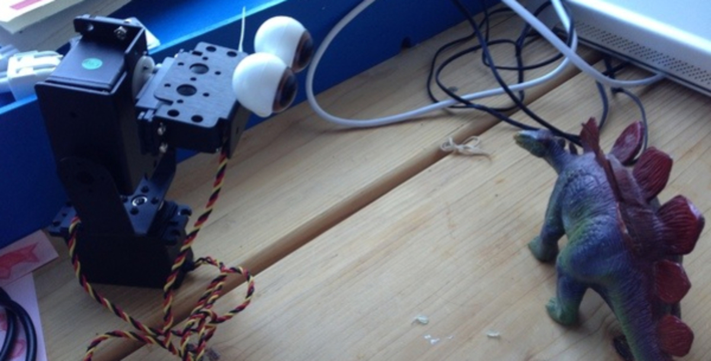

---
tags:
  - posts
id: 65ac4ceb0e7c79000119abd9
title: Week Notes 1831-1835 - Major Projects LEGO & Silos
feature_image:
description: Trying to catch up on a month of very intense activity is a really daunting task. I have a (small) breather before Thanksgiving, so figured…
date: 2012-11-15
full-date: 2012-11-16T03:56:00.000Z
slug: week-notes-1831-1835-major-projects-lego-silos
type: post
draft: true
---

Trying to catch up on a month of very intense activity is a really daunting task. I have a (small) breather before Thanksgiving, so figured it’d be good to squeeze this out before the **real** end-of-semester crunch begins. I’ve been keeping pretty detailed time logs, though, showing what’s been going on every day (indeed, every minute) these past months; these are coming in handy as I reflect.

So here we go. An attempt to recap and summarize briefly the last month or so.

### Silos

When I first got here, I met a lot of very fascinating and smart people, also new students at the Media Lab. Now, it’s nice to run into these people in the hallways or by the coffee machines and exchange small talk about “how are things going.”

It’s also very clear that people are getting pulled into their respective groups and research deeper and deeper as the semester rolls on. People are busy with research projects and class deadlines. This is bittersweet. I’m confident that the talented people that joined the lab alongside me are all going to create some amazing work in the next couple of years, and I’m thrilled to see what we all make, but it also is a bit sad to realize that I’m seeing these people with ever increasing rarity.

https://i1.wp.com/davidnunezdev.wpengine.com/content/images/wordpress/2012/11/mit_cohort_2012.jpg

Classes are a way to mitigate this. I see friends in classes and work with them on projects… as a weekly touchpoint or so, that’s quite nice. We also are starting to hold “Fight the Silo” gatherings (I’ll gladly take credit for coining “fight the silo”) — dinners and drinks and gatherings for the sole purpose of maintaining connections.

Maybe this isn’t a particularly warm thing for me to say, but there’s also a part of me that’s realizing as nice as it is to make friends, it’s equally or more important to be cranking out some career/life-defining work Right Now; as a wise friend told me in email, “This is the mark you make now, so why have any doubts that you  
left any fuel in the tank?”

My goal and challenge would be to create the world-changing work **and** to build relationships with some longer term collaborators / friends along the way. I think it can be done.

### Pearson Visit & Media Lab Member Meeting

Uniquely, the Media Lab derives a significant portion of its budget from sponsor companies (i.e. “members”). Part of the job of the administration is to engage in, effectively, business development to court new sponsors and keep the current consortium happy.

So every semester, member companies of the Media Lab send representatives to get tours, show and tell, and direct access to faculty and, importantly, research assistants/students working on projects. It’s a two-way street; ideally members get inspired by early peeks at the amazing stuff being invented here, and students get to validate their ideas with the real world. (On a pragmatic level, member companies also get dibs on licensing of technology from the lab… so there is a risk that companies use MIT as an R&D arm, but this is explicitly discouraged… businesses do not set our research agendas… technically).

I got to see this first hand as Pearson held an event / conference at the lab for their teams. Publishing, e-books, apps, and education are right up my alley and related to a significant chunk of my work, so it was good to mingle with the Pearson folks and talk about robots and the Ethiopia project.

There is a bit of a tradition for students to cram pretty intensely in the run up to sponsor events – a lot of peer pressure to show new inventions and progress – demo or die – to sponsors. Groups want to one-up each other with amazing new demos.

The robot group, actually, didn’t really fully engage in that cram session – many of the researchers were working on a separate large project the week or so ahead of the sponsor event and the entire thing seemed a bit downplayed. This was by design, apparently. The lab director wanted to demphasize this event (or rather, constrain it to a more intense session in the spring).

On the one hand, I understand and appreciate this approach – as a new student, I didn’t really have any pressure on my to generate something out of the blue, but this was also disappointing as I **wanted** the experience of inventing under pressure. So I took it upon myself to build something new, BracketBot (actual name TBD).

https://i1.wp.com/davidnunezdev.wpengine.com/content/images/wordpress/2012/11/IMG_1020.jpg

It’s an absurdly simple robot that interacts directly with learning games played on a tablet computer (using its gaze and motion to indicate attention and engagement) – it is a prototype of using a game engine to drive robots – I see some value here because game engines offer sophisticated realtime animation blending that many robot systems do not really support, yet.

Sadly, only a few people came through our lab and, in my opinion, the event was a let down. There was quite a nice dinner and commiserating session at a bar after the event, so not all was lost.

### NERC

MIT hosted a robotics conference. I heard a few of the luminaries from traditional robotics speak, including Rodney Brooks introducing the amazing Baxter robot. I walked away from that day fully understanding just how weird my group is compared to other robot labs. They are interested in mechanics, planning, and AI to build efficient and “smart” robots, but they (usually) ignore how robots make people **feel**. Humans get in the way of their studies. Our studies are **all about** the humans.

### Tangible Interfaces Project

I worked on a group project in the tangible interfaces class. It was quite fun collaborating with these folks, but I think we all found the process a little frustrating. First, we had a very difficult time trying to get our project idea set in stone; indeed, I think this showed in our final presentation as our ideas were a little broad and unfocused. One team member, Christian Ervin, who joined us from the Harvard Graduate School of Design went above and beyond to edit and produce UI elements in our demo video.

I was also really desperate to _make_ something, so I focused a lot of my energy around our shared spoons

https://i1.wp.com/davidnunezdev.wpengine.com/content/images/wordpress/2012/11/IMG_1049.jpg

We created a working prototype, Shared Spoons, to explore what it means to embed knowledge in the tools we use. We instrumented two wooden spoons with 6 degree of freedom accelerometer / gyroscope IMUs. This allowed us to determine the orientation of the spoons in 3D space. The spoons were connected to a 3D rendering package that provided visual feedback showing spoon orientation. As a master chef moves the spoon around, sensor data can be recorded so that the gesture of “whisk” can be differentiated from “stir,” for example. As master chefs stir many, many spoons, a knowledge repository of physical interactions with tools is collaboratively generated. The spoons can be used synchronously, as well. We demonstrated a scenario where a master chef stirs one of the Shared Spoons while the apprentice stirs the other spoon. As the apprentice “matches” the velocity and orientation of the master’s spoon, the software generates a pleasant tone; when the spoons are not in harmony, a discordant tone sounds.

### Ethiopia Literacy Tablets

So there was [this article](http://www.technologyreview.com/news/506466/given-tablets-but-no-teachers-ethiopian-children-teach-themselves/) about a project I’ve been involved in for the past 2 years or so.

I read online a lot of hyperbolic optimism and equally fervent pushback about this presentation of the work.

I’m going to have a lot more to say about this, but I’m still looking at data and will be leaning on some coaching on how to address potential fallout when we take a closer look.

In the meantime, I found [this post and the related comment stream](http://bengrey.com/blog/2012/10/we-need-to-think-very-very-seriously-about-this/) pretty thoughtful.

### LEGO

https://i2.wp.com/davidnunezdev.wpengine.com/content/images/wordpress/2015/02/IMG_1105.jpg

I participated in a workshop at LEGO HQ Denmark last week. The event was mostly an internal brainstorming / innovation session where external partners are brought in to provide perspective. The topic revolved around physical toys interfacing with mobile devices. I brought along bracketbot as a demo and used the sequestered time to give him a few more powers; now he can track touches on a tablet (that is not physically connected to anything). Importantly, I also built a “LookAtWithArc” algorithm that makes sure every time he looks at a different spot, he moves in an organic **swoop** rather than a straight line.  

https://i2.wp.com/davidnunezdev.wpengine.com/content/images/wordpress/2012/11/IMG_1131.jpg

I also built a very simple interaction scenario: BracketBot loves playing ‘follow the finger’ on a tablet; when a user stops playing, the robot looks up, pathetically, at the user to imply, “Why are you stopping?!” If the user doesn’t reengage, then the robot starts looking around for more interested players.

I got a factory tour of the LEGOs and was impressed with how reconfigurable their process is to crank out such a diverse collection of projects… sort of “meta LEGO” I really wish I was allowed to take photos in the factory because the image of hundreds of minifigs getting their faces painted on in a robot assembly line will forever be embedded in my memory. Sometime in 2013, there will be more LEGO minifigs than human beings in existence.

Billund is a pretty dull town, otherwise, so while in Denmark, I managed to sneak away and visit [Århus](http://en.wikipedia.org/wiki/Aarhus). The drive was beautiful and I’m really glad for iPhone’s turn-by-turn directions; people were friendly and the food was good — I was overall exhausted and still feel worn out by a too short trip.

https://davidnunezdev.wpengine.com/2012/11/16/week-notes-1831-1835-major-projects-lego-silos/img_1090-2/
https://davidnunezdev.wpengine.com/2012/11/16/week-notes-1831-1835-major-projects-lego-silos/img_1108-2/
https://davidnunezdev.wpengine.com/2012/11/16/week-notes-1831-1835-major-projects-lego-silos/img_1116-2/
https://davidnunezdev.wpengine.com/2012/11/16/week-notes-1831-1835-major-projects-lego-silos/img_1136-2/
https://davidnunezdev.wpengine.com/2012/11/16/week-notes-1831-1835-major-projects-lego-silos/img_1143-2/
