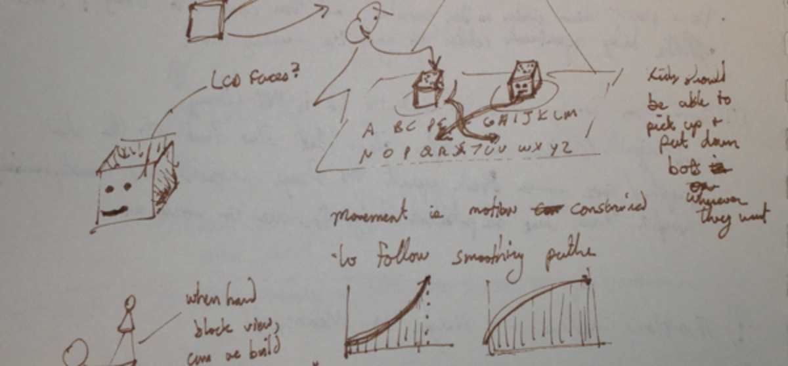

---
tags:
  - posts
id: 65ac4ceb0e7c79000119abd8
title: Week Notes 1836 - Crit Day & Thanksgiving Lull
feature_image:
description: Last Monday, the second year masters students at the media lab all gave short presentations about their thesis projects. It’s an…
date: 2012-11-27
full-date: 2012-11-27T07:32:00.000Z
slug: week-notes-1836-crit-day-thanksgiving-lull
type: post
draft: false
status:
---

Last Monday, the second year masters students at the media lab all gave short presentations about their thesis projects. It’s an opportunity for them to formally propose their research ideas to the entire lab community – faculty, fellow students, etc – to generate critique and feedback.

I [tweeted](https://twitter.com/davidnunez/status/270564516893425664):

> crit day @medialab watching 2nd yr masters students present their awesome work. intimidating, but inspiring that I have a year to get there!

It was, indeed, really amazing to see the diversity of work that people do at a place like this lab. I was also struck by the variety of approaches, rigor, and depth of research people were presented. I walked away feeling like I have a long way to go, but I also had the thought that I could easily see myself making a presentation.

The challenge, really, for the next semester / summer is to start narrowing down my topic area into something of a focus. It’s going to have something to do with robots — probably kids & education, as well.

I’m going with the strategy that I will pick a thesis topic that really fires me up, but that I will also crank out lower entropy, side projects with a lot less pressure (but maybe more risk) on a more frequent basis to shore up places where I’d like to improve my skillsets + to satisfy whatever shiny bobble seems interesting at the moment.

During crit day, I closed my laptop and pulled out my big 9×12″ sketchbook. I use the bigger notebook as a place to do a lot of brainstorming — something about those large, open pages makes me feel quite a bit free to explore broadly. The crit day presentations, coming in and out of focus for me, provided great Big Thinking ambient background noise. I filled up quite a number of pages with some new ideas to explore during side voyages or even as feeders to a more coherent thesis topic.

Over the thanksgiving day weekend, I took the time to disconnect a bit and really relax. It was the lull before the storm; the next few weeks are going to be ridiculously intense…

Yesterday, I met with my advisor to talk about research and projects and that conversation prompted me to pull out [OmniPlan](http://www.omnigroup.com/products/omniplan/) and actually make my life into a Gantt chart for the next month. There are class projects to complete, but also core research milestones to hit before the end of the year. There’s a nice 6-week or so break before classes begin in the Spring — people tend to use this time to take informally offered courses on esoteric topics and/or to use the time to focus on really tangential side projects. Believe me, I have quite a few on the list.

What this really points to is that my time at MIT is going to fly back really fast. Part of me feels like I’m really squandering the opportunity by not cranking out much more work; the realistic part of me takes one look at the past few months and realizes that not only have I already participated in some amazing projects, but I’ve also set myself up really well for the upcoming year.
