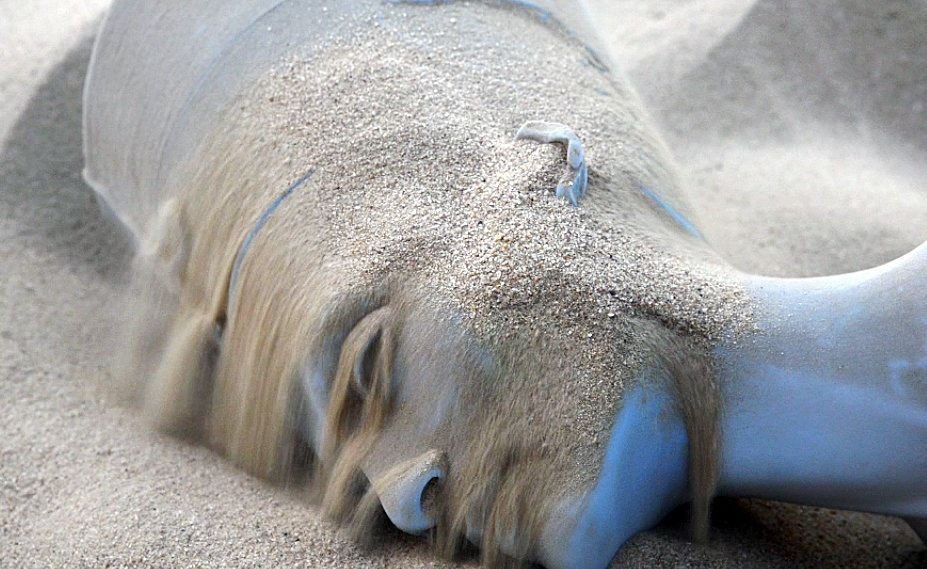

---
tags:
  - posts
id:
title: The Bizarre Story of Nefertiti, Copyrights & 3D cultural data
feature_image:
description: "I've been following with keen interest this story re: 3D scans of an Egyptian bust at the Neues Museum in Berlin."
date: 2019-11-22
full-date: 2019-11-22T13:58:10.000-05:00
slug: the-bizarre-story-of-nefertiti-copyrights-and-3d-cultural-data
type: post
status: done
draft: false
---

I've been following with keen interest this story re: 3D scans of an Egyptian bust at the Neues Museum in Berlin.

In 2016 [two artists seemingly smuggled a scanning rig into the museum](https://www.nytimes.com/2016/03/02/arts/design/other-nefertiti-3d-printer.html?ref=davidnunez.com), took a 3D digital image of the bust, and then sent 3D printed replicas back to Egypt as a provocation about repatriation of artifacts.

Experts began to question the veracity of the artists' claim of undercover scanning because the 3D model was too high a quality and would have required "prolonged access" to the artifact. **It was probably the museum, itself, that created this model.**

> "In other words, this wasn’t a heist. This was a leak." - Michael Weinberg, [The Nefertiti Bust Meets the 21st Century](https://slate.com/technology/2019/11/nefertiti-bust-neues-museum-3d-printing.html?ref=davidnunez.com), Slate.com)

This week, another artist, [Cosmo Wenman](https://twitter.com/CosmoWenman?ref=davidnunez.com), after a prolonged legal battle with the (state-owned) museum, obtained a copy of the 3D model from the museum so that he could release it publicly.

The museum did release the data with a major modification: they added copyright information to the model, itself.

This is problematic because not only are they altering this cultural data, but it's also not actually clear who (if anyone) has the right to assert copyright in this case.

For what it's worth... In [our museum](https://mitmuseum.mit.edu/?ref=davidnunez.com), we claim copyright over things like: images we take of our artifacts, the metadata we write about these objects, and content, like wall text, we put in the galleries. It is probably true that we would own 3D data from artifacts we scan.

We also often alter some of the images we make of artifacts (ex. by placing watermarks on them).

This entire episode raises extremely complicated issues re: ownership and open access for digital museum collections. These are issues we will start to run into as we begin to ramp up a program around 3D scans of objects and other born-digital artifacts.

Lots of interesting conversations in the days ahead.

* * *

_(cover image: still from the artists’ video, “The Other Nefertiti.” -_ [_Jan Nikolai Nelles_](https://www.alloversky.com/?ref=davidnunez.com)_)_
