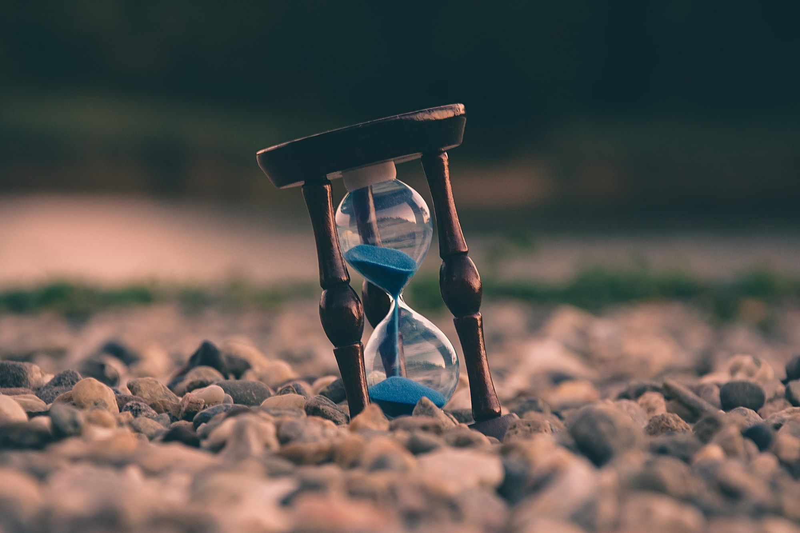

---
tags:
  - posts
id: 65ac4ceb0e7c79000119abb0
title: "Weeknotes #2228 - What is time anymore?"
feature_image:
description: So let's get this part out of the way.
date: 2020-06-05
full-date: 2020-06-05T17:38:38.000-04:00
slug: weeknotes-2228-what-is-time-anymore
type: post
---

So let's get this part out of the way.

I am drafting these weeknotes on a Friday afternoon of what feels like a lost week in what is turning out to be a lost year. Anyone reading this in June of 2020 will completely understand why.

Time seems more fungible lately. I'm simultaneously experiencing dilation and compression of this notion of a "week." I blink, and it's Friday; I get up from a long session at my desk, wondering how it could still be Tuesday morning in June and not December 2021 already.

This week, a colleague told me that she had a numb feeling of floating. When she said it, I immediately understood this exact hovering sensation I'm finding impossible to ignore. I'm in a slow-motion freefall in a bottomless pit.

So this might be the worst moment to be kickstarting anything new.

**Unless,** of course, it's a perfect time.

I've been helicoptering over this intention to write weeknotes, revitalize my website with essays, maybe a newsletter... just making something besides quarantine-bread and anxiety.

I've been here before.

Hours (or weeks? or seconds?) of thinking and researching and reading and notetaking and consuming and studying and envying other peoples' making...

...then the snapping: A loud proclamation to nobody in particular that, "Enough! It's my turn. This is the time. **This time** I will get in the practice of making things, and I will stick to it!"

Then writing for a few days or maybe weeks.

Then not, and I'm not sure why.

Repeat.

**This** time, though. This raging rapid molasses time, it **feels** different. We are in a pandemic, after all, so nothing feels like quite before.

There's been an itch. I'm scratching.

Writing as salve.

Writing as [zeitgeber](https://en.wikipedia.org/wiki/Zeitgeber?ref=davidnunez.com).

* * *

On to the weeknotes:

* We're building a new museum and, at least on paper, are sticking to an aggressive timeline of opening in the Spring of 2022. This means our exhibition development process is charging ahead. We had some fascinating conversations with the designers about Artificial Intelligence nuances (and our museum's role in that storytelling). There's an idea we're floating re: embodied computation that's ticking all the right boxes for me. Not sure it's going to survive in the most interesting way. I'll keep fighting for it.
* I've been working on a software project and essay about some of the inhumane interfaces we're experiencing en masse right now (i.e. low bandwidth human communication through video chats). I have a mostly working prototype but it slows down my machine during actual Zoom calls, so I'm going to set it up on a separate device and pipe it to my main computer.
* Had a lovely conversation with [Ed Rodley](https://thinkingaboutmuseums.com/?ref=davidnunez.com) about potential new models for New England museum collaboration. Rethinking some strategic survival maneuvers seems especially essential these days.
* Our museum has been collaborating with [Micah Walter Studios](https://micahwalter.studio/?ref=davidnunez.com) on a rebuild of our Collections API on top of their system, Accession. I was able to use their prototype to very quickly and easily build a pipe from our collections database into an Airtable table that the exhibitions team uses to communicate object lists to our vendors. Our collections database remains the source of truth for core object metadata, but we can still augment it with exhibition-specific notes with more user-friendly and collaborative tools. Big Win.
* I met with my director, and he reminded me of a couple of dropped balls with some external teams we had been developing through the last few months. Picking those back up and blaming COVID. Always blame COVID.
* Closed up travel expense paperwork for two canceled trips to two conferences I'm super sad couldn't happen: [MuseWeb](https://www.museweb.net/?ref=davidnunez.com) and [eyeo](http://eyeofestival.com/?ref=davidnunez.com)
* Spent many hours in deep dives on tactics behind newsletters, blog posts, etc.
* We're getting our roof redone. Footsteps overhead.
* My favorite tweets of the week:

> I was just about to tweet something on my phone and had to pause because I saw the prompt and honestly.... I don’t even know anymore. [pic.twitter.com/x3UhcodoiY](https://t.co/x3UhcodoiY?ref=davidnunez.com)
>
> — David Nuñez (@davidnunez) [June 2, 2020](https://twitter.com/davidnunez/status/1267876981384916994?ref_src=twsrc%5Etfw&ref=davidnunez.com)

> Invented a nice hack today to help me introduce a layer of focus in my current intention management tool ([#omnifocus](https://twitter.com/hashtag/omnifocus?src=hash&ref_src=twsrc%5Etfw&ref=davidnunez.com)) The red dots mean "just get it done already! this week." Yellow means "2-4 weeks" I have OF perspectives for these. [#productivity](https://twitter.com/hashtag/productivity?src=hash&ref_src=twsrc%5Etfw&ref=davidnunez.com) [pic.twitter.com/kn6mzRVfqN](https://t.co/kn6mzRVfqN?ref=davidnunez.com)
>
> — David Nuñez (@davidnunez) [June 3, 2020](https://twitter.com/davidnunez/status/1268312866962255874?ref_src=twsrc%5Etfw&ref=davidnunez.com)

And of course this one that ultimately got me out of the nest:

> Does anyone out there have a view on differences between [#weeknotes](https://twitter.com/hashtag/weeknotes?src=hash&ref_src=twsrc%5Etfw&ref=davidnunez.com) as described by [@genmon](https://twitter.com/genmon?ref_src=twsrc%5Etfw&ref=davidnunez.com) vs. personal email newsletters other than the delivery mechanism? (assuming it even matters, these days) [https://t.co/cpg5epi6l7](https://t.co/cpg5epi6l7?ref=davidnunez.com)
>
> — David Nuñez (@davidnunez) [June 2, 2020](https://twitter.com/davidnunez/status/1267811306389807104?ref_src=twsrc%5Etfw&ref=davidnunez.com)

This felt good to write, for what it's worth. I'll probably spend some more making hours this weekend doing some writing or tinkering here.  (I'm noticing links in bullet points above aren't getting styled, for example.) I'd like to figure out how to crosspost these to Medium so maybe I can join the [weeknot.es](https://weeknot.es/?ref=davidnunez.com) community.

The clock has officially started. #momentum
