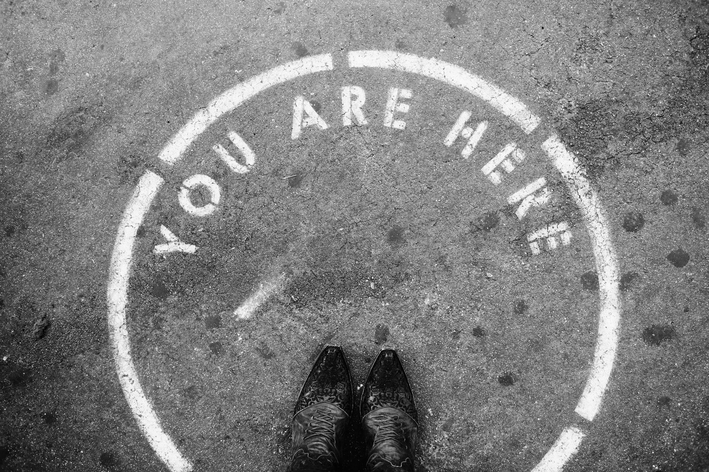

---
tags:
  - posts
id: 65ac4ceb0e7c79000119abae
title: "Weeknotes #2230 - What is here, anymore?"
feature_image:
description: Another week goes by as if it wasn't there at all. A colleague referencing time compression shared with me a humorous take -- and by…
date: 2020-06-19
full-date: 2020-06-19T17:48:32.000-04:00
slug: weeknotes-2230-what-is-here-anymore
type: post
draft: false
---

Another week goes by as if it wasn't there at all. A colleague referencing time compression shared with me a [humorous take](https://www.mcsweeneys.net/articles/heres-how-time-works-now?ref=davidnunez.com) -- and by "humorous" I mean "terrifyingly resonant."

MIT this week announced some [initial decisions](https://covid19.mit.edu/initial-decisions-about-fall-at-mit?ref=davidnunez.com) about the fall semester. I was quite surprised that they are planning for undergraduate students' return (albeit only a small number).

There are still many unknowns, of course, and influences that are beyond the campus's control. What's clear is that as "non-research staff," I'm unlikely going to be allowed to work in my office until 2021. The order of priority is quite clear.

> **1\. Research staff and faculty**, because so much of their work is lab-based. Many are returning this week, following careful protocols.  
> **2\. Graduate students,** whose research generally also depends on lab access and whose apartment-style campus housing allows for physical distancing.  
> **3\. Undergraduates,** many of whom depend on campus resources for their work.  
> **4\. Administrative and other non-research staff,** many of whom can work effectively online. To help limit the total on-site population during this critical pandemic period, staff who can do so may be asked to work remotely at least through the fall semester.

During today's staff meeting we had a conversation about the rhetorical and conceptual need for us to maintain that the museum is a laboratory.

I'm authorized (along with a few other teammates) to go in once a week to make an inspection of the museum spaces. I always take a peek in my office as part of that check. It is disturbing how empty and distant my desk there feels.

This week I had an overwhelming sense of "oh, I don't work here anymore."

**What is "here" anymore?**

This is what happened this week:

* I had legitimate, work-related conversations (in separate meetings, even) about using genetic algorithms to make artificially intelligent typefaces "[walk](https://www.youtube.com/watch?v=kQ2bqz3HPJE&ref=davidnunez.com)," [physically embodied neural nets](http://news.mit.edu/2020/thousands-artificial-brain-synapses-single-chip-0608?ref=davidnunez.com), and (somehow) [esoteric programming languages](https://esolangs.org/wiki/Main_Page?ref=davidnunez.com).
* We're starting to talk about the nuts and bolts of AV equipment in our new Museum alongside the more conceptual media interactives we're designing.
* I did some repair work on our Online Collections Portal at the museum to restore images not showing up. It's a temporary fix, but I discovered a few areas where a little bit of work will go a long way to patch it up until we relaunch with a new infrastructure.
* I discovered [Buttondown](https://buttondown.com/?ref=davidnunez.com) as a more flexible, privacy supporting email Newsletter system. It also handles markdown imports via an API and other nerdery. Along those lines, I spent a small amount of time prototyping some stuff with Vue and thinking about the sisyphean task of redoing my own site using that framework.
* I feel fortunate to be working at an institute that has publicly stated that job security was a top priority during these confusing days. Nevertheless, it's still unsettling to watch exceedingly talented colleagues across the field leaving their institutes (some voluntarily, but most involuntarily).

Favorite tweet of the week:

> Museums, by definition, are in the "long game."  
> 
> It's shocking how irredeemably short-sighted they have become in the middle of all this.
>
> — David Nuñez (@davidnunez) [June 18, 2020](https://twitter.com/davidnunez/status/1273647851613179906?ref_src=twsrc%5Etfw&ref=davidnunez.com)
