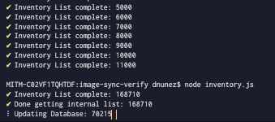

---
tags:
  - posts
id: 65ac4ceb0e7c79000119abaf
title: "Weeknotes #2231 - 27.5 Terrabytes!"
feature_image:
description: Update in Progress
date: 2020-06-26
full-date: 2020-06-26T17:40:18.000-04:00
slug: weeknotes-2231-275-terrabytes
type: post
draft: false
---


Update in Progress

Here's what happened this week:

* I had several Kendall museum meetings about digital experiences, including a deep dive into the infrastructure requirements for delivering these projects. I also sketched out a new esolang based on one of the designs the developers presented. We have some nascent ideas about the building or, at least, a primary feature of the building could somehow embed computation. I'm holding on to this as the epitome of digital+physical museums in an authentic way vs. superficial approaches.
* I met with a colleague to talk about the feasibility of monetizing online content. (tldr; focus on building the audience first or else, like this blog, the hordes will never find or care about the content).
* We had a couple of deep dives on non-traditional displays and the feasibility of building massive media walls with bubbles and soft robotics.
* Kicked off a design phase with [Micah Walter Studio](https://micahwalter.studio/?ref=davidnunez.com) to rethink how we're telling stories about our collections online. Some promising areas of exploration (no pun intended) ahead.
* I was deep in code and AWS configuration this week. I built a reporting tool that gives us some more insight into the pipeline of 210 thousand files (27.5TB) of media assets we're managing. For example, here is a list of file extensions. I'm not even sure what some of these are!

```txt
html
.1
.1ChemFeb1867
.1jpg
.3gp
.538
.ai
.aiff
.bin
.BWC2_r4_s4
.cos
.doc
.docx
.eps
.gif
.if
.iiq
.img
.indd
.jpeg
.jpg
.lst
.m4v
.MakingSkin2
.mov
.mp3
.mp4
.mpg
.mxf
.NEF
.otf
.P061tif
.pdf
.plist
.png
.psd
.rtf
.srt
.status
.t1
.ti
.tif
.tiff
.ttf
.txt
.xlsx
.zip
```

* I also learned that you could mount EBS drives for lambda functions to share. Game Changer for handling large image conversion. `#nerd`
* I'm excited to do a big batch of writing this weekend. I've spent the past few weeks collecting notes and references; I'm trying the bottom-up networked thinking approach to essay writing, and I have enough of a critical mass of research ready to start banging out "content."
