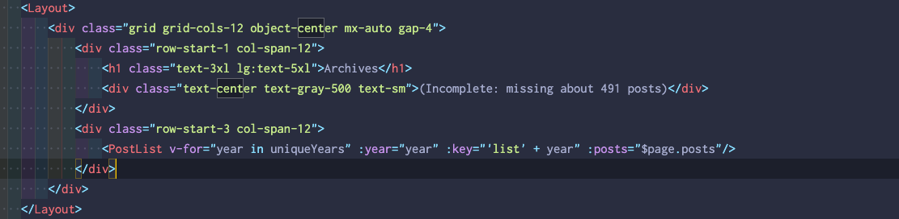

---
tags:
  - posts
id: 65ac4ceb0e7c79000119abb1
title: "Weeknotes #2233 - Marking Time"
feature_image:
description: I'm now in a meeting about our biotech exhibition we're planning for our new museum, and I'm finding myself struggling to keep up with the…
date: 2020-07-10
full-date: 2020-07-10T15:40:44.000-04:00
slug: weeknotes-2233-marking-time
type: post
draft: false
---

- I skipped last week's weeknotes because last Friday, I was on Day 2 of a long 5-day weekend to clear the head and not think too hard about work or anything else, for that matter.
- I read [Make Time](https://www.amazon.com/Make-Time-Focus-Matters-Every/dp/0525572422?ref=davidnunez.com) a couple of weekends ago. It has a smart blend of overarching strategy with a smorgasbord of tactics that you're encouraged to mix and match based on what works (or doesn't). It supports iterating and testing, which I can appreciate. I've been applying some of the tactics, myself over the past couple of weeks. For example, I installed the Freedom app on my phone that blocks internet access from 4-7 am. That tweak, alone, is getting me out of bed and starting my day much faster (no temptation to scroll through twitter as I "wake up").
- Worked a bit on our upcoming online offering related to our Polaroid exhibit that we had to shutter.
- Wrote some language to contribute to the museum's report to the University's President & gave feedback about adjusting our strategic plan to account for the current calamity.
- We kicked off the exhibition development process for a few more galleries, including one about biotech, of which I know nothing.
	> I'm now in a meeting about our biotech exhibition we're planning for our new museum, and I'm finding myself struggling to keep up with the jargon & jotting down phrases to look up later. This is where my job becomes a luxury. [`#AlwaysBeLearning`](https://twitter.com/hashtag/AlwaysBeLearning?src=hash&ref_src=twsrc%5Etfw&ref=davidnunez.com) — David Nuñez (@davidnunez) [July 8, 2020](https://twitter.com/davidnunez/status/1280920580108124161?ref_src=twsrc%5Etfw&ref=davidnunez.com)
- I spent a lot of the past long weekend working on a reboot of my personal website; the goal was to get _something_ online by the end of the break. I did that, but it's not quite "launched." I have an essay in the works about why in the world I would attempt yet another blog reboot.
