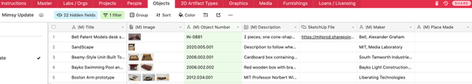

---
tags:
  - posts
id: 65ac4ceb0e7c79000119abb3
title: "Weeknotes #2234 - Smashing things together"
feature_image:
description: We're kicking off a new round of galleries for our upcoming transition to Kendall square. I'm finding myself playing catchup on some new…
date: 2020-07-17
full-date: 2020-07-17T17:24:53.000-04:00
slug: weeknotes-2234-smashing-things-together
type: post
draft: false
---


## Worlds Colliding

We're kicking off a new round of galleries for our upcoming transition to Kendall square. I'm finding myself playing catchup on some new topics but also am super excited by what we're planning in our Collections Gallery and Workshop. We're starting to delve into my interest in the soulful computing, software marginalia, and source code as cultural artifact topics I'm planning to explore quite a bit on my blog and newsletter. I'm excited to get to merge my personal passions with work in a new way as we move forward into this new phase.

## Collections Database Hacking

In lieu of any useful, fit-for-purpose exhibition planning software, we use Airtable to organize our hundreds of objects to be included in upcoming exhibitions. The exhibitions team uses Airtable to nimbly organize metadata about objects, placement in the galleries, etc.

We've had issues in the past trying to support the needs of the exhibition development process while maintaining the "source of truth" about objects in our collection. Conceptually, the collections database gets maintained by the collections team and holds what we "know" about an object.

However, the exhibitions team moves at a different pace during the development of a show, and they often collect a different set of information than is necessary for collections purposes (ex. logistical information used in the production of an exhibition).

Issues occur when the exhibition Airtable bases would diverge from our collections database. We'd have to do a time-consuming reconciliation at the end of the exhibition to determine what is the current set of "truth." This was often happening when everyone is already moving on to the next project and the knowledge rapidly degrades. Furthermore, sometimes we'd want exhibition data to make its way back into our database, and that loop doesn't usually get closed.

For our Kendall square project, we have quite a number of galleries to fill, so this data synchronization problem compounds pretty quickly.

Recently, we have our collections database mirrored in [Accession](https://accession.io/?ref=davidnunez.com), which exports a GraphQL database. So, I can run a query and get back details of any object.

```json
query {
        objects(ID_NUMBER_fuzzy:"${objectId}") {
          category,
          title,
          description,
          maker,
          date_made,
          credit_line,
          condition,
          category,
          collection,
          ID_NUMBER,
          ITEM_NAME,
          PLACE_MADE,
          MEASUREMENTS,
          LEGAL_STATUS,
          MATERIALS,
          FLAG5,
          ITEM_COUNT,
          WHOLE_PART,
          NOTE,
          media {
            larger_file
          }
        }
      }
```

I use the Object ID (an internal number we use for objects in our collection) as the common identifier that both the Airtable base and our collections database will use to refer to an object.

So, we proceed:

1. Our exhibition team created a series of Airtable bases, including the Object numbers. They have identified columns where the data should flow from our Collections database (those with a `(M)` in the screenshot).  Anything in those columns will be filled with data that flows from the collections databases. This means if an exhibition developer writes data in those columns, it will eventually be overwritten by the "true" data from the collections database.



1. Since Airtable has its own robust API, I could write a script that asks the Airtable base which objects need refreshed data from the Collections database.
2. My script then queries the Accession API for each of those objects to gather the latest "true" data.
3. I then pushed updates into _only_ those fields that are considered "one way" from Collections.

In this way, we could intermingle fluid, impermanent exhibition data with the more authoritative object records in our collections. The next steps are to make this script more accessible for the broader team and to address how to get exhibition data back into our collections database.

We ultimately need to reimagine how collection data are managed, honestly. We're jumping through all kinds of hoops because museum software from pervious decades is, generally, so bad and has zero real incentive to innovate or maintain open protocols... that'll be a blog post soon.

## "_Papel_" is "Money" ... Is it, though?

[Money Heist](https://www.imdb.com/title/tt6468322/?ref=davidnunez.com) is SO good. I cannot recommend it enough. We're watching it nightly at home, but sometimes I fall asleep in the middle of it (My days start really early, so I fade quickly in the evening).  This means I have roughly 24 hours to "catch up" to my partner so that we can watch together the following evening.  My Spanish is quite unpracticed, so I have to watch the show with subtitles (i.e. paying full attention to the screen vs. playing it in the background. I often consume shows in the background when doing tedious or non-thinking work.)  This week I experimented with turning on the English sound, so I could "watch" it while doing email. Ooft. I appreciate the effort of the voice actors, but there truly is so much lost in translation and inflection. The Professor and Nairobi, in particular, need to speak only in Spanish. Even the name of the show is weird in English, if we're being honest. In Spanish, it's a poetic _La casa de papel_ (The House of Paper) vs. the clunky English "Money Heist," for crying out loud.

## Other stuff

* Doing a lot of work on the Online Polaroid experience.
* Lovely meetings with colleague outside the museum (adding Basil Hayden's to my "must try" list, as a result)
* Wrote a TON of words for the upcoming blog and newsletter reboot; I aim to get a bit of a reserve built up, so I can make sure I'm outputting regularly enough. I'm probably overthinking _everything_ about this, but I do feel like I have some "Strategy" bubbling up. I'm mostly concerned about how I'm going to be able to rectify how nobody will notice or care about what I'm doing and still continue creating more and more for an empty room without being discouraged by the lack of attention. In other words... patience.
* Speaking of writing: Ulysses app has won me back.

## Favorite tweet of the week:

> I've recently discovered the "study with me" genre on Youtube. Multiple hours of people just studying or doing work. Some have pomodoro timers & music.  
> 
> When I play one in the bkgrnd: peer pressure to focus, shhhh-we're-in-a-library, shared accomplishment... [`#surrogateHumanity`](https://twitter.com/hashtag/surrogateHumanity?src=hash&ref_src=twsrc%5Etfw&ref=davidnunez.com)
>
> — David Nuñez (@davidnunez) [July 13, 2020](https://twitter.com/davidnunez/status/1282723987986972672?ref_src=twsrc%5Etfw&ref=davidnunez.com)
