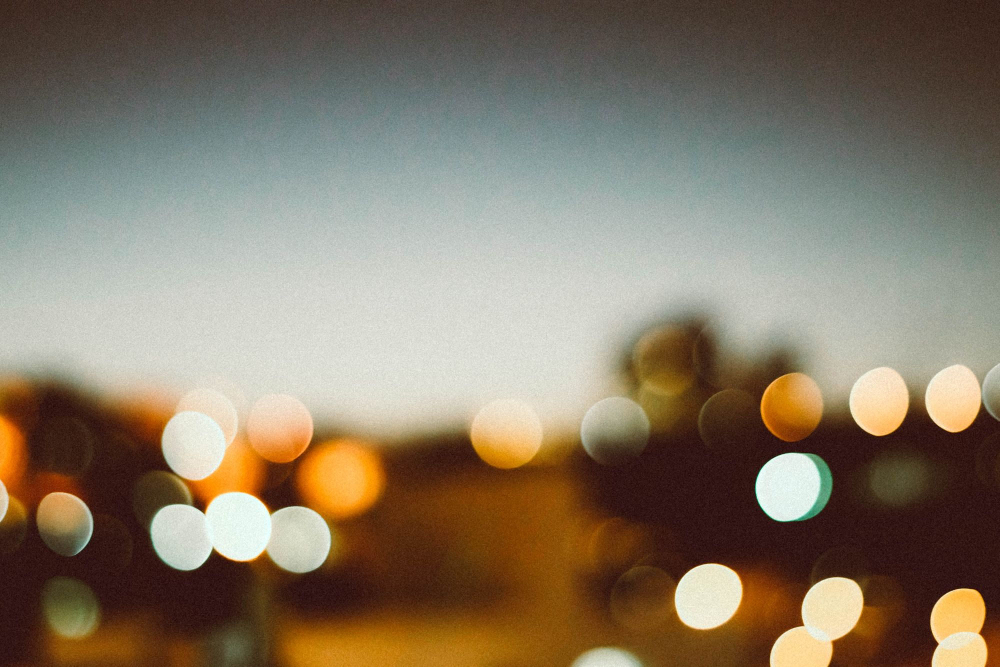

---
tags:
  - posts
id: 65ac4ceb0e7c79000119abb8
title: The Global Derealization
feature_image:
description: This post contains disturbing images, references to traumatic events, and non-medical discussion of anxiety disorder.
date: 2020-08-05
full-date: 2020-08-05T13:08:57.000-04:00
slug: the-global-derealization
type: post
draft: false
---

**This post contains disturbing images, references to traumatic events, and non-medical discussion of anxiety disorder.**

* * *

_On August 4, 2020, at 6 PM (GMT+3), a massive explosion in Beirut, Lebanon, killed and wounded many people and caused major damage to a large part of the city. I learned about the incident five hours later via Twitter and spent at least 2.3 hours in the evening reading news stories and watching videos of the explosion and aftermath._

\*I awoke around 3:30 am (GMT-4) thinking about this explosion and how I was experiencing media during the COVID-19 pandemic. I couldn't fall back asleep, so I decided to write. \*

_This post is a half-baked, half-asleep_ [_hot take_](https://en.wikipedia.org/wiki/Hot_take?ref=davidnunez.com)_, at best, and is meant to capture the past 24-hours for my future reference. This writing spawned many open questions for me to address in the upcoming weeks and years. I will most certainly be revising this essay as my thoughts evolve._

_Last Updated: 2021-05-09-1049 (GMT-4) Grammar fixes_

* * *

## 1\. Derealization

I experience panic attacks occasionally.

Unmanaged stress, poor diet, bad sleep, being in my head too much... all those things. I'm working on it.

My episodes come with an odd and frightening sensation where the things I think I was observing with my eyes don't actually seem real. It's hard to describe except to say that everything feels like it's far away. It feels like I'm in a bubble where the resolution of the world gets, not exactly blurry, but just lossy. Time makes no sense during a panic attack.

Other people have described it as watching the world through a television screen.

This sensation has a name, "derealization."

In fact, it's _because_ it has a name that I can manage it.

Honestly, it's a bit of cognitive judo: know what they are and just let them happen. You have to ride through them and not fight them. Worrying about what's wrong creates an anxiety spiral. It's not the fall that kills you; it's the landing, etc.

I've been feeling shades of this lately and based on conversations I've been having, I don't think I'm alone.

We don't have a name for it. It has a slight tint of derealization to me.

Tell me if this sounds familiar to you?

> ### Derealization
>
> Derealization is a sense of feeling detached from your environment and the objects and other people in it. The world may seem distorted and unreal as if you're observing it through a veil. You may feel as if a glass wall is separating you from people you care about. This aspect of disassociation can also create distortions in vision and other senses.
>
> * Distance and the size or shape of objects may be distorted, and you also may have a heightened awareness of your surroundings
> * Recent events may seem to have happened in the distant past
> * Surroundings may seem blurry, colorless, two-dimensional, unreal, or larger-than-life or cartoonish
>
> @verywell [https://www.verywellmind.com/derealization-2671582](https://www.verywellmind.com/derealization-2671582?ref=davidnunez.com)

While I don't think "name it and then just ride this out" is the answer, I think naming it is a good first step.

## 2\. Beirut Initial Flash

I was in the middle of yet another Zoom meeting with work colleagues yesterday afternoon.

Zoom, for all its miracles it enables, is fundamentally an inhumane interface.

It's the best that we have right now, but as every day passes and I no longer experience my work friends in meatspace, they become less and less real to me.

Over the last months, our brains are rewiring themselves to regard every face on our screens as roughly equal. Our friends, families, and coworkers all visit us in our homes as small-headed maquettes through a limited set of pixels on these cold pieces of glass sitting on our desks.

> We are experiencing each other through lower resolution channels (zoom meetings etc); systems are pixelating all around us. Rules fragmenting. Distance fog.  
> 
> Could it be that the universe simulation is winding down and it’s reclaiming its computational resources before a reboot?
>
> — David Nuñez (@davidnunez) [June 23, 2020](https://twitter.com/davidnunez/status/1275366567828652033?ref_src=twsrc%5Etfw&ref=davidnunez.com)

\[_I have a separate essay and software project in the works about the weirdness and inhumanity of video conferencing. I'll publish that soon_\]

It was about 4:30 in the afternoon. So, as one does, I started drifting off the meeting conversation and checking Twitter.

I saw a couple of retweets float by about the telltale signs of a nuclear explosion.

Then I saw the first of many videos I would watch for the rest of the evening.

https://x.com/ItsSkagg/status/1290756921092431874
>
> — Its\_skagg (@ItsSkagg) [August 4, 2020](https://twitter.com/ItsSkagg/status/1290756921092431874?ref_src=twsrc%5Etfw&ref=davidnunez.com)

I was watching this explosion again and again through the same screen as I was watching my colleagues. Zoom faces took up the same number of pixels as the explosion.

My mind couldn't make sense of it.

The early videos were primary sources. I've been trained to believe that media published from phone cameras directly to Twitter introduces a sense of immediacy that makes me believe in what I'm watching.

It didn't take long for me to start finding multiple videos from all varieties of angles, including that heartbreaking one with the dad and his son inside their home.

There's no pesky "reporting" to help me make sense of it. I can watch all of it and pay attention to none of it as it unfolds in quasi-real-time. I'll self-author the real story.

Aaron Z. Lewis writes about new histories and how the perfect memory of the internet means we can't easily edit out the unpleasant bits. He discusses that traditional media cannot keep pace with internet culture.

> Digital databases are unparalleled [memory machines](https://theconvivialsociety.substack.com/p/narrative-collapse?ref=davidnunez.com) that have radically transformed how information and stories flow between grandparents and children, students and teachers, politicians and voters, journalists and citizens. What Marshall McLuhan called the [perfect memory](https://www.are.na/block/7828126?ref=davidnunez.com) of computers has, in our time, spawned a [garden](http://mycours.es/gamedesign2012/files/2012/08/The-Garden-of-Forking-Paths-Jorge-Luis-Borges-1941.pdf?ref=davidnunez.com) of competing narratives and conceptions of the past/present/future. Digital media serves up an inhumanly large corpus of data that becomes raw material for new subcultures, ideologies, and alternative histories. In today’s chaotic media environment, not even a global pandemic can restore a shared sense of Reality.
>
> [https://aaronzlewis.com/blog/2020/07/07/the-garden-of-forking-memes/](https://aaronzlewis.com/blog/2020/07/07/the-garden-of-forking-memes/?ref=davidnunez.com)

\[_I'm still chewing on this essay. I'll have more to say._\]

We can and do edit what we are experiencing online based on what we're consuming and how we choose to engage. More and more of my reality is self-authored using the raw material of the internet.

I hear voices in these videos. I'm surprised when I hear English, though I shouldn't be. Mostly, I hear and see a lot of "other" in these videos. I'm not proud of this.

As I'm watching Twitter hashtags about `#beirut`, I'm choosing which threads to follow. I'm inventing stories about the videographers. I'm worried about them. Some vantage points do not seem survivable.

Of course, pre-COVID, if this explosion happened, I would still experience it through Twitter feeds on screens. I've never been to Beirut, and I don't know or understand its culture.

It's as unreal to me now as it would have been in January.

The difference, now, is my rewired brain. We have homogeneity in our online lives despite the work/life/world context in which we are experiencing events.

There is no difference between an online meeting, a wedding, or an explosion. Are they real? How would I know?

The line between digital and physical is dead, but not in the technotopian way I always believed in.

I even shop for a pixelated simulacrum of groceries now. This is food that goes into my body and is presumably converted into the electricity that powers my brain that processes the imagery I'm consuming about Beirut and sourdough bread alike.

The world inside our screens has become a liminal space between what is real and what is not.

## 3\. Beirut Shockwave

I woke up in the middle of the night with the Beirut explosion multi-camera shoot replaying in my head. My first instinct was to create a compilation of all the video sources synchronized to show the multiple viewpoints.

Much like a [clapperboard](https://en.wikipedia.org/wiki/Clapperboard?ref=davidnunez.com) used to synchronize sound in film, I would use the flash of the explosion to line up the different clips.

I'd post it on Twitter and insert myself into the conversation stream based on Other's videos. I thought this would be viral-worthy Content™ that would boost my self-promotion and personal branding. Remix culture, baby!

Gross. (Oh, hey, subscribe to my newsletter below!

If I'm more gracious to myself, in my pre-dawn anxiety, I thought objective media forensics would help me find answers and let me just ride through this.

I thought I might be able to analyze the vantage points in the video. The difference between the flash and the sonic shockwave might give a hint of distance from the epicenter.

I could locate on a map where the video was shot.

Then maybe I could learn more about the people that captured the video.

Then maybe I could figure out if they survived or not.

Then maybe they or some news report could tell me they were, indeed, real.

Then maybe I'd know I was still real.

## 4\. First to Publish, First to Remix

I shouldn't have been surprised that there were already numerous examples of synchronized video shoots on Youtube when I got out of bed, the earliest appearing just hours after the explosion.

Mainstream news sources also have edited their compilations and remixes on their sites and social media. They're all fouled up with their logos and chyron. Only sometimes do they acknowledge the source.

First, there was an initial flash of primary sources followed by an immediate and devastating shockwave as the subsequent retweets and remixing speed through all the channels.

I've been haunted by something [Halsey Burgand](https://halseyburgund.com/?ref=davidnunez.com) said during a recent interview about how we are vulnerable to manipulation now that we are experiencing the world through pixels. Our brains are conditioning to media mediation, demonstrating an unprecedented capacity for irreversible plasticity.

When I experienced these virtual explosions so soon after the event and from so many (apparent) primary sources with these different viewpoints, I can make the mental calculation that what I was viewing was real. There wasn't time to overtly manipulate.

Now my Twitter feed feels less real. The threads are all tangled, and I can't find those primary sources anymore—just the videos on somebody else's platform. I don't know how they've been edited or not to capture my eyeballs. I don't know any of these people. They don't feel real to me.

I'm experiencing the explosion through a rapidly expanding vapor bubble.

Why did I feel compelled to message my colleagues during that Zoom call to say, "omg! Did you see that Beirut explosion?" _First to publish._

Why did I think of making a compilation video or writing this blog post as my response? Is it too soon? Is it too late? _First to remix._

Is it real?

Was it ever?

I don't know that for sure.

I can only see everything through these few pixels on my screen. It's lossy.

My retelling is noise.

And now the remixes.

And now I know I'm not sure.

## 5\. 9/11

It's been almost 19 years since 19 hijackers committed murder/suicide on September 11, 2001. An estimated 2,977 people from over 90 countries died in the attack.

I remember learning about an airplane hitting one of the Twin Towers because there was an email alert from CNN in my inbox. I still subscribe to those CNN breaking news alerts. They land alongside all the vanity and marketing newsletters also in my inbox competing for my attention.

We watched the event unfold over the 1 hour, 41 minutes, and 42 seconds until the second tower collapsed.

We watched network television news anchors report on the Pentagon crash and the downing of Flight 93.

We continued to watch as the devastation unfolded over the following 24 hours.

Over the following days and weeks, we reluctantly watched our hope evaporate as we understood the reality that people were not going to emerge from the ruins.

We watched President Bush galvanize and polarize a nation, "Let's roll."

I wasn't in NYC or DC or PA, so I saw all this, quasi-live, through a television screen.

I wrote about this on September 11, 2002, here on my blog.

> I watched the events unfold live on television. The fires, the falling bodies and buildings, and the walking wounded are forever etched in my mind.
>
> I didn't actually cry until I saw that helicopter shot of the Statue of Liberty with New York clouded in smoke in the background.
>
> In a daze, after phone calls to family, I forced myself to go to work that afternoon, mostly to be with other people and also because the information and news was too fast, too wild, and too conflicting.
>
> My friends and I also began emailing like mad to share and connect.
>
> The same technology that galvanized the nation on that day also intensified the negative impacts: the confusion, the horror, and the grief. I remember reading story after story in a desperate attempt to make sense of it all; to educate myself about people and places like the Taliban and Pakistan and, now, Iraq.
>
> The problems arose when I began to realize I couldn't trust what I was reading; in an almost vulgar game of oneupmanship, for a while the news outlets started reporting every little detail, unchecked, as if it was "breaking news." Many times, stories were retracted.
>
> @davidnunez [https://davidnunez.com/has-it-really-been-a-year/](https://davidnunez.com/has-it-really-been-a-year/)

As I think about it, It's probably not a coincidence that I started blogging in the months after 9/11.

Most of us have memorialized, rebuilt, and moved on. That's what humans do. Our forgetfulness is humanity's superpower and its curse.

Our memory gets fuzzy. The past feels less real the further away it gets.

This tendency to let time smooth out the rough edges is also the hope I grasp onto as I'm watching the world pixels explode in front of my eyes in 2020. I just want to make it through the ride.

Of course, conspiracy theorists have spent the past 19 years scouring every frame of these 9/11 videos looking for answers. They will likely find none in those pixels. They'll author their stories anyway.

We'll author stories about these days for years to come, also.

## 6\. COVID-19

9/11 played out over a few weeks on my television screen. Beirut happened on my computer screen in seconds.

I experienced them both with immeasurable heartbreak, and every day they will feel less real to me. I'm only human, after all.

Now, we are all experiencing an explosion in ultra-slow motion.

We're still watching an initial flash of a pandemic. Many people have died as part of the first blast.

I don't know when the devastating shockwave will rip through, and that's the hell of all of this.

Meanwhile, it's drip torture of never-ending news and speculation. There's plenty of time for manipulation, and our understanding of what is real and what is not is challenged continuously.

Our reality bubbles have closed in on us as we hunker down in our homes, peeking out at the world through pixels in a glass portal. It's not normal. We're not wired for this. I empathize with people who desperately and recklessly ignore socially distancing and stay-at-home orders.

This isn't how we evolved. Our animal instinct to forget and ground ourselves in Reality is too strong. We need each other to know that we are real.

We are experiencing a global derealization. I've named it for myself, but I don't like the looks of this ride. The fall is going to kill us. We just might be living in a simulation that is winding down. I have no way of knowing if any one of us is real or not.

## 7\. The Fall and The Landing

I cope. I take stock of what I _do_ know.

* There are entities, including you, with whom I'm interacting regularly online and offline.
* I laugh when you tell me jokes, and I cry when I see you struggle.
* These emotions I experience when I interact with you feel real to me.

It doesn't matter to me if I'm real or not.

Nor does it matter to me if you are real or not.

Right now, what matters to me is that when we are together inside this liminal space, it's the "we" that feels real.

That's enough to help me ride this one out right now. I hope we can find each other through our screens.

We don't know what's next, but I have hope we can soften our landings together.

* * *

_(Cover Photo by_ [_Bruno Nascimento_](https://unsplash.com/@bruno_nascimento?utm_source=unsplash&utm_medium=referral&utm_content=creditCopyText) _on_ [_Unsplash_](https://unsplash.com/s/photos/blurry?utm_source=unsplash&utm_medium=referral&utm_content=creditCopyText)_)_
