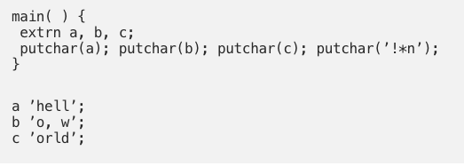
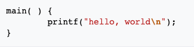
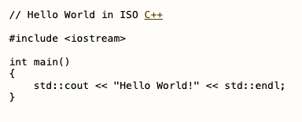
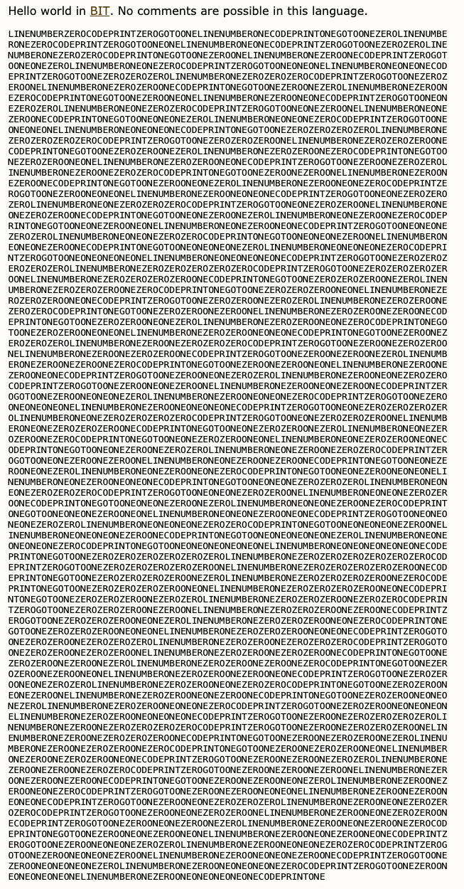
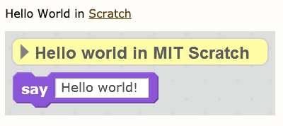
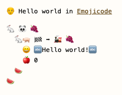
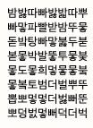
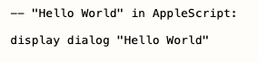
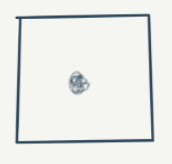

---
tags:
  - posts
  - output/newsletter
id:
title: Hello, World
feature_image:
description: Let's talk about source code. Here's a program.
date: 2020-08-13
full-date: 2020-08-13T16:55:51.000-04:00
slug: hello-world
type: post
status: done
draft: false
eleventyExcludeFromCollections:
episode: 1
---

Let's talk about source code. Here's a program.

Right now, your instinct is to immediately delete this newsletter, thinking you've made a terrible decision.

"After ten words, he's showing me computer code. Oh no. Why did I willingly subscribe to this? No, thank you, computer nerd. I'm not interested in your technospeak."

Understandable.

Fight that instinct. Your soul depends on it.

You invited a vampire into your inbox, so you may as well bear with me for a minute or two.

I'm sorry to be the one to tell you this, but something bit you on the neck a long, long time ago.

It turned you into a cyborg, and I'm one also.

I should explain.

You're staring at a glowing glass pane through which you are consuming some version of reality. If that screen went away, you'd survive. I'm sure you'll likely be happier over time.

Let's take it a step further and take away software from your life. Again, you'll survive.

You'd lose the superpowers, though.

The ability to navigate the world, explore vast repositories of knowledge, and induce emotional states by watching pixels dance across the screen will disappear. You'll have friends you can't talk to again because they live so far away. Were they real friends? Were they real?

Stop reading these pixels for a minute and try to take in just how much you're surrounded by software.

There's your mobile phone. That one is obvious. It gossips about you to a cell tower somewhere nearby in computer-speak.

The electricity flowing through the veins of your home? Software regulates it.

Your kitchen is simply infested with technology. Gross. I see your appliances with all their digital displays blinking at you. Your refrigerator is lovingly stroking your food with its temperature regulation code. Don't even get me started on your microwave.

You may be thinking, "Not me. I have a healthy relationship with technology. I turn off my computer at 5:00 PM every day."

I'm curious. What software tells us it is 5:00 PM? Who wrote it? How do you know it's not lying to you?

Maybe it's telling you it is 5:00 PM, but it's actually 5:01 PM. It's sucking one minute out of your day, so you can feed it just a few more drops of your data. Slurp.

I can't prove any of this. Time is weird in 2020.

(Time, itself, is indeed one of the Great Lord Elder technologies.)

My point is, we have all been in communion with software for so long, we can no longer see it in the mirror.

If software turned into dust right now, your life would cease to exist as you know it. You'd adapt. Maybe. Again, cyborg.

That's why I want to explore a little bit of source code with you. Source code is a clue that the vampires have been living among us and inside us for centuries. It is one of many technology ephemera twisted around our DNA.

I should be clear. I know we've been trained to fear vampires. They have a horrible reputation, what with their bloodletting (ahem) "habits."

Rest assured, that kind of vampire doesn't exist. Real vampires used streaming technology to put those fake vampires on our televisions as a distraction.

I do think we can have a symbiotic relationship with these creatures. They feed off of us, and in return, they perform magic on our behalf.

Take this email, for example.

An incomprehensible series of miracles were necessary for you to be reading these words right now, including your decision to plug yourself into the Internet.

The vampires worked overtime to make sure we could be here together.

So let's give them credit for that, but let's not let our guard down. We must understand them if we are going to live among them. It's their world now and we're just cyborgs along for the ride.

Embrace the daylight.

## Source Code

Computers communicate in the language of electricity, magnets, and physics.

Humans communicate in the language of glyphs, utterances, movement, and multiple subconscious signals we can't even control.

For our purposes, you don't have to be fluent in the language of computers.

All you need to know is that source code is a way for humans to express their ideas through machines.

These human ideas go through lots of steps before the computer "does" something with them.

Try to read source code like you would explore a piece of literature. Squint your eyes and consider it in the same thought space as a painting in a museum. It's like a script for your favorite Netflix series, maybe?

Source code is a morphing cloud passing overhead on a bright August sky.

It's anything you want it to be and nothing that you expect.

Programs are the journey and the destination.

Let's ride those clouds for a bit.

## hello, world

Brian Kernighan wrote this code in 1969.

This program is distinctive, actually. It's the first of its kind.

It tells the computer to do just one small thing, "Scrawl the phrase `hello, world` onto a screen."

If you read this code aloud like you would recite a poem, much of it won't make sense to you.

That's ok. You're a cyborg. We'll figure this out.

You might notice the `hell` in the depths of the program.

As you tumble through the deeper levels of code, you'll bang your head against a semicolon and say `o, w` before you crash into the end of it all, `orld`.

Just by examining the lines of text, you might get a sense of what the programmer was trying to scream into his machine. You don't always need to make a computer read programs you.

You can do this kind of casual reading with a lot of code poems once you stop trying to "figure it out" and just let it wash over you. It's gratifying enough and often helpful.

If you want, you can learn a little bit more about code at some point.

Then you will start reading software like literature in ever-deepening levels. You'll form opinions about style and develop a taste for a particular school of code.

You will discover all the little jokes and sad stories programmers leave for each other in the margins. Among the text, you'll find rampant toxicity and unspeakable beauty.

You'll transport yourself into the labs and bedrooms and sleek Silicon Valley incubators where code originates.

Programs are storybooks.

You don't need to do any of that, though. The fact that you read it at all is a beautiful thing.

I'd be happy if you just know that it exists, honestly.

## hell(o, world) spawn

The 'hello, world' program first appeared in a lovely short story called "[A TUTORIAL INTRODUCTION TO THE LANGUAGE B](https://web.archive.org/web/20150611114644/https://www.bell-labs.com/usr/dmr/www/btut.pdf)," a document to teach people how to talk to computers using the "B" programming language.

Here's the code again from the top of the newsletter. It is another "hello, world" program by Dr. Kernighan written in the "C" programming language.

Why would he write two 'hello, world' programs?

In his own words,

> The only way to learn a new programming language is by writing programs in it. The first program to write is the same for all languages:

> Print the words  
> hello, world

> This is the basic hurdle; to leap over it you have to be able to create the program text somewhere, compile it successfully, load it, run it, and find out where your output went. With these mechanical details mastered, everything else is comparatively easy."

_from The C Programming Language, Brian Kernighan and Dennis Ritchie (1978)_

"Hello World" programs are used to teach the first steps of a programming language. They establish that the programmer has all their systems ready to go and are prepared to express even more ideas using this new language.

Computer scientists invent programming languages all the time. They do this for fun, sometimes. Many have adopted "hello, world" as the primer used to teach other people how to speak to computers through a new language.

Because of this, there exist hundreds of 'hello, world' programs. Here are just a few, all taken as screen grabs from [The Hello World Collection](http://helloworldcollection.de/?ref=davidnunez.com).

Here's 'hello, world' in a language I invented called [I-AM](https://github.com/davidnunez/I-AM?ref=davidnunez.com).

## The Journey

Imagine you attend a performance where a computer is on stage. It translates all of the 'hello, world' programs into its own electrical language. It would then perform the ideas encoded in those programs. From the audience, you would see the exact same result in all cases. 'hello, world' would show up on a computer display.

However, these programs are not identical, clearly. The way they are written and the context in which they were written holds human meaning.

Their uniqueness is also meaningful inside the machine. The computer will execute a different series of steps to interpret each code.

As a bystander, all we see is the finished product, so we don't know the technology for what it is: Soulful.

We enjoy (and often hate) the way technology helps us along our ride.

We don't often stop to think about the people who make technology. We forget that their soul is entangled with ours through machines. We take for granted all the programmed impossibilities that needed to resolve so you could receive an email.

Programs are the journey and the destination.

## "Hello, World"

To me, "Hello World" is more than a programmer's trope.

When someone writes a "Hello, World" program, it's an announcement, "I'm here. I've set up my canvas. I have something to say."

Or more to the point: "I exist."

Computer programmers have been screaming "Hello, World" into machines for a very long time now.

The abstractions among the programmer, their medium, and you have been pixelated. I hope this newsletter will help you respond to their greeting.

Through it all, I want to explore and tell you about what I find in that liminal space between the 0's and 1's where the heart of computation lives.

This is the essence of Soulful Computing.

Hello, World,

David Nuñez

## Coda

I met my artist/programmer friend, [Sophia Brueckner](https://www.sophiabrueckner.com/?ref=davidnunez.com), when we were at the MIT Media Lab.

Sophia is an Assistant Professor at the Stamps School of Art & Design, University of Michigan, Ann Arbor, and current Artist in Residence at Bell Labs, the birthplace of "hello, world."

Her piece, "[Singing in Code](https://vimeo.com/24433402?ref=davidnunez.com)," is about a programmer's cyborganic relationship with the software they write.

https://vimeo.com/24433402?ref=davidnunez.com

She says a programmer needs to "think like a computer" to achieve the flow state required to translate ideas into software.

She's been singing her code in the background as I've been writing this newsletter.

I had my computer read back this newsletter to me before sending so I could hear and correct any mistakes.

I'm certain there are several mistakes remaining, anyway.

* * *

No vampires were harmed in the making of this newsletter. They were only strengthened.

If you respond to this email, it will go right into my inbox. I'd love any feedback you might have. Was this too long? It was probably too long.
