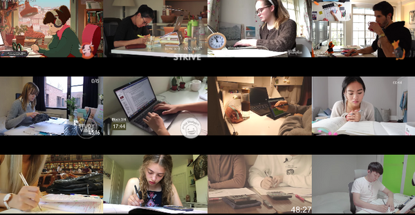
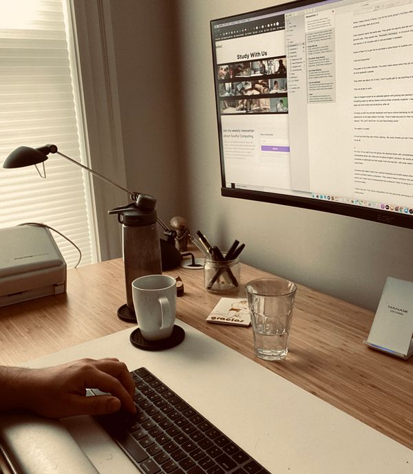
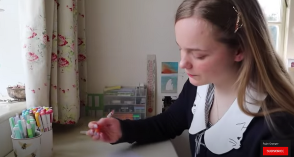
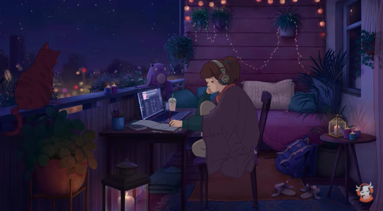

---
tags:
  - posts
  - output/newsletter
id: 65ac4ceb0e7c79000119aba4
title: Study With Us newsletter
feature_image:
description: I recently joined a global study group.
date: 2020-08-27
full-date: 2020-08-27T16:20:51.000-04:00
slug: newsletter-study-with-us
type: post
draft: false
episode: 3
---

I recently joined a global study group.

I spend so many hours with these people during the pandemic that I now call them my friends.

They have no idea that I exist.

When I need a boost of focus, I put all my study group's YouTube videos on my screen and play them all at once.

You can join us, if you'd like: [/study-with-us](https://davidnunez.com/study-with-us)

Every session starts the same way. They greet me warmly and set out the ground rules. They explain the [Pomodoro Technique](https://en.wikipedia.org/wiki/Pomodoro_Technique?ref=davidnunez.com) to structure study time into blocks of 25-minutes with 5-minute breaks in between.

Some of them try to get me to purchase a subscription to Audible.com.

"Like and Subscribe!"

This goes on for a few minutes.

They never ask about me. In fact, I don't usually get to say anything at all.

Then we all get to work.

I like to imagine myself as an adorable geezer with graying hair passing his remaining years by taking classes among these university students. I need to keep the mind sharp and productive, after all.

I'd show up with my earnest backpack and saucy stories betraying my life experience of the days before YouTube. They'd make excuses for their wrinkling mascot, "Oh, don't mind him. It's just David being David."

The reality is crueler.

It's not just that they don't think I belong.  My study friends just don't think of me at all.

It's true. I'm an odd fit for this group. My desktop bloats with spreadsheets and unanswered email. My notes are not about English Literature. My words are the scratches of administrivia that stream from the day job. I will never need to study them.

Everyone else takes notes from medical textbooks and drafts essays about ancient societies before computers. Their output means nothing in the real world, yet it feels more consequential than whatever I think I'm doing as I drip my hours away.

I have a day job. That, alone, disqualifies me from genuinely belonging in the study group.

A human is a machine of constant learning, and these people perform exquisite studying on my behalf. I live vicariously through their flashcards.

I marvel at their virtuosity.

## Study With Me

I discovered my study group through my friend, [Ruby Granger](https://www.youtube.com/channel/UC6a8lp6vaCMhUVXPyynhjUA?ref=davidnunez.com). Though, if I'm honest, "friend" might be overstating the case. She acts like she doesn't even know who I am.

I stumbled on her YouTube channel as I've been collecting examples of videos dedicated to productivity hacking.

Ruby is a social media influencer in the [StudyTuber](https://www.newyorkminutemag.com/studytubers-you-should-watch/?ref=davidnunez.com) genre.

On her YouTube channel, she offers advice about scholarly pursuits like studying for exams (or "revise" for them, as they say on the more refined campuses). She performs productivity so that we might aspire to be better students. Advertisers sponsor her channel because she has captured the attention of 507,000 subscribers, like me.

Yes, "Ruby Granger" is a pseudonym related to [Hermione](https://en.wikipedia.org/wiki/Hermione_Granger?ref=davidnunez.com).

One of her videos, "[Live Study With Me!](https://www.youtube.com/watch?v=VdmLOtn8AEo&t=3s&ref=davidnunez.com)" is 2.75 hours of her camera feed of her simply studying. She hardly speaks and doesn't really acknowledge the audience much. She means for viewers to have this video running in the background as they work to simulate a joint study session.

A quick search on YouTube for "Study With Me" unveils hundreds of these videos from dozens of creators. Some are over 8 hours long. Some are running live, but most are simply recordings of past sessions.

The Study With Me phenomenon became popular in South Korea, where it's known as "gongbu bangsong" or "gongbang," a Korean phrase for "study broadcast."

This is related to, but distinct from, "[mukbang](https://www.youtube.com/results?search_query=mukbang&ref=davidnunez.com)," streaming videos where the host performs gluttony by gouging on large quantities of food.

[The Man Sitting Next to Me](https://www.youtube.com/channel/UC5F_d3cnqsl_6syKejWVWxw?ref=davidnunez.com), a Korean StudyTuber with over 50,000 subscribers, [describes a mutual benefit](https://www.businessinsider.com/youtubers-study-video-gongbang-studying-focus-youtube-trend-2019-2?ref=davidnunez.com) for him and his viewers.

> By watching other people studying, they can also get motivated to study hard. And for myself, by studying with all of you, I can prevent myself from getting lazy and continue to focus with my study.

I'm glad I could help.

It's not a surprise to me that Study With Me videos are so popular.

In the pre-COVID times, before we were aware of how dangerous we are to each other, I'd often sneak away from my office to go work at coffee shops.

It was lovely sitting among strangers with their laptops open. Even as we were all lost in our socially distant headspaces, our minds and bodies were still chattering away with each other. Our study effort was contagious, entraining focus.

Maybe it's just [peer pressure](https://pubmed.ncbi.nlm.nih.gov/26265430/?ref=davidnunez.com) that makes us try harder. If we worked hard together, nobody would discover that we had no clue what we were doing.

Now that I can't loiter among the espresso machines, my virtual study group brings back that sense of shared purpose in the coffee shop.

StudyTubers have become my new concentration community.

## The Infinite Study Session

The queen bee of Study With Me is ChilledCow. She has over six million subscribers. 29,950 other people are watching her live stream as I am writing this. Popularity contest, indeed.

I must say she has excellent taste in music.

ChilledCow is remarkable. Her session has broadcast live for years. For 24 hours a day, she remains deep in her studies. She never sleeps nor runs out of paper in her notebook.

Go to her [Youtube channel](https://www.youtube.com/watch?v=5qap5aO4i9A&ref=davidnunez.com) right now.

She's still there, studying.

I don't know her cat's name, but he stares out the window, watching the sunrise and sunset on his infinite study session.

I study her video feed sometimes, looking for clues about how she manages to remain so focused. Maybe if I watch her long enough, I can finally be like her, my productive mentor.

If I can just squeeze in twelve more hours of studying like ChilledCow, maybe nobody will realize I'm an imposter.

I'm not entirely sure she is a real person.

Bored. Mostly I think ChilledCow and her cat just seem bored.

She seems caught in some kind of loop, her movements cycling endlessly on autopilot.

She's writing something over and over in her notebook. It's a bit blurry in the YouTube window. I squint and think I can read it, "All work and no play..."

Every once in a while, I catch her at 1 or 2AM in the morning. She yawns and sips from her coffee mug to help power through another hour.

I wonder where her friends are right now. How can she afford such a gorgeous apartment? What does she put in that coffee to keep her awake for so many hours in that cozy chair?

What kind of exam could possibly take this much preparation? [The Turing Test](https://en.wikipedia.org/wiki/Turing_test?ref=davidnunez.com)?

Another 25 minutes have passed, and I've accomplished nothing.

Maybe I should stop comparing myself to others.

I hope she's ok.

## Can't Stop Watching

It's been shown that ambient noise [influences creative work](https://www.jstor.org/stable/10.1086/665048?seq=1&ref=davidnunez.com#metadata_info_tab_contents).

My study group is happy to oblige. They are constantly nudging computer mice, chugging water bottles, and shuffling reams of paper. Why is there so much paper in 2020?

Someone announces his next break, and his screen turns into a countdown timer with music, "Hey, can you watch my laptop while I get another cup of coffee?"

I never feel like taking a break at the same time he does.

Then there's that one guy who regularly clears his throat again and again.

Ruby and I are good friends, so I want to joke, "Ha Ha. How do you manage to type so _loudly_?"

I'm genuinely asking—keys on keyboards clack in their excessively productive cacophony.

I start hearing all the pencil scrapes and highlight marker squeaks, and now that dog won't stop barking outside that window.

Why does nobody study outside?

They all squirm around on their creaky seats. They scratch their foreheads and gnaw on their fountain pens as they ponder the perfect introduction paragraph. This is 2020, people! Haven't you heard of COVID-19? Stop touching your faces, please!

Their fidgeting is deafening.

In a coffee shop, all these people would be in my peripheral vision. Online, they are dancing right alongside my spreadsheets.

We end the session at the four-hour mark, and I haven't accomplished anything.

I'll try again tomorrow. Tomorrow will be the day I actually get stuff done.

Tomorrow I'll be more like them.

## Are you watching?

I like watching StudyTubers because they remind me of a time long ago when the only things I worried about were problem sets and scheduling laundry sessions around classes.

I've looked and can't seem to find age-appropriate Work With Me YouTube channels.

Real Work is actually terrifying and often depressing. Who wants more of that in their life?

Maybe I should start a Work With Me channel. I could influence people.

I'd just put a well-lit pencil cup on my desk, point a camera at myself, and go about my daily drudgery.

Then I'll make money with advertisers.

Then I won't have to do Real Work anymore.

Nobody would watch, of course. I wonder if the threat of spectators would make me self-conscious.

How loudly do I type?

Maybe if I became a WorkTuber, I'd become focused and productive.

Then nobody would realize I'm an imposter.

Meanwhile, I really think you should check out Audible.com.

Like and subscribe,

David Nuñez

## Coda

This newsletter was inspired by a twitter exchange:

[https://twitter.com/davidnunez/status/1297905516476346370](https://twitter.com/davidnunez/status/1297905516476346370?ref=davidnunez.com)

In some future newsletters, I want to tease apart why people like to watch others play video games or write software, live. How is viewing a virtuosic programmer like watching Julia Child cook? (It is mirror neurons. Everything always boils down to mirror neurons.)

Some links:

* The [Coffeehouse Effect](https://en.wikipedia.org/wiki/Coffeehouse_effect?ref=davidnunez.com) is a named phenomenon.
* [Coffitivity](https://coffitivity.com/?ref=davidnunez.com) is a resource that simulates coffee shop background noise
* [The Audience Effect](https://www.tandfonline.com/doi/abs/10.1080/00224545.1980.9924271?ref=davidnunez.com) describes how being watched influences how well someone does at tasks.

Here is a critique of StudyTubers from [Ebb Magazine](https://www.ebb-magazine.com/essays/studytube-and-the-fetishisation-of-productivity?ref=davidnunez.com):

> "StudyTube is therefore less concerned with the use value of ‘productive’ studying — acquiring new skills and knowledge with which to better understand the world — than the exchange value: documenting, packaging and selling the feeling of productivity to audiences and advertisers."

* * *

_Of course, my background playlist while writing this was [lofi hip hop radio - beats to relax/study to](https://www.youtube.com/watch?v=5qap5aO4i9A&ref=davidnunez.com) by ChilledCow._

* * *
