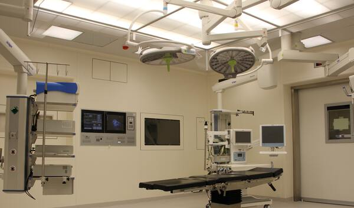
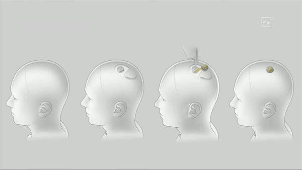
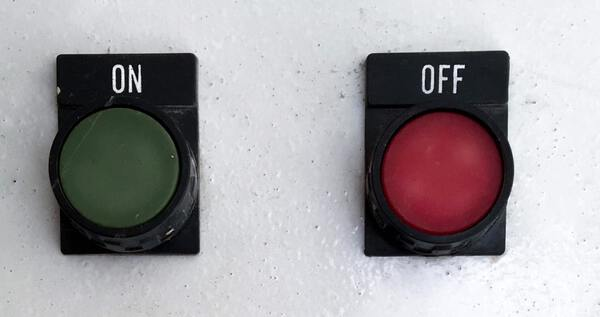
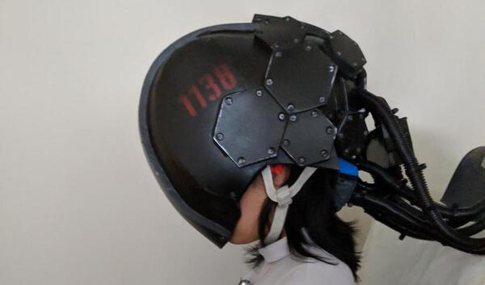

---
tags:
  - posts
  - output/newsletter
id: 65ac4ceb0e7c79000119aba3
title: Happy Upgrade Day
feature_image:
description: Happy Upgrade Day.
date: 2020-09-03
full-date: 2020-09-03T16:22:51.000-04:00
slug: happy-upgrade-day
type: post
---

Happy Upgrade Day.

You are on an operating table, immobilized, but fully awake. You glance sideways and see the brain implant in a sterile package marked with the Neuralink logo. It is smaller than you anticipated.

"You may feel a little pressure," says the robotic surgeon, but you don't sense anything except a faint vibration and cool moisture.

You felt the real pressure a long time ago.

The machine pulls aside a flap of your scalp near the cowlick on the back of your head. You hear grinding and crunching as it removes an impossibly perfect circle from your skull. Laser scalpels slice through layers of meninges to expose your parietal lobe.

An infrared camera maps out your brain's surface using the same computer vision algorithms as might be applied to identify faces in a crowd.

Are you in there?

An electrified probe caresses your brain at the margins of the injection site. The robot asks you to play a game where you name animals appearing on a screen in front of your face, "Horse. Elephant. Lion. Spaghetti."

The probe instantly retracts. Over a thousand miles away, a human doctor you've never met is chopping cauliflower for dinner. Her iPad chimes a notification. She taps the screen. The probing resumes.

When the robot is satisfied that it has adequately aligned its microscopic instruments, it injects over forty thousand hair-like nanoprobes into your tissue at pre-computed locations and depths. It is like a sewing machine threading needles among your neurons. For an instant, as you continue to name animals, you think you see forty thousand points of light stampede across your field of vision.

It's beautiful, but then it's gone.

Titanium screws fasten a computer chip with a protective cap over the surgical site. They've assured you the manufactured plug is airtight and more robust than bone. You have come to believe artificial is always better than natural.

The procedure takes less than seven minutes. You spend an hour performing calibration routines with a virtual agent in a recovery room. Then you return to your office to make up for the time off. It helps with the process if you have mental stimulation in your familiar environment immediately following the operation.

Things will not seem different right away. However, it takes just a few days for the implant to collect enough data about your brain activity to train its machine learning model. The system begins to make predictions about you. The chip reciprocates with small electric charges.

Your vision sharpens slightly, and you have a sudden craving for pasta.

## Win-win

Like most people, you could never afford a Neuralink procedure on your own.

Six months ago, you signed your performance improvement plan with your manager. The company will subsidize your implant, and in return, you will repay them in monthly installments over the next three years. The Firm's accountants have calculated a positive return on investment. "A no-brainer," they joke. You think of it as professional development. It's a fast track to the Executive Suite.

Win-win.

The accountants know you will want to upgrade to a new version of the chip after three years. You will sign a new agreement. The actuaries know that after five upgrades, your brain tissue will likely reject further intervention. It is then that the Firm will no longer require your services.

The company will waive the remaining payments on your implant as part of your severance package. Your debts will be forgiven, and maybe you will forgive yourself for how ugly you have become.

You realize you haven't saved up enough of your extra income to afford a retirement implant on your own. You never made it to the upper floors. The company will pay for you to install a sixth Neuralink chip, albeit consumer-grade, and you are grateful.

This gesture is how they will retrieve their intellectual property and ensure you will not access the Firm's resources when you are no longer part of the team. Your severance will be complete.

Of course, there is a 39.7% chance that this final implant will kill you.

Your beneficiaries will sue the company, even though you knew what you were signing during the exit interview. The accountants have already factored these legal expenses in their cost-benefit analysis of your career ladder. The company will settle out of court for a pre-determined sum. Your loved ones can then afford brain implants, on their own.

Win-win.

## Turned On

You find it difficult to describe to your unlinked friends what it's like to have an implant. It's not like the movies, where you jack into a matrix and gain superpowers. You don't suddenly have brain links to everyone else's Wikipedia rabbit holes. It's more subtle than that.

You achieve focus with unwavering stamina during the 50-hour week. You smile more, and people smile back. When you are doomscrolling political chatter on Twitter or binge more than 28 minutes of Netflix, you feel disgusted. Regular exercise comes naturally to you now. You don't seem to need bathroom breaks during the day anymore. Life seems more bright as if you never experience a poor night's sleep.

It's like a constant microdose of productivity without any of the unpleasant side effects. It's a cognitive prophylactic ensuring your brain contains only positive affirmations.

You are what you think.

You know both the Firm and Neuralink can access the data collected from the chip. They use it for business reasons. This arrangement seems pretty fair to you, especially when they increased your salary after you opted in.

Besides, you know you can always download the data. It's yours, after all. However, you're not quite sure how to do that. The source code for the chip and the data analysis is proprietary and closed. No matter. It's not like you'd be able to understand it, anyway.

There's a privacy app on your phone you can use to disable the implant when you leave work. You stopped bothering with that when you realized how boring your life could be when it's turned off.

Artificial is just better than natural.

## Linkers

There is nothing about your chip that explicitly identifies when other implants are nearby. Privacy laws strike again. Instead, the Neuralink implants talk among themselves in a mesh network whenever they are near each other. You feel an almost magnetic pull towards upgraded brains.

The upper floors of the Firm's office tower are staggeringly electric. One day, you'll get a promotion that puts you in an office up there. For now, it just feels like sludge humans surround you.

You exchange telepathic glances with others in your network whenever an unconnected person says something stupid in a meeting.

You high-five over rounds of beer when colleagues show up at work with a "shower-cap," the brain-mapping device worn the month before implant surgery. You wonder why it took them so long to join the team.

You feel more attracted to other Linkers, despite how ugly they may appear to those who have not upgraded. You now understand why they say beauty is only skin deep. This level of understanding is something you would never have considered before you had the help of the chip.

Brains are beautiful. Augmented brains are works of art.

## Success

In the early days, jobseekers would shave off little patches of hair to try to fool interviewers. Some even went to tattoo parlors to have counterfeit implants placed just under their skin. Of course, that was all just quackery. None of those chips carried the correct private-keys for authentication. Employers wised up pretty quickly. They're not allowed to ask directly whether an applicant wears a chip, but they can unquestionably install detectors in the interview rooms.

Your younger cousin is in town, so you invite her out for coffee to catch up. She was once a rising star at a venture capital firm. The Partners encouraged her to upgrade, but she declined the procedure for "religious reasons." The Equal Opportunity Act made It illegal for her bosses to fire her because she refused to take the chip. They found a way, anyway.

You think she has an innate fear of success.

She sits across from you, droning on and on about the trivialities of her mediocre business. Her bootstrapped company has over 100 employees around the world. She's going to sell it off for a tidy sum and retire at age 36. She tells you about the countries she plans to visit with her boring husband and their unremarkable children. Photography is her new hobby.

You shake your head. How can she give up on everything when she's so young?

You try to explain slowly, in words she might understand, that if she insists on such stupid financial decisions, then she'll never be able to afford a chip for herself. You offer to help her invest her money with the Firm so that she might earn enough to implant her children. Why wouldn't she want to give them every opportunity that she never had? How could she throw her life away when there was still so much more to accomplish?

You didn't realize you were shouting until you caught the eye of a Linker across the café.

Your cousin smiles softly at you and pats your hand as she gets up to leave. Her eyes are sad. You know she wants you to support her choices, but you can only feel pity for her wasted life.

You stare with unwavering focus into your cup of coffee. Caffeine does nothing for you these days.

You start walking back to your office to make up the hour you just wasted—a point of light flies across your field of view. Your back straightens once again.

Your (soon-to-be) fellow Linker,

David Nuñez

## Coda

Last Friday, Elon Musk [livestreamed with a couple of pigs](https://www.youtube.com/watch?time_continue=28&v=DVvmgjBL74w&ref=davidnunez.com) to demonstrate how his company, [Neuralink](https://neuralink.com/?ref=davidnunez.com), has progressed with its brain interface devices.

Many called this appearance a [publicity stunt](https://www.hayvine.com/tech/is-elon-musks-new-brain-chip-for-real-or-its-just-another-publicity-stunt?ref=davidnunez.com). Some researchers think of Neurolink as [dangerous pseudoscience](https://www.technologyreview.com/2020/08/30/1007786/elon-musks-neuralink-demo-update-neuroscience-theater/?ref=davidnunez.com).

However, brain interfaces are not new; in fact, there are decades of research that seem far more advanced than Neuralink's progress (see links below).

Space travel is not new either, but when Elon Musk sent astronauts to the International Space Station earlier this summer, we noticed.

Here is a collection of links related to brain hacking:

* An [article from SingularityHub](https://singularityhub.com/2020/09/01/neuralinks-new-brain-implant-the-hype-vs-the-science/?ref=davidnunez.com) contains links and references to many brain-machine interface projects.
* [Microdosing LSD](https://www.theverge.com/2017/4/24/15403644/microdosing-lsd-acid-productivity-benefits-brain-studies%0A?ref=davidnunez.com) is a widespread cognitive enhancement tactic among the technorati.
* [Neurohackers](https://en.wikipedia.org/wiki/Neurohacking?ref=davidnunez.com#Transmission_of_electrical_currents) have been creating DIY devices to stimulate their brain with electricity.
* Here is a paper about the [social context of DIY brain stimulation](https://www.ncbi.nlm.nih.gov/pmc/articles/PMC5423946/?ref=davidnunez.com)
* [Dan Novy](https://www.media.mit.edu/people/novysan/overview/?ref=davidnunez.com) invented a technique to use a high-powered stimulation device to trigger hallucinatory lights in your field of view. I recommend watching his [dissertation defense](https://www.media.mit.edu/events/dan-novy-dissertation-defense/?ref=davidnunez.com) with an (ahem) "open mind."  

* * *

_My soundtrack for this newsletter was_ [_Brain.fm_](https://brain.fm/?ref=davidnunez.com)_, an app that generates music and binaural beats to improve focus. I think it works. It might be a placebo._

Photo Credits:

* [Marcel Scholte](https://unsplash.com/@mscholte?utm_source=unsplash&utm_medium=referral&utm_content=creditCopyText)
* [Neuralink](https://www.neuralink.com/?ref=davidnunez.com)
* [Constantin Wenning](https://unsplash.com/@conniwenningsimages?utm_source=unsplash&utm_medium=referral&utm_content=creditCopyText)
* [elnaz asadi](https://unsplash.com/@elnazasadi?utm_source=unsplash&utm_medium=referral&utm_content=creditCopyText)
* [Hunters Race](https://unsplash.com/@huntersrace?utm_source=unsplash&utm_medium=referral&utm_content=creditCopyText)
* [Novysan](https://www.media.mit.edu/people/novysan/overview/?ref=davidnunez.com)

Thanks to [@CheerUpEmoDev](https://twitter.com/CheerUpEmoDev/status/1300935699152027648?ref=davidnunez.com) for "brain links to everyone else’s Wikipedia rabbit holes."
