---
tags:
  - posts
  - output/newsletter
id: 65ac4ceb0e7c79000119abaa
title: Freediving into a Spreadsheet
feature_image:
description: Dan Bricklin's professors at the Harvard Business School thought he was wasting his time creating an electronic substitute for the paper…
date: 2020-09-10
full-date: 2020-09-10T23:51:51.000-04:00
slug: freediving-into-a-spreadsheet
type: post
draft: false
episode: 5
---

Dan Bricklin's professors at the Harvard Business School thought he was wasting his time creating an electronic substitute for the paper ledgers he and his classmates were using to complete their coursework. In the 1970s, data entry was for secretarial pool transcription and the technicians keeping the mainframe oiled and calculating. Harvard graduates shouldn't sully their hands in such details.

The professors didn't realize that Bricklin's invention would forever change business practices and give birth to the Personal Computer revolution within the next decade.

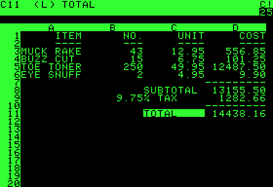

Bricklin first studied at MIT, where he became familiar with the power of computing. It was only natural for him to think about applying this technology to business problems while at Harvard. He hacked together the first version of what we now recognize as spreadsheet software in 1978. His program could manipulate a 20x5 sheet of values.

He wasn't the first to prototype spreadsheets. That distinction goes to Richard Mattesich in the early 1960s, followed by Rene Pardo and Remy Landau, who built a program called "LANPAR" in 1969 used to manage budgets at large organizations like AT&T and General Motors. However, this software required mainframe computers to operate. Mainframes required the funds of government defense contracts or multinational corporations, outside the reach of most businesses.

Dan Bricklin and his fellow MIT graduate Bob Frankston wrote the software that became VisiCalc in 1979, designed to run on personal computers. People like Steve Jobs, Steve Wozniak, and Bill Gates were busy working on the hardware and operating systems. They were creating the technological ancestors of the device on which you are reading this newsletter.

PCs were considered hobbyist toys meant for children and crackpots. VisiCalc, however, gave Steve Jobs a compelling answer for "Why?"

Indeed, Jobs [credits the release of spreadsheet software](https://www.inc.com/bill-murphy-jr/steve-jobs-said-this-1-surprising-thing-is-what-made-apple-a-giant-success-it-was-introduced-40-years-ago-this-week.html?ref=davidnunez.com) as what "propelled the Apple to the success it achieved, more than any other single event."

Suddenly, small business owners could afford the same tools as the Big Companies. Steven Levy [writes about this as changing the way we were thinking](https://www.wired.com/2014/10/a-spreadsheet-way-of-knowledge/?ref=davidnunez.com). Instead of using ledgers to document what is currently happening in a business, people could start testing out scenarios to answer "what if?" Spreadsheets acted like virtual reality businesses.

> Some will lose themselves in the rows of columns, the grids becoming their windows on the world. They will spend their evenings in front of their computers, the dark dimly lit by the glow of green phosphorescent numbers, fiddling with scenarios, trying to make the profit line perfect.

Fast forward to 2020, and spreadsheets are considered table stakes for many jobs. We turn to them to help us organize or make sense of all the inputs that inform our work. Outside of business, we often turn to spreadsheets to track our health, shopping lists, and relationships. They are a convenient and approachable way to wrap our heads around slices of our digital culture.

The real power of spreadsheets is their flexibility. I would assert that spreadsheets encode a programming language, making every spreadsheet user (including you) a software developer. Spreadsheets are general computers from a computer science perspective, as Felienne Hermans et al. demonstrated by creating a [Turing Machine in Excel](https://www.felienne.com/archives/2974?ref=davidnunez.com).

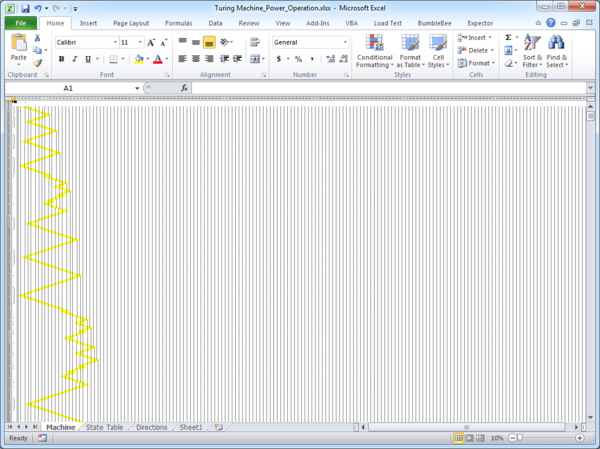

When you construct a budget spreadsheet, for example, you are following the broadest steps of programming. You translate an idea into a model and then manipulate the cells in a spreadsheet to generate insight. Sometimes you render a graph visualization or apply formatting to improve the user interface.

Inputs, processing, outputs. That's computing. That's software.

Now what?

## Spreadsheets are Cultural Spaces

Marie Foulston [wrote about a spreadsheet party](https://onezero.medium.com/party-in-a-shared-google-doc-d576c565706e?ref=davidnunez.com) she hosted during the COVID-19 lockdown. She wanted to create a socializing space "for the mundane, the idle, and the liminal"  Because she was finding social video calls too exhausting, she set up a shared Google Sheet. She invited friends to party inside the document.

> I work with game designers and artists to create installations and exhibitions in real-world, shared public spaces. That is not possible at the moment. I don't know when it will be possible again.

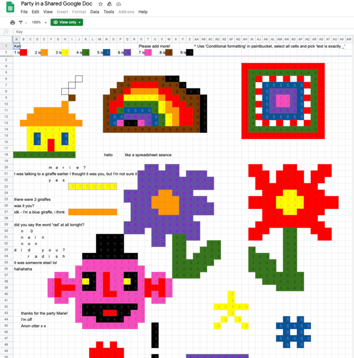

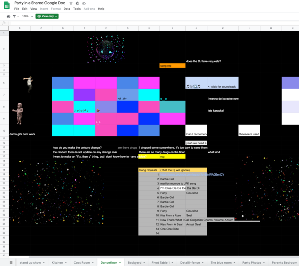

Throughout the evening, friends showed up in the spreadsheet and started inventing ways to interact with each other using just their cursors and entering values and formatting on cells. They created artwork together, made games, and even held a spreadsheet dance party.

Using the spreadsheet in this way is different from a chat room or group message on an iPhone. It hijacks the "x,y" of the columns and rows to create a spatial interface where your cursor indicates your attention area. You can't see what's happening in the other rooms (tabs) of the document. As you are typing something into the spreadsheet, your focus is limited to current and nearby sheet locations.

> I stop and type to someone in a nearby cell. My cursor is blue, theirs is orange.... I have no idea whether they are a close friend or a total stranger. How do you hold yourself, and what do you say to someone when personal context is totally stripped away?

I had a similar experience collaborating in real-time with [Micah Walter](http://micahwalter.com/?ref=davidnunez.com) on a Google Spreadsheet back in April. We were doing things like leaving comments next to each others' cursors to create conversation threads _in situ_ and blinking the highlighter to call attention to parts of the document. We used Slack as a backchannel even though Google has a chat window built into the spreadsheet. This space felt unique. It was like we were standing inside a shared whiteboard. We were dancing with each other on top of data.

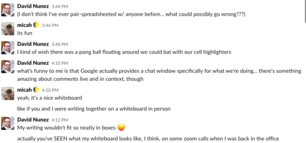

Other people encode culture in spreadsheets. Tatsuo Horiuchi [creates intricate Excel spreadsheet paintings](https://mymodernmet.com/tatsuo-horiuchi-excel-spreadsheet-paintings/?ref=davidnunez.com) by manipulating each cell's color shading in an Excel file.

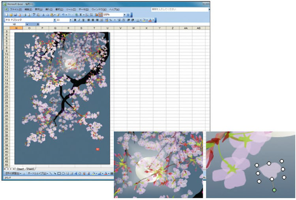

Similarly, Danielle Aubert published "[16 Months Worth of Drawings in Microsoft Excel](http://www.danielleaubert.info/index.php/16-months-worth-of-drawings-in-microsoft-excel/?ref=davidnunez.com)," a book of her abstract artwork on top of spreadsheets. It's fascinating to me that spreadsheets, as initially conceived, were a replacement for paper ledgers. Now, artists are fixing spreadsheets back into permanent, physical forms.

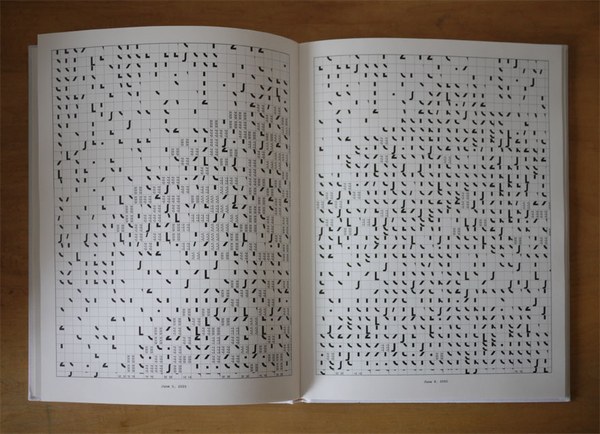

Spreadsheets encode metadata about culture, also. I think about this in my work at MIT. Data projects often use tables of data as the common denominator for telling stories. Museums post data about their collections in `CSV` files which we can open using spreadsheet software. (Examples from [The MET](https://github.com/metmuseum/openaccess?ref=davidnunez.com) and [WCMA](https://github.com/wcmaart/collection?ref=davidnunez.com))

[Chad Weinard writes about Data as a Medium](https://medium.com/@caw_/data-as-medium-361814dba6a9?ref=davidnunez.com):

> Collection objects connect people across time. What separates the Picasso from the flea market find is the context, the stories, the connections, the impacts associated with an object accumulated over years. Even while resting in storage, a digitized object can be useful, inspire, circulate in culture, motivate new stories. This is the life of an object, and museums must take pains to preserve that life alongside the object itself. Such is the opportunity for collection data.

If spreadsheets shape the way we think, that includes the way we create and talk about artwork, as well. Spreadsheets influence our social interaction and help us make meaning with each other.

## Spreadsheets Facilitate Social Action

Spreadsheets democratize the computational playing field, so they can also be a tool for commentary and social action. Michelle Millar Fisher created a Google Spreadsheet, [Arts/Museum Salary Transparency 2019](https://docs.google.com/spreadsheets/d/14_cn3afoas7NhKvHWaFKqQGkaZS5rvL6DFxzGqXQa6o/htmlview?usp=sharing&sle=true&ref=davidnunez.com), to illuminate pay disparity in the field. Museum people voluntarily contributed over thirty-three hundred rows of job salary data to the document. When you analyze the rows in the spreadsheet, you'll find unpaid internships alongside $300K curator salaries. The aggregation of data in this collective effort has become a crowdsourced tool that might empower staff to organize for better pay and compensation.

There are microstories in the spreadsheet, as well. On row 2453, you'll find the entry for an Associate Curator at MoMA PS1 with a starting salary of $90K. There is a curious note in column H, "Never started - job offer illegally rescinded."

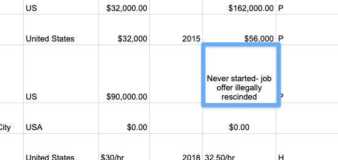

This entry refers to [Nikki Columbus and her pregnancy discrimination case against MoMA PS1](https://nytimes.com/2019/03/26/arts/design/moma-ps1-settles-with-curator-who-said-giving-birth-cost-her-job-offer.html?ref=davidnunez.com), its chief curator, COO, and Director. When you start unpacking the figures in the table, perhaps a spreadsheet is a small step towards normalizing the discussion of injustice.

In his essay, "['Real' Programming Is an Elitist Myth](https://www.wired.com/story/databases-coding-real-programming-myth/?ref=davidnunez.com)," Paul Ford talks about a mutual-aid group his spouse helps plan to keep their community fed during the COVID-19 crisis. Much data needs managing and analysis to coordinate food pantries, volunteer schedules, and the myriad logistics of preventing neighbors from going hungry. This data needs to remain private and secure. If the system breaks down, people don't eat.

Complex data and complicated workflows were once impossible to manage without software developers creating specific tools to solve problems. Instead, the group uses a spreadsheet system called Airtable to remain organized.

> When people build their own Airtable to feed the neighborhood, that's culture.  
> No one owns their network, although the data lives on servers controlled by Airtable.  
> If you do it long enough and work with friends, you can do wonderful things.  
> That's real programming.

Margaret Howie [created a spreadsheet](https://medium.com/@infamy_infamy/take-this-spreadsheet-save-the-world-a-tool-for-unsure-activists-30fcdba7117a?ref=davidnunez.com) to help activists make plans necessary to achieve their social aims. It includes a template to organize SMART goals, objectives, and next actions.

It is unique among productivity tools because it also encourages consideration of Big Questions, personal inspiration to help activists persevere through challenging fights, and a confrontation with discomfort, all measured through rows and columns.

> While your mental and physical health is always top priority, your comfort isn't. Worthwhile change comes out of enduring all kinds of irritating and tiresome situations.

Sometimes the tool can embody social action. Open up a fresh Google Sheet right now. When you spell out "Pride" on the top row of any Google Sheet (one letter per column), you will see a rainbow. Some anonymous programmers added this to Google Sheets in 2013, where it has remained seven years later. That says something.

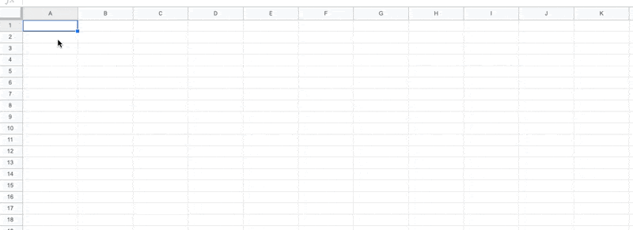

It's crucial to consider spreadsheets' origins and their current impact on our society. New data tools are emerging to satisfy business needs. Techniques like machine learning and no-code data workflows take root in industry and then start making their way into our social and cultural practices.

We need to understand who builds these things and why.

We need to know today's emerging technology that future society will consider as revolutionary as spreadsheets 50 years from now.

## Abandon All Hope ye Who Enter (Data) Here

I buckle down my helmet as I sit on the structure in `A2`, inducing hyperoxygenation. People warned me not to attempt this dive. Every expert believes it is unsurvivable, even for a seasoned spreadsheet jockey like myself.

To get to this point took hundreds of hours of corporate training and decades of data entry. I am among a small number of people in the world who practice the controversial sport of spreadsheet diving.

I got interested in competitive spreadsheets through data untangling events, but I quickly grew tired of that tedium. Creating beautifully organized spreadsheets came easily to me. When it was no longer challenging, I needed a new fix.

These days, pushing spreadsheet boundaries makes me who I am. When I'm deep in a spreadsheet, I feel alive in ways no mathematics could model. There, among the rows and columns, I can push myself and my formulas. I believe if I die inside a spreadsheet, then at least I'll leave behind a glorious sheet in my wake. It'd be my gridded memorial.

I can't afford to think this way, right now, though. I am determined to break the world record, leaving my edits in the great workbook filled with the divers before me.

I peek over the edge into column `B`. I'm not sure what I was expecting to see. The bottom of the spreadsheet, of course, is well beyond the computation horizon. I give my support team a thumbs up. They salute back. I step off the platform with my right arrow key, and my voyage begins.

The first rows of the spreadsheet fly by very quickly. In these early moments, I take the time to check out all of my systems where it's still easy to change format columns and test formulas with minimal undos. Here, it's safe to use the Page Down key.

Nevertheless, I always pause my scroll on Row `2048`. On the side of the data wall, there are scratches of a final message from a programmer, "Here be Dragons."

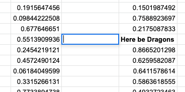

Nobody knows who she was. The sheet has long ago filtered out her memory. We've named her cell "Lotus," and she offers a warning for those trying to go too far. Our tradition is to call out "1-2-3" as we touch the text when we pass by. I resume my descent.

Numbers scroll by me as I float downwards. I used to memorize them during practice runs to pass the time, but somebody turned them into `=RAND()`'s and now they're always changing. I like it better this way. It keeps me on my toes.

I enter the midnight zone of the spreadsheet, reaching depths in which sunlight cannot penetrate. I turn on my highlighter so I can see around me. The bright yellow light brings me focus.

The support team floats at various rows along my way. They've set up conditional formatting based on complex `=IF()` formulas that consider all the variables in the sheet cells. They flash green at me when I'm still within safe boundaries. Red means stop. On this day, it's green all the way down.

Once, during a relatively shallow practice dive, I accidentally opened up a new tab and lost myself in an empty table. I had no way of referencing my teammates back on the other sheet. It was the one time where blank sheet syndrome made me fearful. It took many technical support calls for the team to figure out how to pull me back on the original tab. I owe my life to them on every one of these dives.

They are like family. They are also my enablers.

I briefly turn over towards the column headers and see the safety divers slowly fade away as I find myself below their comfort rows. I wave at them, but I doubt they could see me at this depth.

Soon I am alone.

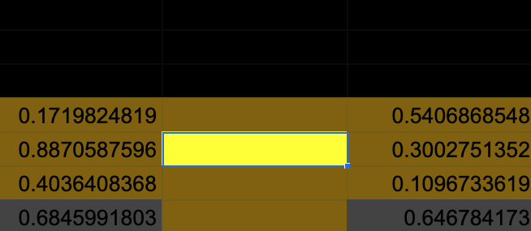

Somewhere around row `129418`, the edges of my vision begin to pixelate. I see pivot tables appear in my peripheral vision. I know these are hallucinations. Pivot tables are the nightmare that the oldtimer jockeys claim they've employed but can never accurately describe. For me, pivot tables are mermaids that want to pull me off course into an abysmal complexity. I leave them behind.

An hour or so later, I look over at the row header and read `140502`. I just broke the record. The plan is to signal my status to the team at `C1` and then begin my slow ascent. If I were to climb too quickly, the undo buffer would overflow, and I will drown before reaching the surface. "The Bends," they call it. Nobody wants to see the gridlines when they bend.

I have a different idea, however.

I clear off my cell value and continue further down. By the time my friends on the surface realize what I've done, I should already be at the bottom. I am too close to return now.

The system is straining under the pressure of a spreadsheet this deep. Every new cell takes longer to render. Nobody anticipated the software would need to support a dive like this, and the laptop fans are screaming in an attempt to give me air. I continue, my every muscle pounding. It feels like someone has set up freeze panes all around me.

I find myself one cell away from the bottom row. The alert box appears, warning me that I've exceeded the maximum number of cells. I dismiss it and attempt to touch the floor again. The alert reappears. We spar on top of the data for many hours, my every attempt repelled.

By now, my team is weeping over my fate.

Time means nothing anymore as I push the Down Arrow key again and again. My vision begins to constrict to a pinpoint. I push one final time, and the cell wall suddenly collapses beneath me.

All is quiet in my final cell. I am alone with my slow breath. The lines around me melt into an inexpressible tapestry of color and strings and numbers. I am now the one weeping, knowing how foolish I was to think I could create a model for this infinite beauty.

I feel the `=RAND()` creep into the formula bar. Before I shut down, I scratch into the adjacent cell, "I am the Dragon."

Then I sink further, beyond the edge of the spreadsheet.

David Nuñez

* * *

## Coda

* [A website that will help you generate an excel spreadsheet from a digital image](http://www.think-maths.co.uk/spreadsheet?ref=davidnunez.com), [a gallery of Google Sheet artworks](https://www.sheet2site.com/art/?ref=davidnunez.com), and [more about making your own excel art](https://mymodernmet.com/excel-art/?ref=davidnunez.com).
* Here is Dan Bricklin talking about spreadsheets during [his TEDxBeaconStreet talk](https://www.youtube.com/watch?v=YDvbDiJZpy0&ab_channel=TED&ref=davidnunez.com) and his [personal site with Visicalc stories](http://www.bricklin.com/history/sai.htm?ref=davidnunez.com).
* Programmers of Microsoft Excel notoriously embedded 3D video games inside the program.
* A hacker going by the name s0lly took this a step further and created a 3D engine using cells as pixels.
* The maximum size of a Google Sheet is 5 million cells. An Excel spreadsheet can by 1,048,576 rows by 16,384 columns. I challenge you to find out what lies beyond those constraints.

* * *

_I listened to [Grid](https://open.spotify.com/track/4S5YsUSBkFWOgbtxb6jTjf?si=f9HbSqkkQ-63V6pfMG21pA&ref=davidnunez.com) by Perfume Genius while writing this newsletter. [Learning](https://open.spotify.com/album/4PWFQia8JgPaWomVti8Rmh?si=ZQXJARrVStuXtwEPjv_V6Q&ref=davidnunez.com) makes a good soundtrack for a spreadsheet dive, also._

_Thanks to [Andrea Ledesma](https://twitter.com/am_ledesma/status/1303483166657843201?s=20&ref=davidnunez.com) for "Abandon All Hope ye Who Enter (Data) Here"_
