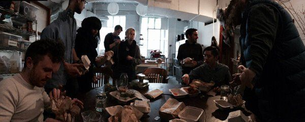
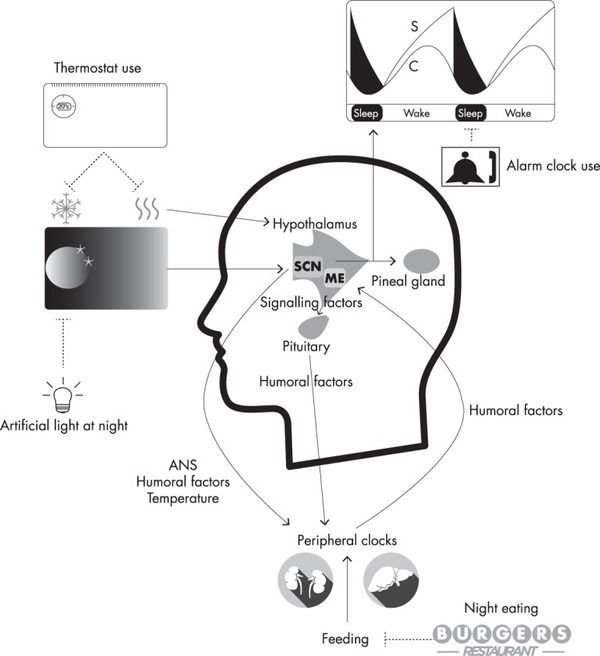
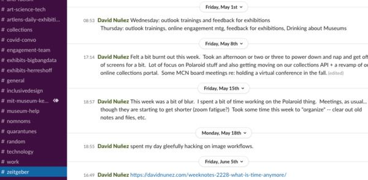

---
tags:
  - posts
  - output/newsletter
id: 65ac4ceb0e7c79000119aba9
title: Time is Weird in 2020
feature_image:
description: Time is weird in 2020, wouldn't you agree?
date: 2020-09-17
full-date: 2020-09-17T21:44:00.000-04:00
slug: time-is-weird-in-2020
type: post
draft: false
episode: 6
---

Time is weird in 2020, wouldn't you agree?

I've been thinking a lot lately about a practice I learned from my friend, [Jamie Zigelbaum](http://jamiezigelbaum.com/?ref=davidnunez.com), when we were working together at his studio in the, to put it mildly, "chimeric" building at [33 Flatbush Avenue in Brooklyn](https://www.nytimes.com/2011/01/12/realestate/commercial/12incubate.html?ref=davidnunez.com).

In the late afternoon, every person at the company stopped work for a few minutes to write up a note about the day. We'd post these notes in an email thread or Slack channel, and they were as honest, personal, and transparent as they could be in a quasi-public forum. We'd read them privately, and mine would always run too long.

The exercise wasn't really to communicate official progress or hold each other accountable, though maybe it did those things in some small way.

We just wrote whatever happened to be at the front of our minds. It was mostly about work projects, like notes from client interactions or milestones met. Sometimes we just shared interesting bits of trivia we'd have stumbled on in our travels through the internet. It was a daily ritual of reflection. It marked the time.

When you get a large group of people in a noisy Brooklyn office working on a dozen different projects, the pace of activity can feel frenetic. Time moves so quickly in an environment like that. With so many pressing deadlines, it may seem counterintuitive for everyone to stop working to pass little notes to each other.

It was an intentional act where we all paused our client projects so we could breathe and reflect. There's a mild sprinkling of mindfulness in this act, of course.

We had other ceremonies, also, like Burger Friday, that marked the end of the week. Parties on the rooftop seemed to correspond with changing seasons. I miss those quite a lot, as well.

The daily writing exercise, though, still sticks with me the most. I realize now that the words inside those notes weren't consequential. It was the communal ritual that mattered. It's not _what_ we were writing but that we were writing at all. More importantly, we were all writing _together in synchronisity_. These moments of reflection were important for keeping our hearts beating a steady pace. It was [entrainment](https://www.sciencedirect.com/topics/psychology/entrainment?ref=davidnunez.com).

Blip blip. Write & Send. Blip blip. Write & Send. Blip blip.

We called this ritual "**zeitgeber**."

## Internal Clocks and External Stimuli

"[Zeitgeber](https://en.wikipedia.org/wiki/Zeitgeber?ref=davidnunez.com)" in German translates roughly into "Time Giver." [Jürgen Aschoff](https://en.wikipedia.org/wiki/J%C3%BCrgen_Aschoff?ref=davidnunez.com) coined the term as part of his work, establishing the field of chronobiology. Zeitgeber refers to stimuli in our environment that help regulate our circadian rhythms. The sunrise/sunset, train commutes (when we used to do those), Friday afternoon happy hour, and your iPhone alarm clock are all zeitgebers.

These environmental influences work at scales longer than 24-hours, also. The weather in Boston is in that weird phase shift, where summer is fighting to remain relevant. New England autumns are gorgeous; I love the way the air smells like chimney smoke. That's coming soon.

I wonder what autumn smells like through a mask?

In Cambridge, we also know it is autumn by the sudden influx of hundreds of thousands of students returning to the area's 60+ universities. The population dramatically changes here, and you can _feel_ it. In 2020, most students stayed home this year or are re-defining "off-campus" by taking their semester in [rented houses in places far from New England like Hawaii](https://www.nytimes.com/2020/08/28/style/college-collab-houses-coronavirus.html?ref=davidnunez.com). I don't think [leaf peeping](https://en.wikipedia.org/wiki/Leaf_peeping?ref=davidnunez.com) is quite the same in Honolulu, for the record.

My calendar says my birthday is next week. That zeitgeber brings the yearly reminder of everything I've not accomplished and how little time I have left. Anne-Laure Le Cunff calls this "[Time Anxiety](https://nesslabs.com/time-anxiety?ref=davidnunez.com)":

> It's an obsession about spending your time in the most meaningful way possible. And when society tells us—or when we interpret signs from society as saying—that it's too late to achieve a particular goal, we don't perceive it as meaningful enough. We need—we demand—that what we do with our lives actually matters.

Time anxiety is no joke, and in 2020, time feels incredibly strange. Sure, I've taken on the COVID hobbies of pasta making and newsletter writing, but it's almost October, and I don't know what I've done with the past nine months.

We're experiencing [time compression and expansion simultaneously](https://www.scientificamerican.com/article/a-monday-is-a-tuesday-is-a-sunday-as-covid-19-disrupts-internal-clocks/?ref=davidnunez.com).

> These perceptions may be attributed to a tug-of-war between two concepts: [retrospective and prospective time](https://www.sciencedirect.com/science/article/abs/pii/S0001691813002515?ref=davidnunez.com). Dan Zakay, a professor at the Baruch Ivcher School of Psychology at the Interdisciplinary Center Herzliya in Israel, explains that retrospective time perception evokes the recollection of past events and how long they lasted. Prospective time involves judging the duration of an event at the present moment.

You're not alone when you notice the weeks are flying by, but the minutes last forever.

[COVID-somnia](https://journals.lww.com/neurotodayonline/Fulltext/2020/07090/Sleep_Neurologists_Call_It.1.aspx?ref=davidnunez.com) keeps us up at night because our circadian cycles are [disrupted](https://assets.researchsquare.com/files/rs-27400/v1/c4722e39-f542-4730-a2af-b518f4f22591.pdf?ref=davidnunez.com), further scrambling the days and weeks. There might even be weird links between the COVID-19 virus and circadian rhythms. [The time of day someone is infected affects how the virus progresses](https://www.biorxiv.org/content/10.1101/2020.09.09.290718v1?ref=davidnunez.com). It mainly concerns me when our daily habits are all over the place, and sleep hygiene is difficult to maintain.

During the lockdown, we lost many zeitgebers at once. We are reckoning with a complete reconfiguration of the workweek and workday. I no longer need to constrain my focus to set hours. My work time intermingles with the rest of my life fluidly. Our commutes no longer bookmark our workdays. We spend our weekends in the same places as our weekdays.

Some people say that they need to stick to artificial routines to remain productive and sane when all the other cues around them have collapsed. "[The morning routine](https://www.google.com/search?q=productivity+morning+routine&ref=davidnunez.com)" is standard fare among the productiviata and all the YouTubers who are dispensing advice about how to Get Things Done During a Pandemic™.

A colleague of mine has a series of recurring weekly meetings for distinct projects. She says that she knows the day of the week based on the topics of the meetings. Her Zoom windows are her zeitgeber.

I start my workday at a mostly regular time every morning, albeit earlier without my bus/subway commute. I don't work on the weekends. Of course, even before 2020, there never was a reason for me to maintain a 9-5 schedule. Nobody forced me to travel to a physical building for 40 hours a week to provide value to my colleagues and advance our organization's mission. I'm lucky that I have a mostly location-agnostic job and seem to work more productively when I can regulate my isolation and interaction with colleagues through Zoom windows.

I've thought that even when everyone "goes back," time will still be weird, and maybe we'll spend as much of it working from home as working from work. I may never go back to an office.

I find a lot about that appealing. I'm going to need to find better ways to keep a beat, though.

## Writing as Zeitgeber

Ever since my time in that studio in Brooklyn, I've been keeping a private log where I write a daily note to myself as a zeitgeber every afternoon. Mine looks a little like a work journal; it's short and sweet and often filled with non-sequiturs. Sometimes I skip a month. Sometimes it's just three words and an emoji. Often it's a number in a habit tracking spreadsheet. It doesn't matter whether I keep my zeitgeber in a written journal, [Day One](https://dayoneapp.com/?ref=davidnunez.com), or even some other [notetaking app](https://roamresearch.com/?ref=davidnunez.com) _du jour_.  The format doesn't matter, and it isn't even so relevant what I write down as much as it is that I write it at all.

Here's one from April, seven weeks into lockdown:

> Met with a colleague in France re: games as a co-creation tool. MMT meeting discussing Polaroid Online and Kendall Exhibition feedback. Met w/ Emily and Lindsay about a couple interactives in the new museum. Listened in on the technical lighting conversation. Did some work for Drinking About Museums (next one on Thursday!) Feeling a bit worn down in Week 7. Took a power nap mid-afternoon and that helped a bit (cup of coffee before going down for 23 minutes... wake up to the caffeine boost, as well)

For me, the writing ritual is grounding. I give myself a sense of cadence, regulated by a small moment of thinking and writing. It is an action entirely under my control rather than something I can't alter, like a sunset.

...or a coronavirus.

At the studio, our zeitgeber writing practice had the ultimate effect to create entrainment among our team. Like fireflies synchronizing their blinks, we reset ourselves on a regular beat through this ritual. It's helpful for me to keep my private zeitgeber going, but I miss the part where I share these thoughts with peers and friends. Zeitgebers work better for me when I can keep time with others.

I've tried a few things to get this feeling back.

When I first started at the museum, I would send weekly summaries to my colleagues, including a section of interesting links or my pontification on some museum technology ideas. They were a lot like newsletters. I didn't keep it up because I was doing it alone.

Then there's Twitter. My words there are like fireflies in a forest. Lit for a nanomoment and then off. Then on again somewhere else altogether. Every once in a while, a person or two or fifty likes or replies to one of my tweets. We entrain around an idea, and time stops. Then we get out of sync, and I'm alone among the trees once again.

I created a `#zeitgeber` channel in the museum's slack workspace, and for a while, some people joined me in there, writing their own notes. It was great to sync up my heartbeat with colleagues I might not ordinarily see during the day. Then COVID-19. Habits are difficult to keep. I see my colleagues even less, and sometimes I'm a firefly blip-blipping all alone in the forest.

I tried restarting my weeknotes habit on my website this summer and even managed to keep it up for a solid six weeks. [Weeknotes](https://medium.com/job-garden/a-pre-history-of-weeknotes-plus-why-i-write-them-and-perhaps-why-you-should-too-week-16-31a4a5cbf7b0?ref=davidnunez.com) are great zeitgeber. There's a [community of weeknotes writers](https://weeknot.es/?ref=davidnunez.com), even, to help keep the beat. I have a strong sense of closure for the week when I publish weeknotes. It's been a useful marker for the weekend's start, no matter what "weekend" means these days.

I'm now at the 6-week mark with this newsletter. It's starting to feel like a time-giver for me, honestly. I know it's Wednesday because I'm desperately throwing words together, and I know it's Thursday because I'm spending too much time reading and re-reading what I've written before breaking out in a sweat as I push "publish."

It's been a joy and a COVID-coping mechanism, and I appreciate knowing maybe somebody will see my firelight through this email. Let's find out if in 46 episodes from now, I can mark a year.

If you have a newsletter of your own, please do send me the subscribe link. If not, I'd highly recommend [starting one](https://medium.com/@revue/the-definitive-guide-to-personal-newsletters-85b82ada546d?ref=davidnunez.com). I would certainly sign up, so you know you'd have at least one subscriber. (I recommend [Buttondown](https://buttondown.email/?ref=davidnunez.com); it's free and straightforward to start).

Regardless, it's going to be great entraining with you through whatever time does next. See you in the forest.

Blip. Blip.

David Nuñez

## Coda

* [Summary of many known zeitgebers](https://mybiohack.com/blog/zeitgebers-circadian-rhythm?ref=davidnunez.com) with links to the research.
* A creepy and beautiful slow burn of a short story by Greg Egan, "[Zeitgeber](https://www.tor.com/2019/09/25/zeitgeber-greg-egan/?ref=davidnunez.com)"
* A 1967 paper by Jürgen Aschoff about [human beings desynchronizing with each other](https://pdfs.semanticscholar.org/300e/270d72642fff7723b3dbd06b3af2774cff7b.pdf?ref=davidnunez.com).
* Jason Fried hates daily standup meetings so much that he [built Zeitgeber writing rituals into Basecamp as a core feature](https://m.signalvnoise.com/status-meetings-are-the-scourge/?ref=davidnunez.com).

* * *

_While writing this newsletter I was listening to "[Funny How Time Slips Away](https://open.spotify.com/track/0hXHpNiW5dHv21aUhYDEnA?si=MaCm528rQJ23C6x9e-sIHA&ref=davidnunez.com)" by Willie Nelson._

Photo credits

* Jamie Zigelbaum `#BurgerFriday`
* Potter GD, Skene DJ, Arendt J, Cade JE, Grant PJ, Hardie LJ. Circadian Rhythm and Sleep Disruption: Causes, Metabolic Consequences, and Countermeasures. _Endocr Rev_. 2016;37(6):584-608. doi:10.1210/er.2016-1083
