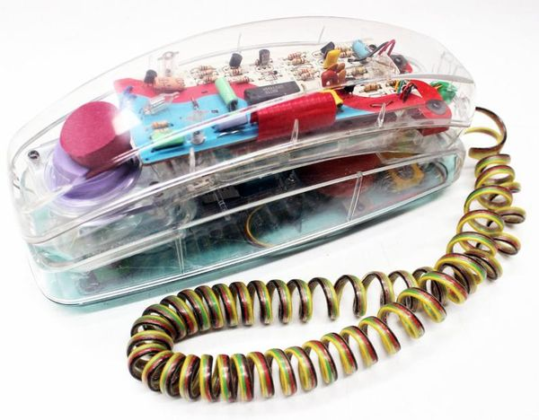
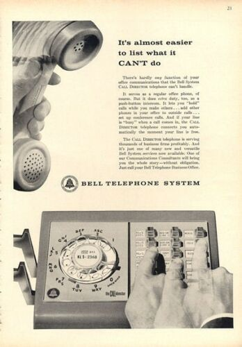
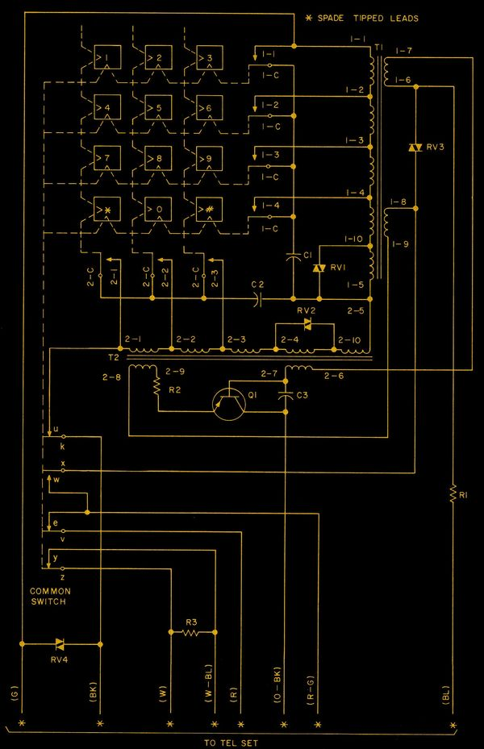
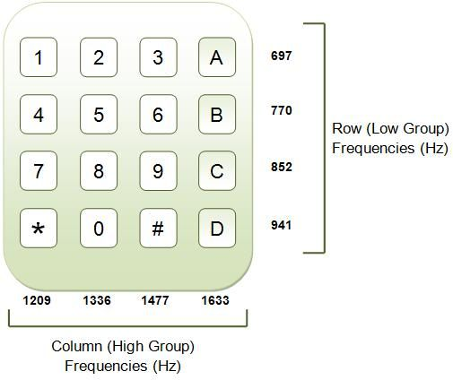
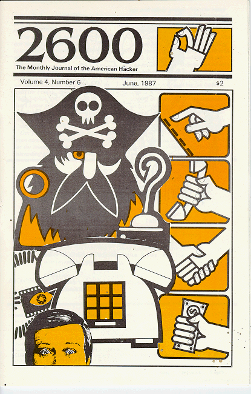
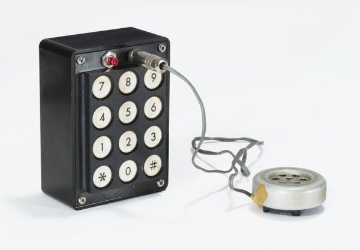
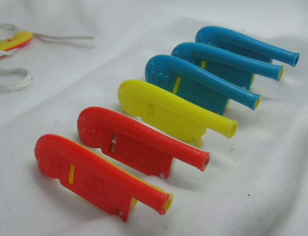

---
tags:
  - posts
  - output/newsletter
id: 65ac4ceb0e7c79000119abab
title: Press 1 to Continue
feature_image:
description: I had a meeting with a colleague a few days ago, and she requested that instead of a video chat over Zoom, we should pick up the phone and…
date: 2020-09-25
full-date: 2020-09-25T00:24:51.000-04:00
slug: press-1-to-continue
type: post
---

I had a meeting with a colleague a few days ago, and she requested that instead of a video chat over Zoom, we should pick up the phone and have an old-fashioned audio-only conversation like human beings.

Our chat turned to phone calls on landlines and what it was like when entire households shared the same phone number and the clicks of someone picking up the extension in the other room, "MOM! Get off the phone!"



She told me about her party line conversations with friends while they chatted about boys and homework on those ubiquitous 1980's clear phones. She was bubbling as she recalled, "they lit up when someone was calling!"

It was a sign of luxury (or parental capitulation) when the teenager got a separate phone line.

Of course, I certainly talked to friends for hours on the phone, but I also spent just as many hours connecting with other computers over modems. Every time I placed a call through the computer, the modem's speaker would emit a series of touch-tones, squeaks, and static that I came to recognize as my successful passing into the world of BBS's and ultimately the internet. It was soothing to hear the computers start a conversation with each other. There's a beautiful term for it. "[Handshaking](https://en.wikipedia.org/wiki/Handshaking?ref=davidnunez.com)." Hello, world.

I started thinking about the nostalgia of phones before the era of blackberries and mobile devices. We now carry supercomputers around in our pockets that we laughingly refer to as "phones." However, we still cling to a bygone era as we stroke the smooth numeric keypads on iPhones and express outdated social norms through our telephony handshakes, "Hello."

I grew up around some rotary phones, like the one at grandma's house, but I'm of the Touch-Tone generation. I can still feel the squishy buttons with their phosphorescent backlit glow on that yellow corded phone in my childhood kitchen. I still remember my first phone number because of the way it sounds. It was the melody that my fingers sang when I wanted to reach out and touch my home.

The telephony system is an incomprehensibly complex amalgam of mechanical and computerized devices spanning multiple decades of vintage. These systems intermingle fluidly, and it's often unclear where the boundaries begin and end.

Ideas travel from our brains along our nervous system to vibrate the vocal cords that push air towards a tiny magnet in our headsets. This device creates an analog signal that electronics turn into a digital sequence of 1's and 0's. The phone circuitry analyzes and manipulates these bits into a compressed stream. The now pale representation of our original idea travels over radio frequencies to cell phone towers. The real magic begins as the telephone systems route these signals across light beams in fiber optic cables and electric current through copper. Our transformed voice burrows underground, flies through the air, and bounces off of satellites in space. Sometimes it takes a journey in the depths of the ocean and impossibly emerges from the abyss to begin its metamorphosis through the systems back into electricity and sound. Our brain's neurons somehow reassemble into some simulation of a human voice.

This is what it means to "phone home."

The game of telephone is one of idea-hopping from one complex system to the next.  I often wonder what gets lost in translation.

With what am I communicating on my phone if it's not really your voice?

## Press 2 for Touch-Tones

AT&T was working on a replacement for rotary dial phones since before World War II. Their first systems involved mechanisms of vibrating reeds to signal across the telephone lines. After the war, when transistors started to see mass adoption in consumer products, electronics could be compressed and robust enough to fit inside a small telephone device.

At the 1962 World's Fair, AT&T demonstrated the first Touch-Tone interface, ushering a new era of telephone communications.

However, the new system required major upgrades to the telephone infrastructure of network switches and local exchanges, so it took a while before touch-tone phones were common in homes and offices. [Rotary phones persisted](https://www.concordmonitor.com/rotary-phone-granite-geek-science-nh-14838348?ref=davidnunez.com).

> Because of the slow rollout, regulators required AT&T, the national Ma Bell telephone network, to support both pulse and tone dialing. The regulation was carried over after the telephone system was deregulated in the 1980s but it appears to have faded away since then.



However, most telephone systems can still support dialing using rotary phones because current technology makes processing pulses inexpensive and easy.

> "I think the (equipment) companies support rotary out of inertia rather than design," said (Paul Violette, President, New Hampshire Telephone Museum).

In much the same way, touch tones persist through the 21st century. Even though Voice Over IP and mobile phones use digital dialing techniques now, they confront us with numerical keypads that harken to a day when pushbutton phones were a modern miracle. I can dial by talking to Siri, "Call Mom." However, if I call my bank, I still input my credit card using the keypad.

Touch-Tone is a brand name for a technology called Dual Tone Multi Frequency (DTMF). Here is how it works. Every row and column on a telephone keypad is assigned a tone with a specific frequency (as measured in Hz). If you hold all the keys down in a row or column in older Touch-Tone phones, you'll hear those single tones.

When you combine a row and a column and play two tones at once, you hear the discordant noise that we recognize as a Touch-tone. For example, "6" is a combination of 1477Hz and 770Hz.



Suppose you squint hard enough at this schematic of the ubiquitous 35-Type DTMF keypad (via [Telephone Collectors International](http://www.telephonecollectors.info/?ref=davidnunez.com)). In that case, you might see how the keys relate to inductors that attenuate a single-transistor oscillator to produce the dual tones. I'm not an electrical engineer. Don't quote me on this.

The [International Telecommunication Union's (ITU-T) Recommendation Q.23](https://www.itu.int/rec/T-REC-Q.23/en?ref=davidnunez.com) specifies DTMF tones. The row frequencies range from 697Hz to 941Hz, and the column frequencies are in a higher range from 1209Hz to 1633Hz. The engineers selected these values because they are not common in music or speaking, but are still within the human hearing range, which phone systems can easily support.



You'll notice that these specs allow for a fourth column. Those keys appear on telephone technicians' equipment and mean that DTMF can support 4 bits of data (i.e., a "nibble" or a half of a byte), which becomes essential in future computing innovation.

Decoding the DTMF signals involves a digital signal processing technique called the [Goertzel algorithm](https://en.wikipedia.org/wiki/Goertzel_algorithm?ref=davidnunez.com), invented in 1958. It can efficiently detect and separate the tones when determining which keys were pressed by a caller.

DTMF is an example of "In-band signaling." From [wikipedia](https://en.wikipedia.org/wiki/In-band_signaling?ref=davidnunez.com):

> In [telecommunications](https://en.wikipedia.org/wiki/Telecommunications?ref=davidnunez.com), **in-band signaling** is the sending of [control information](https://en.wikipedia.org/wiki/Control_signal?ref=davidnunez.com) within the same band or channel used for data such as voice or video.

This is the opposite of "out-of-band signaling," which uses a separate track of information to facilitate communication.

The differences between in-band and out-of-band signals are a fundamental concept for Soulful Computing. I'll explore them in detail in future episodes.

In the meantime, users of telephones get valuable audible feedback when they push buttons. It is helpful in situations where saying things like a credit card number out loud might be insecure.

It also means anything that can generate the appropriate tones over the audio channel can control the telephony system.

## Press 3 for Phreaks and 2600Hz

Joe Engressia (aka [Joybubbles](https://en.wikipedia.org/wiki/Joybubbles?ref=davidnunez.com)), born in 1949, was seven years old when he stumbled on an infamous exploit on the telephone system. He would often take comfort listening to the dial tone on his family's phone. Born with blindness, he could whistle with perfect pitch and discovered that when he whistled specific frequencies (2637.02 Hz, significantly) while on the phone, he would activate the phone switches on the network. He continued experimenting with his telephone throughout his life. He was an early hacker in the most real sense of the word, and many consider him the father of "phreaking," the subculture of technology enthusiasts who would hack telephone networks for fun.

Bill Acker, another person with blindness, was inspired by Engressia, and they connected over their love of telephone systems. Acker soon discovered he could play his recorder on the phone at 2600Hz to control the system.

Because of its association with the phreaking community, the number 2600 has reverence in the hacker community. It is also the name of the [magazine](http://2600.com/?ref=davidnunez.com) published by [Emmanuel Goldstein](https://en.wikipedia.org/wiki/Eric_Corley?ref=davidnunez.com), an influence on my impressionable teenage years roaming around on the BBS's.



Ralph Barclay read the Bell System Technical Journals in 1960 or so, and he realized he had enough information to puzzle how it might be possible to avoid using a payphone to make a call. He could use the telephone system for free. He assembled an electronic circuit inside a 12"x7"x3" metal box. The box happened to be painted blue and sang a perfect 2600Hz pitch.

The eponymous [Blue Box](https://phreaking.fandom.com/wiki/Blue_box?ref=davidnunez.com) was born, and it was used for decades by phreakers to explore Ma Bell's systems.

Steve "Woz" Wozniak and Steve Jobs infamously [started their business partnership](https://www.theatlantic.com/technology/archive/2013/02/the-definitive-story-of-steve-wozniak-steve-jobs-and-phone-phreaking/273331/Recommended?ref=davidnunez.com) selling blue boxes after Wozniak read about phreakers in [Esquire magazine](http://classic.esquire.com/secrets-of-the-blue-box?ref=davidnunez.com). One of their blue boxes recently [sold at auction for $125,000](https://www.bonhams.com/auctions/24495/lot/109/?ref=davidnunez.com) after the auction house authenticated the circuit boards and components as compared to other known Woz Blue Boxes.



_Blue Box from the collection at [The Henry Ford Museum](https://www.thehenryford.org/collections-and-research/digital-collections/artifact/452666/?ref=davidnunez.com)_

"If it hadn't been for the blue boxes, there would be no Apple. I'm 100 percent sure of that," says [Steve Jobs](https://www.goodreads.com/book/show/11084145-steve-jobs?ref=davidnunez.com).

([Here's an instagram video showing the Blue Box in action](https://www.instagram.com/p/BbuWbmSlwkp/?utm_source=ig_embed&utm_campaign=embed_video_watch_again))

Phreaks found each other on party lines and through in-person meetups. John Draper operated a pirate radio station and broadcast his telephone number on the illicit airwaves to gauge how far his station reached. Dennis Terry, a DJ and phreaker, heard the broadcast and introduced Draper to people like Joe Engressia. Draper knew how to build electronic circuits, so he helped his friends make blue boxes. He also learned from the hackers that a toy whistle found in cereal boxes could whistle a perfect 2600Hz, so he adopted the hacker name, "Cap'n Crunch."



_Captain Crunch whistles from [The Telephone Museum](https://telephone-museum.org/telephone-collections/capn-crunch-bosun-whistle/?ref=davidnunez.com)_

The community of like-minded misfits celebrated a spirit of harmless mischief, hacking, and discovery. Indeed, most of these early explorers didn't see what they were doing as criminal acts.

> I do it for one reason and one reason only. I'm learning about a system. The phone company is a System. A computer is a System, do you understand? If I do what I do, it is only to explore a system. Computers, systems, that's my bag. The phone company is nothing but a computer." Captain Crunch in Secrets of the Little Blue Box, Ron Rosenbaum, Esquire Magazine (October 1971)

Of course, the phone companies didn't see it that way, and it was an arms race involving the FBI and eventual imprisonment for many phreakers.  Some, like Acker, ended up having long, successful careers working for telephone companies.

## Press 3 for Unintended Consequences

Not all phreaking is benign.

Matthew Weigman is a legally blind phone enthusiast who participated in toxic communities on shared party lines, a forum where he felt his blindness was not a liability. Indeed, like Engressia and Acker, because he has blindness, his sense of hearing gave him an [advantage as a phreaker](http://www.davidkushner.com/article/the-boy-who-heard-too-much/?ref=davidnunez.com).

> He could impersonate any voice, memorize phone numbers by the sound of the buttons and decipher the inner workings of a phone system by the frequencies and clicks on a call, which he refers to as "songs." The knowledge enabled him to hack into cellphones, order phone lines disconnected and even tap home phones. "Man, it felt pretty powerful for a little kid," he says. "Anyone said something bad about me, and I'd press a button, and I'd get them."

Once, he randomly pushed touch-tones on his phone during a party line call and stumbled on a Moderator mode where he could access the otherwise private phone numbers of room participants.

"Now, whenever someone on the line trash-talked him, he could quietly access their number and harass them by calling them at home." (via David Kushner, "[The Boy Who Heard Too Much](http://www.davidkushner.com/article/the-boy-who-heard-too-much/?ref=davidnunez.com)")

His skills as a phreaker and [social engineer](https://en.wikipedia.org/wiki/Social_engineering_\(security\)?ref=davidnunez.com) made him an incredibly dangerous adversary. He had the uncanny ability to impersonate voices and knew enough about the systems' technical underpinnings to convince phone company employees to give him security codes. He would "[dox](https://en.wikipedia.org/wiki/Doxing?ref=davidnunez.com)" people who he perceived wronged him and launch relentless abuse campaigns. For example, he knew how to manipulate the phone systems to endlessly ring someone's phone while spoofing a different phone number on Caller ID.

His harassing behavior also included many instances of "swatting," an act of telephone fraud involving social engineering and phreak tactics to trick emergency services and police officers to respond, with guns drawn, to fake incidents at the homes of enemies. Matthew Weigman served over eleven years in prison for his crimes.

Touch-tones are involved in more subtle forms of fraud, as well. 22.8 billion total robocalls were made in the first half of 2020. These calls often start by compelling you to "Press '1' to speak to a customer service representative or Press '2' to be removed from our call list."

This is a false choice. The only way to win is not to play.

Scammers call thousands of phone numbers a day, hoping that one or two will lead to a score. They use your touch-tone response as "proof of life." When you press a key, their system learns that a human being answered at that phone number. When you prove you are real to the system, you become a hot prospect, and your phone number will be sold and resold among the phone spammers.

Consumer Reports offers this advice:

1. Hang up.
2. Do NOT press any buttons — even if it's to try to remove yourself from the company's list — as doing so may just lead the robocaller to call you more.
3. File a complaint with the FTC. You can do that online at FTC.gov or DoNotCall.gov, or by calling 1 877 FTC HELP.

In the 1980s, during Saturday Morning Cartoons, nefarious advertisers would convince children to hold their telephones up to the screen, and a series of DTMF digits would play through the tv speakers, triggering a dial sequence. The children unwittingly placed phone calls to premium-rate numbers (ex. 1-900), which would charge against the parents' phone bills. (via [Jane and Michael Stern](https://www.goodreads.com/book/show/150686.Jane_and_Michael_Stern_s_Encyclopedia_of_Pop_Culture?ref=davidnunez.com)). This was not illegal at the time, but indeed fell into a grey area of ethics.

As recently as the early 1990's, the telephone companies engaged in the shady practice of attaching a small, premium fee for "Touch-tone" features as part of a phone bill. They charged customers, despite that DTMF actually saved companies money in infrastructure and support fees. The consumer already had access to Touch-tone capability as long as they owned a phone that had a keypad. These unjustified fees [represented billions of dollars of extra profit](https://www.latimes.com/archives/la-xpm-1990-10-05-fi-1736-story.html?ref=davidnunez.com) for the phone companies. When regulators abolished the practice, the corporations lumped these charges into an increased base cost of service.

Because of their robust nature and ease of integration with already existing channels using in-band signals, DTMF tones show up in customer service lines and automatic teller machines. Governments have even considered using DTMF for [electronic voting](https://www.eac.gov/sites/default/files/eac_assets/1/28/SIV-FINAL.pdf?ref=davidnunez.com). However, these systems are far from secure. Rahul Sasi created a proof of concept [for a technique called "fuzzing"](http://www.nbcnews.com/id/49076937/ns/technology_and_science-security/t/hacked-touch-tones-crash-phone-networks-steal-data/?ref=davidnunez.com) where poorly programmed automated phone software could cause systems "to become inaccessible, or no calls from the customer go through," resulting in "a lot of panic" and a "huge" amount of damage.

DTMF can lead to unintended consequences, but I don't want to leave you with the impression that they are all unpleasant.

It's my birthday today.  Here is the score for "Happy Birthday" as provided by [Touchtone Telephone Songs](http://michaelv.org/projects/telephone/?ref=davidnunez.com).

_Happy Birthday To Me_

```
1   1   2   1   6   3-   1   1   2   1   9   6-

1   1   #   9   6   3   2-   #   #   9   6   9   6
```

Here are the Monkee's playing Touchtone Symphony on the Glen Campbell Show.

And finally...

## The Soulful Computing Helpline

I'm pleased to announce the launch of the Soulful Computing Helpline.

Call **+1 205-861-2082**

I'm not kidding. I made this thing as a birthday gift to you.

Give the operator a call. It's lonely.

Whistling at 2600Hz,

David Nuñez

## Coda

* I'm going to dedicate many future newsletters to phreaking and other early hacking culture. I've only scratched the surface in this episode, but I felt I'd be negligent not to reference it if I'm writing about touch-tones.
* In the meantime, run, don't walk to Phil Lapsley's [Exploding the Phone](http://explodingthephone.com/?ref=davidnunez.com) (formally [History of Phone Phreaking](http://www.historyofphonephreaking.org/?ref=davidnunez.com))
* I had always assumed the Atari 2600 also took its name from phreaker culture as an inside programmer joke. As I was researching this newsletter, I discovered it's more likely that it [got its numerical designation after the Atari 5200 release](https://www.gamasutra.com/view/feature/3551/a_history_of_gaming_platforms_.php?print=1&ref=davidnunez.com) (i.e., a standardization of one half of that model number).
* [An iPhone App that emulates phreaker boxes](https://apps.apple.com/us/app/phonal-tonal/id344326827?ref=davidnunez.com)
* [Touch Tone Genius](https://www.youtube.com/watch?v=nXsxokff540&ab_channel=ANDREWHUANG&ref=davidnunez.com)
* Rahul Sasi's Paper on Fuzzing, ["How I DOS'ed my Bank"](https://dl.packetstormsecurity.net/papers/attack/rahulSasiPaperDetails.pdf?ref=davidnunez.com)
* Shout out to the [New Hampshire Telephone Museum](https://www.nhtelephonemuseum.org/?ref=davidnunez.com)

* * *

_I listened to [Telephone and Rubber Band](https://open.spotify.com/track/5hZEcoqQBmDoOJIObPYnk0?si=5Y-1DfNYSQue5Lpw6AVnHg&ref=davidnunez.com) by Penguin Café Orchestra while writing this newsletter._
