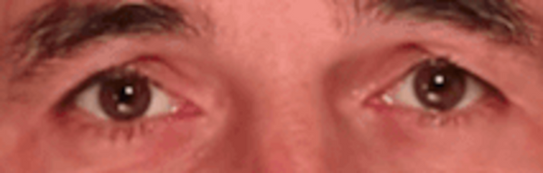
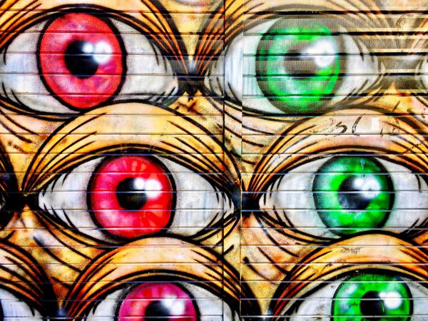
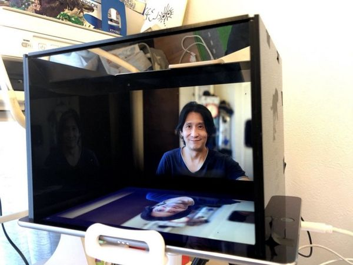
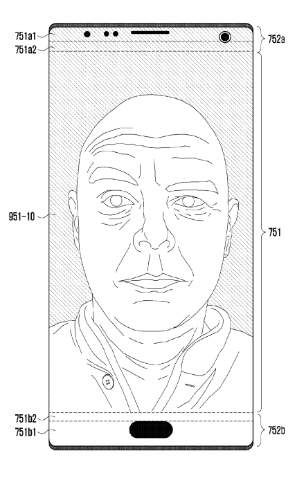
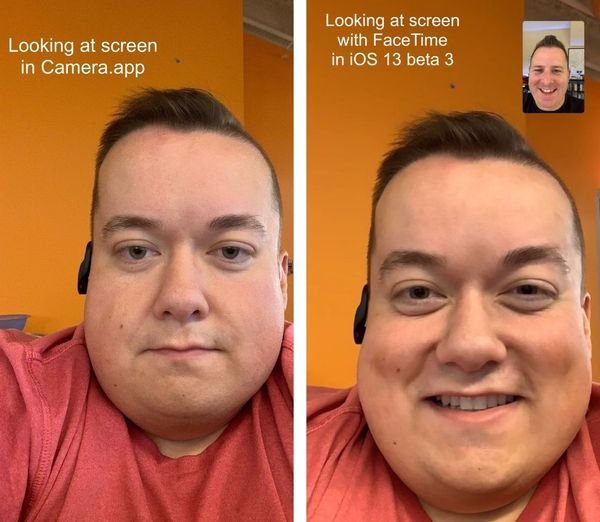
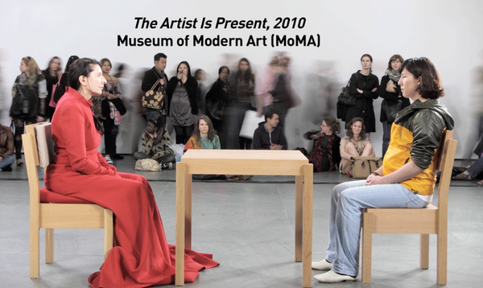
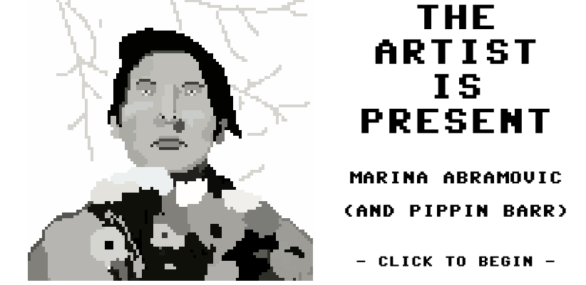
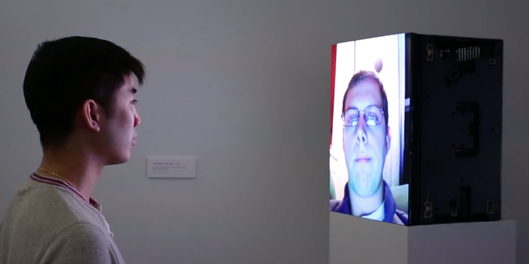
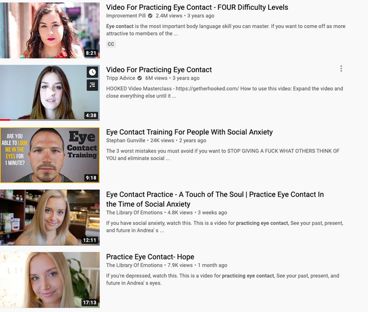

---
tags:
  - posts
  - output/newsletter
id: 65ac4ceb0e7c79000119aba6
title: Eye to Eye
feature_image:
description: Dressed in a long-sleeved, untucked white shirt, he climbs onto a platform in front of the audience. For the next ten minutes, he says…
date: 2020-10-02
full-date: 2020-10-02T01:13:51.000-04:00
slug: eye-to-eye
type: post
draft: false
episode: 8
---

Dressed in a long-sleeved, untucked white shirt, he climbs onto a platform in front of the audience. For the next ten minutes, he says nothing at all as he looks out into the eyes of his followers. Each has paid a small fee to receive this gentle, loving gaze. A woman bursts into tears, the intensity of it all overwhelms her.

After this first of many gazing sessions, he retreats backstage to recharge. In this interstitial, facilitators guide the acolytes through meditation and healing sessions. Someone stands up to testify that they no longer suffer from chronic back pain. A woman tells the crowd about how the gaze will open their minds to new realities.

All the answers lie inside his gaze. The man in white returns and stares again. He never speaks. This ritual repeats all day.

He is Josip Grbavac, a Croatian faith healer. However, when he stares into your eyes, he becomes [Braco the Gazer](https://www.braco.me/en/?ref=davidnunez.com), and during COVID-19 lockdown, he took his healing [practice online](https://www.youtube.com/watch?v=dX8gTveyCGY&ab_channel=BRACOofficialchannel&ref=davidnunez.com).

Every 30 minutes, Braco appears on his [YouTube live stream](https://www.youtube.com/watch?v=dX8gTveyCGY&ab_channel=BRACOofficialchannel&ref=davidnunez.com) and begins an unblinking gazing session over sweeping orchestral music.

I've watched a few of these.

I'll be honest. The video stream is quite weird, but I also find it surprisingly soothing. I should point out that Braco the Gazer is doing this for [free for the next five days](https://www.youtube.com/watch?v=dX8gTveyCGY&ab_channel=BRACOofficialchannel&ref=davidnunez.com) if you want to take a "look" (ahem) for yourself.

I have no way of knowing if he's actually there, streaming live or if I'm only watching a recording. That's fascinating to me. Does it matter if he is real or not? How much of the energy of his gaze gets lost in the video translation?

Of course, I don't think Braco's eye contact has any healing powers, but I certainly sense something humane embedded in his stare. Is it real?

They say that the eye is a window to the soul. What portal are we traveling through when we stare into these virtual eyes?

## Look Into My Eyes

Eye contact has profound physiological and psychological effects on humans. We [pay more attention to other people](http://www.tandfonline.com/doi/abs/10.1080/13506280444000157?journalCode=pvis20&ref=davidnunez.com) when they are looking at us. We tend to [learn better when we see that someone is watching us](http://eric.ed.gov/?id=EJ223946&ref=davidnunez.com). Most people [can tolerate 3.2 seconds of eye contact](http://www.scientificamerican.com/article/eye-contact-how-long-is-too-long/?ref=davidnunez.com) from a stranger before it gets too weird. Excessive staring can trigger [self-conscious shame and anxiety](http://isiarticles.com/bundles/Article/pre/pdf/39234.pdf?ref=davidnunez.com) in some people. Staring can be aggressive and exceedingly hostile, especially for [people who might have borderline personality disorders](https://www.ncbi.nlm.nih.gov/pmc/articles/PMC3427787/?ref=davidnunez.com).

And yes, gazing can even be therapeutic as patients trust a doctor more if there is [appropriate eye contact during a session](https://www.ncbi.nlm.nih.gov/pubmed/7410567?ref=davidnunez.com), thereby making treatments more effective.

It turns out that [even images or drawings of isolated eyes](https://www.sciencedirect.com/science/article/pii/S1090513810001248?ref=davidnunez.com) rather than the eyes of an actual person can have the same effects.

We use eye contact and numerous other channels like body language and pheromones to [establish social communication with others](https://www.frontiersin.org/articles/10.3389/fpsyg.2019.01262/full?ref=davidnunez.com). Our brains are continually observing and analyzing social dynamics and cues when in conversations with others. For example, you know when you've lost someone's attention when their eyes wander, and if you are skilled at reading signals, you might adjust your speaking pattern in response.

However, eye contact is strange and difficult to achieve using videoconference software. Zoom meetings are inhumane because when you look into a colleague's eyes, there is no biological feedback. Neither of you modulates your behavior. They have no idea you are gazing.

You could stare, unblinking at their eyes for the entire hour-long meeting and they'd never know.

Don't make a habit of this, by the way. It's creepy and stressful. I empathize with Lilah Ramzi when [she writes](https://www.vogue.com/article/zoom-video-chat-eye-contact?ref=davidnunez.com):

> When I returned (my eyes) to the screen, back on the virtual eyes of one of my colleagues, I felt a pang of extreme discomfort. At that very moment, they could see me, seeing them, and the connection was too much for me to handle.  
> The sequence of faces is different for every respective user but even with the anonymity, it still feels like a staring contest with whoever you've decided to lock eyes with.

Because we can stare at others without consequence, I think we assume that other people are staring at us in return. The reality is, like in real life, nobody is watching us as much as we imagine they might be.

When we have our camera feed on the screen in a Zoom call, like a mirror, we are probably looking at ourselves a lot more than others look at us. Cyberpsychologist Andrew Franklin says because we different conversational signaling online, [we behave unusually in our virtual meetings](https://www.insider.com/why-you-stare-at-yourself-zoom-calls-psychologist-2020-4?ref=davidnunez.com):

> In real life, when you talk to someone, you aren't also seeing yourself. But on a video chat, as you talk, you're watching yourself vocalize the words and react to what other people are saying. As you're seeing yourself, you're beginning to wonder how others see you too, and that, combined with the pressure of prolonged eye contact, can be exhausting. Sometimes people even feel like they have to perform over-the-top reactions in order to prove they are present and listening.

[Recent research from Tampere University](https://www.sciencedaily.com/releases/2020/04/200423130442.htm?ref=davidnunez.com) in Finland confirmed that we have similar biological responses to eye contact over a video conference as we do when we look into the eyes of someone in person.

Specifically, your galvanic skin response, measuring arousal, is heightened when looking someone in the eye. In other words, you sweat more when you make eye contact with someone.

Interestingly, this reaction only happens in a videoconference when you think you are in a live conversation. If you believe you are watching a recording, then you don't have the sweat response.

Muscles in your face also involuntarily twitch when you make eye contact over Zoom, the same way as when you are communicating in physical spaces. The sweat and muscle twitch responses are ways researchers know that you are having some kind of emotional response to the eye contact even though it's only pixels on a screen.

Researchers [have also shown](http://www.fau.edu/newsdesk/articles/virtual-communication.php?ref=davidnunez.com) that if you think you are watching a live video stream, you are more likely to pay attention to the speaker's whole face, especially the eyes. However, if you are watching a recording, you will tend to fixate on someone's mouth.

> "Because gaze direction conveys so much socially relevant information, one's own gaze behavior is likely to be affected by whether one's eyes are visible to a speaker," said Kleiman, first author. "For example, people may intend to signal that they are paying more attention to a speaker by fixating their face or eyes during a conversation. Conversely, extended eye contact also can be perceived as aggressive and therefore noticing one's eyes could lead to reduced direct fixation of another's face or eyes. Indeed, people engage in avoidant eye movements by periodically breaking and reforming eye contact during conversations."

I take this all to mean that eye contact in a videoconference is real as long as you believe it's real.

Braco makes me sweat, is what I'm trying to say.

## Look, But Don't Look

Videoconference calls can also disrupt eye contact because of something called parallax. The camera on your laptop or cell phone is usually at the edge of the screen. This positioning means if you are looking at the faces in a zoom window, you are not looking at your camera's lens. To the other people in your meeting, you are looking away from them, so you avoid eye contact.

There are ways to mitigate this. The standard advice is to train yourself to stare into the camera lens when you are speaking. Unfortunately, this means you won't be able to see the other meeting participants' faces and reactions as you talk, defeating the purpose of a video chat.

Many people have constructed [teleprompter-like](https://medium.com/@mask303/diy-device-for-video-conferencing-that-achieve-eye-contact-cb393edb4401?ref=davidnunez.com) boxes to [correct for camera placement](https://hackaday.com/2020/05/29/two-way-mirror-improves-video-conferencing/?ref=davidnunez.com). These techniques seem cumbersome and also might make it difficult to collaborate on shared documents or engage in meetings with more than 2 participants.

You could also embed a camera inside the display and use small gaps in the screen to expose the lenses. This way, when you stare at the pixels on the screen, you are also looking into the camera. Samsung even has a [patent for this technology (pdf)](https://nl.letsgodigital.org/uploads/2018/01/nieuwe-smartphone.pdf?ref=davidnunez.com). This approach would require significant tweaks to hardware to work, however.

Both [Microsoft](https://www.xda-developers.com/microsofts-eye-contact-feature-goes-live-on-the-surface-pro-x-to-keep-your-gaze-focused-in-video-calls/?ref=davidnunez.com#:~:text=Microsoft%20announced%20today%20that%20its,of%20the%20Surface%20Pro%20X) and [Apple](https://www.idownloadblog.com/2020/07/02/facetime-eye-contact-correction-tutorial/?ref=davidnunez.com) recently announced a different solution. The software uses computer vision and artificial intelligence techniques to digitally alter your face so that it appears you are looking directly into the camera, even when you are not.

Initially, Apple creepily named their system "FaceTime Attention Correction."

We are already using lighting effects, beauty filters, and virtual backgrounds in video calls to present an alternate reality to others. However, I wonder if we are going too far allowing AIs to rewrite reality by changing a person's gaze. This is concerning given how much we communicate through our eyes.

What makes for an authentic human interaction when we can't trust what our own eyes are seeing and _saying_?

What is real anymore? I'll ask Braco.

Rather, I'll stare into his eyes for all the answers.

See you soon,

David Nuñez

* * *

## Coda

* For people with blindness, video conferencing brings its unique challenges. Here are resources from the [American Foundation for the Blind](https://www.afb.org/about-afb/events-and-awards/afblc-2020-overview/virtual-afblc/remote-instruction/resources?ref=davidnunez.com).
* An Indonesian YouTuber has over 3 Million views of his [staring into the camera for two hours](https://www.youtube.com/watch?v=x8zFL-0rBAw&ref=davidnunez.com). "You all can decide for yourself whether this video is useful or not. Have fun watching!" he joked.
* In 2010, artist Marina Abramović created a performance at MoMA, [The Artist is Present](https://www.moma.org/learn/moma_learning/marina-abramovic-marina-abramovic-the-artist-is-present-2010/?ref=davidnunez.com). She sat in the middle of a gallery during opening hours and invited museum visitors to [line up and gaze into her eyes](https://vimeo.com/72711715?ref=davidnunez.com).

* In 2011, Pippin Barr created an [online version of the full The Artist is Present experience](https://www.pippinbarr.com/2011/09/14/the-artist-is-present/?ref=davidnunez.com) that is only available during regular museum hours. It simulated the ticket desk, incessantly long wait times, and even recreated a few artworks hanging on the wall. [Here is a walkthrough](https://vimeo.com/83378824?ref=davidnunez.com).

* Fascinating documentary about the making of [The Artist is Present](https://www.imdb.com/title/tt2073029/?ref=davidnunez.com)
* Jamie Zigelbaum's [Doorway to the Soul](http://jamiezigelbaum.com/doorway-to-the-soul?ref=davidnunez.com) (2015) "is a digital sculpture that displays the faces of mechanical turk workers as they are recorded. These workers are paid $0.25 to stare into their webcam for one minute."

* There are dozens of YouTube videos of people staring into the camera intended to help viewers [practice eye contact](https://www.youtube.com/results?search_query=eye+contact+practice&ref=davidnunez.com). Like this [one](https://www.youtube.com/watch?v=nsQYRqb_aW4&ab_channel=TheAngrySpud&ref=davidnunez.com).

* Adobe is [dropping support for the Flash player at the end of this year](https://www.maketecheasier.com/browsers-ending-flash-support?ref=davidnunez.com) and all major browsers will block Flash programs, destroying a swath of early internet culture, games & artwork. This includes the Pippin Barr piece abovie. Is anyone preserving these before it's too late?

* * *

_How could I not be listening to [In Your Eyes](https://open.spotify.com/track/1wyluqXP2ujdTpCfm1E617?ref=davidnunez.com) by Peter Gabriel on repeat as I was writing this newsletter?_

Additional Photo Credits

* [Braco](https://www.braco.me/?ref=davidnunez.com)
* [Massimo Virgilio](https://unsplash.com/@massimovirgilio?utm_source=unsplash&utm_medium=referral&utm_content=creditCopyText) on [Unsplash](https://unsplash.com/s/photos/eyes-painting?utm_source=unsplash&utm_medium=referral&utm_content=creditCopyText)
* [Will Sigmon](https://twitter.com/WSig/status/1146146914985009154?ref=davidnunez.com)
