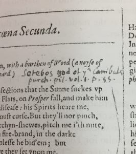

---
tags:
  - posts
  - output/newsletter
id: 65ac4ceb0e7c79000119abad
title: Bricolage 001
feature_image:
description: Hello friend,
date: 2020-10-09
full-date: 2020-10-09T02:47:12.000-04:00
slug: bricolage-001
type: post
draft: false
episode: 9
---

Hello friend,

When I started this Soulful Computing newsletter project, I promised myself that I would prioritize consistent publication. I'll send out a newsletter every week, no matter what. People talk about a productivity technique called "don't break the chain." It's often <a href="https://www.reddit.com/r/IAmA/comments/1ujvrg/jerry_seinfeld_here_i_will_give_you_an_answer/ceitfxh/?ref=davidnunez.com">misattributed</a> to the comedian, Jerry Seinfeld. From the <a href="https://blog.doist.com/dont-break-the-chain/?ref=davidnunez.com">doist blog</a>:

> The productivity method commits you to completing a daily goal for an extended period of time. Each day that you complete your daily goal, you add an "x" to a calendar. Eventually, you build a chain of x's that extends days, weeks, or months. This streak of accomplishments is increasingly rewarding and dissuades you from breaking the chain. Eventually you're able to build a long-term habit like daily journaling or morning stretching.

I don't want to break the weekly chain. So, you should expect an email from me every Thursday. Consider it a <a href="https://davidnunez.com/time-is-weird-in-2020/">zeitgeber</a>.

At some point, I'll reevaluate whether or not I'm still enjoying writing these, but I'm going to show up for this until then. I want to improve my writing. To do that, I need to put in the repetitions.

However, if I'm to make writing Soulful Computing a sustainable habit, then I have to think about tactics that will help me deliver a newsletter even when I'm under time constraints imposed by the rest of my life. At the very least, there will be some weeks where I'm not feeling especially creative or just tapped out.

For instance, I've recently been participating in an online course at <a href="http://hyperlink.academy/?ref=davidnunez.com">hyperlink.academy</a> about writing micro-textbooks. From the course description:

> A micro-textbook is a substantial work of instructional writing. It's bigger than a tutorial, but much smaller than an actual textbook. On the low end, it could be about 2000 words, and on the high end could get up to about 20,000.

By the end of October, I will have written a little book (about deploying digital signage and media players in museums), and I'm now generating lots of words for the book chapters in earnest. The micro-textbook endeavor is taking up a lot of my daily writing time and mental energy.

I made a plan for weeks like this, where an extended essay on a single theme is a bit out of reach for me. Every once in a while, I will publish a much shorter, skimmable (but hopefully still surprising and joyful) email.

These smaller newsletters will contain one or two quick thoughts and links about Soulful Computing that I may have found over the past week. Sometimes I'll use this opportunity to provide updates on topics covered in a prior email. These letters might exist in that taxonomic space somewhere between a Twitter post and a short blog article.

Consider these interstitial episodes a bit of a release valve for us, or perhaps a palette cleanser to let us catch our breaths between the longer essays.

I'm calling these interludes "Bricolage."

> _**bri·co·lage noun**_
>
> 1. a construction made of whatever materials are at hand; something created from a variety of available things.
> 2. (in literature) a piece created from diverse resources.
> 3. (in art) a piece of makeshift handiwork.
> 4. the use of multiple, diverse research methods.

Bricolage, in theory, should take less time for me to research and produce; they'll be a byproduct of what I'm reading and thinking about, pulled together over a week as I'm voyaging online. However, if I'm honest, I don't want to write just a "curated links" newsletter. For me, this exercise is about the art of storytelling and not necessarily about just delivering a list of links.

I've considered reducing the frequency of publication to give me more time to develop the essays. It may be the right approach long term, but for now, I need the weekly self-imposed deadline as a motivational tool.

All this to say, it should be evident that I'm playing around with style and approach every week. I'll probably start experimenting with cadence and pacing, as well.

Would love to hear what you think,

David Nuñez

---

## Spreadsheet Errors

In <a href="https://davidnunez.com/freediving-into-a-spreadsheet/">episode 5</a> of this newsletter, I wrote a short story, <strong>Abandon All Hope ye Who Enter (Data) Here</strong>, about a voyage beyond the edge of a spreadsheet

<blockquote>The system is straining under the pressure of a spreadsheet this deep. Every new cell takes longer to render. Nobody anticipated the software would need to support a dive like this, and the laptop fans are screaming in an attempt to give me air. I continue, my every muscle pounding. It feels like someone has set up freeze panes all around me.</blockquote>

In the past week, we learned that almost 16,000 people infected with coronavirus <a href="https://foreignpolicy.com/2020/10/08/uk-coronavirus-covid-spreadsheet-excel-error-outsourcing/?ref=davidnunez.com">went unreported as part of the United Kingdom tracing program</a> due to the data sets extending beyond an Excel spreadsheet's limits.

<blockquote>Unfortunately, the process produced XLS files—an outdated Excel format that went extinct in 2003—which had a limit of 65,536 rows, rather than the around 1 million-row limit in the more recent XLSX format. With several lines of data per patient, this meant a sheet could <a href="https://www.theguardian.com/politics/2020/oct/05/how-excel-may-have-caused-loss-of-16000-covid-tests-in-england?ref=davidnunez.com">only hold</a> 1,400 cases. Further cases just fell off the end.</blockquote>

What do you do when you run out of spreadsheet space? You make more spreadsheets, of course:

<blockquote>Public Health England has worked around the present problem: Serco Test and Trace still takes an Excel 2003-formatted XLS spreadsheet as part of the data pipeline—but the process now uses multiple sheets, so the files don't overflow again.</blockquote>

The underreporting of COVID-19 cases isn't, of course, the first costly spreadsheet error. The European Spreadsheet Risk Interest Group maintains a staggering <a href="http://www.eusprig.org/horror-stories.htm?ref=davidnunez.com">catalog of spreadsheet horror stories</a>.  

One prominent example is the spreadsheet data entry mistake at the London 2012 Olympics, where the organization <a href="https://www.telegraph.co.uk/sport/olympics/8992490/London-2012-Olympics-lucky-few-to-get-100m-final-tickets-after-synchronised-swimming-was-overbooked-by-10000.html?ref=davidnunez.com">oversold synchronized swimming events</a> by 40000 seats.

When scientists entered the names of specific human genes into an Excel spreadsheet, the software would use autoformatting to transform those names into dates. For example, <a href="https://www.genenames.org/data/gene-symbol-report/?ref=davidnunez.com#!/hgnc_id/HGNC:26077">Membrane Associated Ring-CH-Type Finger 1</a> is abbreviated to" <code>MARCH1</code>," which Excel translates into a date, "March 1st." Twenty-seven genes [have been renamed to work around]("symbols that affect data handling and retrieval") these technical constraints. Because of this, the HUGO Gene Nomenclature Committee published guidelines for gene naming, including guidance for "symbols that affect data handling and retrieval."

JP Morgan Chase lost over $6 billion in 2012 because an analyst copied formulas from one spreadsheet to another without <a href="https://en.wikipedia.org/wiki/2012_JPMorgan_Chase_trading_loss?ref=davidnunez.com">checking the math</a>.

Harvard Professors Reinhart and Rogoff published an academic paper, <a href="https://en.wikipedia.org/wiki/Growth_in_a_Time_of_Debt?ref=davidnunez.com">Growth in the Time of Debt</a> that Republican politicians used to justify <a href="https://www.nytimes.com/2014/04/02/us/politics/paul-ryan-budget.html?ref=davidnunez.com">austerity cuts</a> to promote economic stimulus.  As part of a routine homework assignment, a University of Massachusetts Amherst student, Thomas Herndon <a href="https://www.bbc.com/news/magazine-22223190?ref=davidnunez.com">discovered severe errors in the Reinhart-Rogoff research</a> due to missing data and other errors in a spreadsheet.

## Handwriting

- New research shows a neurological basis for how <a href="https://medicalxpress.com/news/2020-10-kids-smarter.html?ref=davidnunez.com">writing notes by hand helps people learn and remember things better</a>. 
- There has been a <a href="https://p1k3.com/2020/7/?ref=davidnunez.com">lot of online chatter</a> about digital notetaking <a href="https://deliber.at/2020/note-taking-apps/?ref=davidnunez.com">tools and techniques</a> lately. Most of these tools depend on typing notes on computers (or, at best, <a href="https://www.instapaper.com/read/1309713770?ref=davidnunez.com">transcribing handwritten notes imperfectly</a> into digital text). I wonder about what we are losing by not slowing down and scratching ink on paper.
	

- Here is a neat demonstration that uses <a href="https://www.calligrapher.ai/?ref=davidnunez.com">neural nets to simulate calligraphy</a>.
- Jason Scott-Warren used handwriting analysis of marginalia annotations to identify <a href="https://www.english.cam.ac.uk/cmt/?p=5751&ref=davidnunez.com">John Milton's copy of the Shakespeare First Folio of 1623</a>.
	

- Here is a lovely video of a man drawing the "hardest kanji."

https://www.youtube.com/watch?v=V3Nb-CjIZYQ