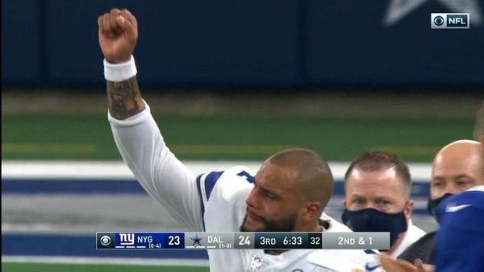
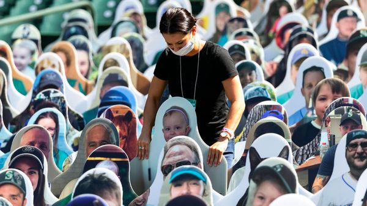

---
tags:
  - posts
  - output/newsletter
id: 65ac4ceb0e7c79000119aba8
title: (Not So) Quiet, Please
feature_image:
description: Dak Prescott, the 27-year-old quarterback for NFL's Dallas Cowboys, suffered an especially gruesome ankle injury last Sunday. I don't…
date: 2020-10-16
full-date: 2020-10-16T04:20:51.000-04:00
slug: not-so-quiet-please
type: post
---

Dak Prescott, the 27-year-old quarterback for NFL's Dallas Cowboys, suffered an especially gruesome ankle injury last Sunday. I don't recommend looking it up. Suffice it to say, his season is over, and his career as a professional athlete forever altered.

The Cowboys were hosting the New York Giants at their home field in Arlington, Texas. The AT&T Stadium is one of the few NFL venues that is permitting people to attend the games during the COVID-19 pandemic. Even with the seats only filled to 25% capacity, 20000 fans slipped into stunned silence when Dak hit the ground. They then roared with appreciation as he rode a cart off the battlefield.

Recently, Dak Prescott told his fans that he has been spending 2020 battling [anxiety and depression](https://www.espn.com/nfl/story/_/id/29854487/cowboys-prescott-got-help-anxiety-depression-offseason?ref=davidnunez.com) due to the death of his brother and the stress of the coronavirus pandemic. There has been [vital commentary](https://www.psychiatrictimes.com/view/seeking-help-is-not-weak?ref=davidnunez.com) about how heroic symbols of masculinity, like the leader of a football team, can and should seek help when they need it.

I wouldn't have held it against him to sit this season out. I wasn't overly optimistic that the teams would play this year. Football is a full-contact sport where lots of bodies are flying into each other. Unlike one-on-one mixed martial arts competitions, which can [secure actual islands](https://www.ufc.com/news/ufc-fight-island-where-ufc-fight-island-fight-island-schedule-and-more?ref=davidnunez.com) to keep competitors quarantined, it's a team sport. An NFL franchise is 53 players and a massive support system of coaches, trainers, and analyst personnel who attend the games. This is a secondary outbreak waiting to happen. It's [already happening](https://www.nfl.com/news/falcons-working-remotely-facility-thursday-positive-covid-19-test?ref=davidnunez.com).

Between lost ticket and concession sales at venues and lost revenue due to canceled televised games, the coronavirus will [cost at least $12 billion](https://www.espn.com/espn/otl/story/_/id/29110487/sudden-vanishing-sports-due-coronavirus-cost-least-12-billion-analysis-says?ref=davidnunez.com), assuming the best-case scenarios that there will be _some_ form of professional sports continuing. Sports leagues have an incentive to do whatever it takes to get players on the field, and perhaps more importantly, people to spectate and watch advertisements.

Last Sunday's game resumed after Dak went to the locker rooms, and Twitter filled with well-wishes to Dak from heartbroken fans and non-fans alike. We saw, instantly, replay footage of the accident, his emotional departure from the stadium, and even his arrival at the hospital. His brother posted a selfie before the quarterback entered emergency surgery. This rapid delivery of additional content is another example of how much of a [second-screen experience televised sports have become](https://journals.humankinetics.com/view/journals/ijsc/9/4/article-p424.xml?ref=davidnunez.com).

> God is good, and he’ll be back STRONGER than ever. I FUCKING guarante3 IT. Let’s go [@dak](https://twitter.com/dak?ref_src=twsrc%5Etfw&ref=davidnunez.com) continue to walk by [#FAITH](https://twitter.com/hashtag/FAITH?src=hash&ref_src=twsrc%5Etfw&ref=davidnunez.com) & I’ll make sure you continue to [#FIGHT](https://twitter.com/hashtag/FIGHT?src=hash&ref_src=twsrc%5Etfw&ref=davidnunez.com) [pic.twitter.com/0SWqGJ937h](https://t.co/0SWqGJ937h?ref=davidnunez.com)
>
> — Tad Prescott (@86Prescott) [October 11, 2020](https://twitter.com/86Prescott/status/1315439802305708032?ref_src=twsrc%5Etfw&ref=davidnunez.com)

While I'm not at all happy this happened to him, I'm glad it happened in a stadium with fans. When he raised his fist as the crowd cheered for him, tears ran down his face. You'd have to be heartless to watch this and not feel _something_.

If this happened two weeks ago, when the Cowboys played the Seattle Seahawks, there would not have been a real crowd to cheer for him. [CenturyLink Field](https://www.si.com/nfl/seahawks/gm-report/seahawks-trying-to-find-sweet-spot-for-crowd-noise?ref=davidnunez.com) is remaining empty during this season. The Seahawks' stadium has a reputation for [promoting incredibly loud crowd noise](https://www.businessinsider.com/seattle-seahawks-stadium-loud-2014-1?ref=davidnunez.com). Its unique curved roof acts like parabolic sound amplifiers back onto the field.  
When they are allowed to attend, fans are a bit closer to the players in action, and the metal and concrete of the architecture cause the crowd noise to reverberate.

Football quarterbacks are like generals on the field. They assess how the defensive team is positioned and sometimes "call an audible" by shouting commands to their teammates right before the play begins. This ad-hoc adjusting is nearly impossible when a single voice gets drowned out by 137.6 decibels of a screaming crowd. It's so much an advantage for the home team that the crowd is often referred to as the ["12th man" on the 11-player squad](https://www.si.com/nfl/2014/01/15/nfl-playoffs-seattle-seahawks-fans-mike-glennon?ref=davidnunez.com).

> "There isn't a more uninviting place for a visiting NFL quarterback than CenturyLink Field, where Seattle's 12th Man might as well be in the huddle screaming into a megaphone."

Seattle doesn't even have the loudest stadium. That Guinness World Record belongs to [the stadium in Kansas City at 137.5 dB](https://www.chiefs.com/video/arrowhead-stadium-breaks-crowd-noise-record-13886015?ref=davidnunez.com). Most stadiums amp up the noise with canon fire, fireworks, and foghorns whenever the home team scores points.

Crowds [cause known psychological effects](https://www.researchgate.net/profile/L_Epting/publication/281766861_Cheers_vs_Jeers_Effects_of_audience_feedback_on_individual_athletic_performance/links/56b22c9208ae795dd5c7a490.pdf?ref=davidnunez.com) on players depending on the sport, the player skill, and the actual audience behavior. For example, players can be motivated to perform with more aggression when they feel they have the crowd's support. When the fans boo the opposing team, [its performance decreases](https://www.jstor.org/stable/3033796?ref=davidnunez.com).  [Multiple](https://www.sciencedirect.com/science/article/abs/pii/S1469029201000334?ref=davidnunez.com) [studies](https://journals.humankinetics.com/view/journals/jsep/32/4/article-p483.xml?ref=davidnunez.com) [have](https://www.frontiersin.org/articles/10.3389/fpsyg.2019.02380/full?ref=davidnunez.com) [shown](https://www.scirp.org/html/24626.html?ref=davidnunez.com) [that](https://shapeamerica.tandfonline.com/doi/abs/10.1080/02640410701275193?ref=davidnunez.com) crowd noise also affects the decisions of umpires and referees. In return, people that attend sporting events as spectators are influenced by the "[rituals of solidarity](https://www.tandfonline.com/doi/abs/10.1080/16138171.2016.1226029?ref=davidnunez.com)" like screaming at the top of their lungs among like-minded tribe members.

In some fancier sports like tennis or golf, crowd noise has [traditionally been discouraged](https://www.nytimes.com/2003/06/29/sports/sports-of-the-times-quiet-please-sounds-of-silence-to-a-point.html?ref=davidnunez.com) by players and enthusiasts:

> Why do we need meditation-style silence when sweaty people are whacking a ball across a net?  
> The insistence on "quiet, please," seems an anachronism dating to more genteel times when tennis seemed to be in the hands of the upper class. In some circles, it was considered polite to cease breathing when Chauncey and Geoffrey were competing for the club championship.

While lately, there have been calls for allowing more fan engagement during these competitions, it's not entirely unreasonable that a tennis player might need to hear a racket striking a high-speed ball to anticipate where it might land.

> Serena Williams, who likes the atmosphere in American football and basketball, said: "I think if someone in the new generation comes along and they're trained to play with noise, it's O.K. I think in our generation right now, we're not trained for that."

An instance of "quiet, please" can go too far, though. During the U.S. Open Tennis tournament last month, players were disturbed by the lack of fans attending. Grand Slam champion Andy Murray [lamented the lack of fan energy](https://sports.yahoo.com/quiet-please-u-open-players-213447174.html?ref=davidnunez.com) at the tournament:

> (There are) times like after one of my practices last week, I was walking back to the locker room, I was walking through the grounds. I was like, Wow, this is pretty sad because usually this place is just filled with energy and atmosphere like before the tournament starts.

During a pandemic, a "quiet, please" is a surreal occurrence.

In a fan-less season, the home teams' noise advantage diminishes, and players' performance is altered. Sporting venues have resorted to many tactics to restore some crowd normalcy to the game, including pumping in fake crowd noise. The manager of the New York Yankees doesn't mind it but isn't enthusiastic:

> "Early in the day, I really didn't like it. It sounded kind of like we're trying to tune in our AM radio and trying to find the station and we couldn't find it. I felt a little better with it during the game. It did feel a little bit more natural. So, you know, hopefully there's some tweaking of it or whatever, but as long as it wore on, and during the game, I was okay with it."

Teams are selling tickets to "spectators" who are represented by [cardboard cutouts in the seats of the stadium](https://www.mlb.com/news/how-baseball-teams-are-making-fan-cutouts-work?ref=davidnunez.com).

Leagues are using technology to bring fans into the stadiums, virtually. Danish Superliga club AGF Aarhus set up video screens that projected their supporters on Zoom calls:

> Meanwhile in Denmark, fans of AGF Aarhus have been supporting their team via Zoom 💻🙌 [pic.twitter.com/ki3MFaJEnd](https://t.co/ki3MFaJEnd?ref=davidnunez.com)
>
> — ESPN FC (@ESPNFC) [May 29, 2020](https://twitter.com/ESPNFC/status/1266323409056731139?ref_src=twsrc%5Etfw&ref=davidnunez.com)

Mark Cuban, the billionaire owner of the basketball team, The Dallas Mavericks, has ideas for apps that might help [people assemble their crowd](https://nypost.com/2020/06/20/mavericks-mark-cuban-sounds-off-on-nba-restart-black-lives-matter/?ref=davidnunez.com) from the comfort of their couch at home:

> "There will be a lot of technology we will be experimenting with to try to introduce noise and make the event more entertaining for players and TV viewers. We have been having a lot of fun with apps that allow fans to push noise they make at home into the arena. So not only will there be competition on the court, there will be competition from fans to contribute energy as well!"

Football is a made-for-television sport. We don't watch a game as much as we are a live-action production. Multiple [impossible camera shots from robotic systems](https://twitter.com/danhanzus/status/1186025478794039296?lang=en&ref=davidnunez.com), amplified player voices, and all the analyst commentary would not be available to a stadium spectator. Broadcasters also mix in artificial crowd noise during games. They've been [doing this well before COVID-19](https://profootballtalk.nbcsports.com/2020/05/21/simulated-crowd-noise-for-nfl-broadcasts-has-been-done-before/?ref=davidnunez.com). It's now just more apparent when you suddenly realize there is no crowd in the stadium. If you pay attention to it closely, sometimes the crowd noise on the television speakers doesn't precisely match up to the game's activity. Most of the time, though, it just washes over you as white noise should.

It's fun to watch sports as a simulation of battle, but it's never fun to watch a soldier fall. Before COVID-19, when a player fell injured on the field, you could hear the crowd react, even via a television mediation. There's an unsettled murmur of tension as we watch the team physicians patch the player up just enough to get them off the field. There's a loud cheer of admiration and relief when the player bravely gives thumbs up to indicate that, "no, I am not dead."

Then the team owners and network television executives cheer as the game resumes until the next advertising break.

Go Cowboys, and speedy recovery to Dak Prescott, is what I'm saying.

Quiet please,  
David Nuñez

* * *

## Coda

* Jason Gay writes about his experience attending a [crowdless New England Patriots game](https://www.wsj.com/articles/whats-it-like-inside-an-empty-nfl-game-11601298257?ref=davidnunez.com).

> "Let me get the obvious out of the way: It was weird. It was deeply weird. Even getting to the game was weird. The final miles into Foxborough are an infamous traffic-choking torture chamber that will make a hardy driver weep in a Buick. On Sunday, that drive took less time than toasting a Pop-Tart."

* [NBC Sports broadcasted simulated NBA games](https://www.si.com/extra-mustard/2020/03/20/nbc-sports-washington-wizards-capitals-video-game-simulations?ref=davidnunez.com). Major League Baseball games are [also being simulated](https://theathletic.com/1732632/2020/04/09/introducing-the-athletic-alternate-universe-for-the-2020-mlb-season/?ref=davidnunez.com).
* Brodcasters actively attempt to build rapport with audiences. Now they are using [social media to do this more efficiently](https://journals.sagepub.com/doi/full/10.1177/1527476417699708?ref=davidnunez.com).
* The latest version of the NFL video game, "Madden '21" has all sorts of [bizarre problems with its physics simulations](https://mashable.com/article/madden-21-glitches-videos/?ref=davidnunez.com).

* * *

_I was listening to "[Lonely in a Crowd](https://open.spotify.com/track/1zsXasN6cbCerKSzZUfJHI?si=t9h5T7dATCe2wCYEkvbRKQ&ref=davidnunez.com)" by G R I Z on repeat while writing this newsletter._
