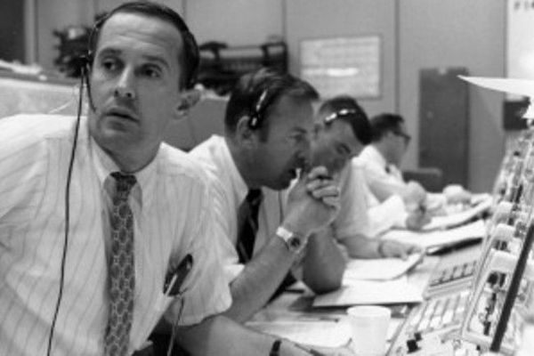
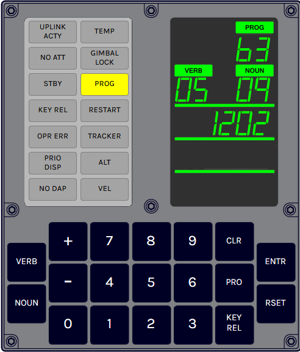
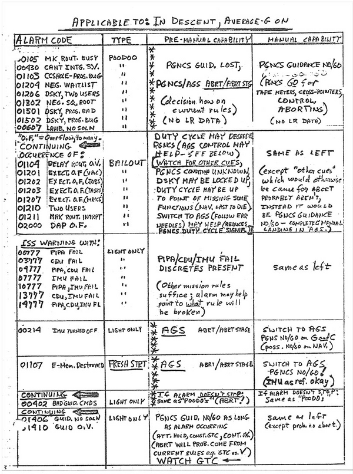
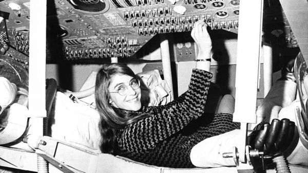
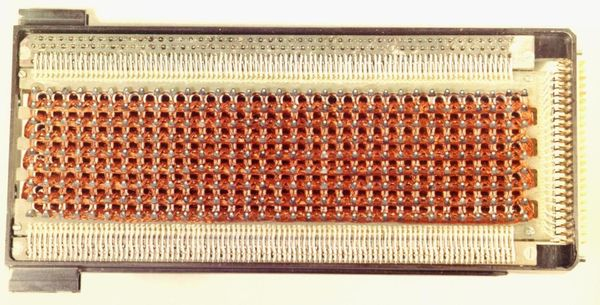
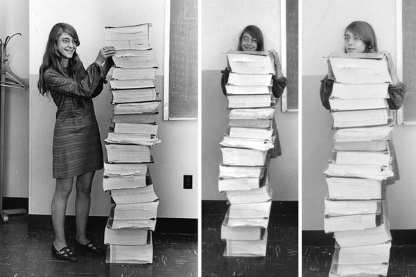
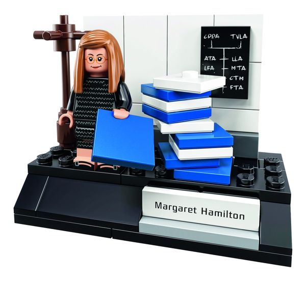

---
tags:
  - posts
  - output/newsletter
id: 65ac4ceb0e7c79000119abac
title: Error 1202
feature_image:
description: Aboard the Lunar Module Eagle (LM-5), Neil Armstrong and Buzz Aldrin were 30,000 feet above the moon surface and rapidly descending. It was…
date: 2020-10-23
full-date: 2020-10-23T15:55:51.000-04:00
slug: error-1202
type: post
draft: false
episode: 11
---

Aboard the Lunar Module Eagle (LM-5), Neil Armstrong and Buzz Aldrin were 30,000 feet above the moon surface and rapidly descending. It was July 24, 1969, and The Apollo 11 mission had been proceeding relatively smoothly. About 4 hours later, the astronauts would make history as a man took a small step onto the moon.

Something went wrong.



* * *

During the lunar descent burn, at mission elapsed time 102:38:22, an alarm rang inside the Eagle. The astronauts registered their concern to their colleague, Charles Duke [back on Earth](https://www.hq.nasa.gov/alsj/a11/a11.landing.html?ref=davidnunez.com).

> **102:38:26** Armstrong: (With the slightest touch of urgency) Program Alarm.  
> **102:38:30** Armstrong: (To Houston) It's a 1202.  
> **102:38:32** Aldrin: 1202. (Pause)  
> **102:38:42** Armstrong (onboard): (To Buzz) What is it? Let's incorporate (the [landing radar](https://www.hq.nasa.gov/alsj/alsj-LMRadars.html?ref=davidnunez.com) data). (To Houston) Give us a reading on the 1202 Program Alarm.  
> **102:38:53** Duke: Roger. We got you...(With some urgency in his voice) We're Go on that alarm.

In their countless hours of training and simulation, the astronauts had never prepared for this alarm. Nobody had ever seen it happen before. Their mission was now in jeopardy as `1202` blinked in the Lunar Module multiple times throughout the descent.



My dad, a metallurgical engineer at Rocketdyne in Canoga Park, was one of the 400,000 people across the United States who had contributed to the Apollo program. They were all watching.

The people at the MIT Instrumentation Lab, who were listening in on the conversations between Houston and somewhere above Mare Tranquilitatis, looked at each other in stunned silence. They knew what `1202` meant. They had, after all, designed the hardware and software behind the computer onboard the spacecraft. Don Eyles, the 25-year old programmer who wrote the code for the lunar landing, [was among them](https://doneyles.com/LM/Tales.html?ref=davidnunez.com):

> "Then we heard the words "program alarm". In Cambridge we looked at each other ... Alarm code 1202 appeared on the DSKY. This was an alarm issued when the computer was overloaded — when it had more work to do than it had time for. In Cambridge the word went around, "Executive alarm, no core sets". Then Armstrong said, with an edge, "Give us a reading on the 1202 program alarm".  
> From here events moved very quickly, too fast for us to have any input from Cambridge. It was up to Mission Control in Houston.

If it were up to Eyles, he would have [stopped the mission](https://news.mit.edu/2009/apollo-eyles-0717?ref=davidnunez.com), "My mind screamed for an abort. Never had we contemplated continuing a lunar landing after a 1202 alarm. We have to abort, I thought."

Instead, the decision about whether or not to continue the mission fell on the shoulders of a 26-year old NASA guidance officer, Steve Bales.

Just weeks prior, he had mistakenly called an unnecessary abort during a mission simulation in response to an alarm. To prevent this from happening again, his deputy Jack Garman made a handwritten cheat sheet of all the possible error codes.



With 8 minutes to go before Eagle would land, Jack Garman looked at his handwritten page for the error code `1202`. According to mission rules, the landing should continue.

The MIT Instrumentation Lab needed to invent a new computer to fly in space. Most computers in the 1960s were mainframes that filled entire rooms. The Apollo Guidance Computer (AGC) could only take up a cubic foot of volume. There were two computers on the Apollo spacecraft. NASA installed one AGC in the Lunar Module that took Neil and Buzz to the moon surface. The other computer stayed in lunar orbit with Michael Collins on the Command Module, Columbia.

The AGC's needed software that would perform [intricate calculations](https://www.nasa.gov/feature/ames/math-invented-for-moon-landing-helps-your-flight-arrive-on-time?ref=davidnunez.com) required to launch a projectile from Florida, get it into Earth orbit, fling it off into space aiming for a tiny rock 238,900 miles away, orbit the moon before landing on it, launch again from the moon, dock with the command module, and impossibly find its way back to splashdown in Earth's oceans.

Margaret Hamilton, the 33-year old director of the Software Engineering Division at the Instrumentation Lab, was ultimately responsible for the Apollo On-Board flight computer programs. Her team needed to invent new programming languages and techniques alongside computer hardware. They pieced together complicated sensor and output systems that needed to operate in the most extreme scenario ever imagined. Hamilton so transformed how software projects developed that we still use the phrase she coined to describe the activity, "software engineering."



The entire Apollo flight software was over 36000 words long and hardwired into copper wires woven like quilts into blocks referred to as "core rope memory."



The Apollo Guidance Computer in the lunar module had seven slots for temporary data (similar to RAM) that could hold 12-word blocks called "Core Sets." For comparison, modern smartphones have more than [one million times more memory](https://www.realclearscience.com/articles/2019/07/02/your_mobile_phone_vs_apollo_11s_guidance_computer_111026.html?ref=davidnunez.com) than the AGC.

These were primitive machines compared to the supercomputers we carry in our pockets. While they could perform calculations with many variables more quickly than any human being, they were quite limited with how much data and computation they could manage at once.

Each 12-word Core Set could only hold five words to run a program, leaving the remaining seven words to store temporary data like sensor readings. All the 36,000 words in the flight software broke apart into 5-word chunks and executed on the computer one at a time. The software engineers designed a sophisticated system to load and unload these program slices based on their priority and urgency at any given time during the mission.

During the Apollo 11 descent, Buzz Aldren turned on a radar unit as he had done countless times before in simulation. For [technical reasons involving frequency-locking and phase-synchronization](https://www.doneyles.com/LM/Tales.html?ref=davidnunez.com), the radar started to flood the AGC with too much data. The computer kept trying to execute tasks that were later determined by Don Eyles to have been entirely unnecessary to calibrate the radar signals in response.

This overeager calculation was happening during a critical phase of the mission when many other high priority program tasks competed for the computer's attention. The `1202` indicated the AGC Core Sets did not have enough space to hold all the data it was trying to process. In essence, the radar signals were performing a denial of service attack on the AGC.

Fortunately, the code had a safety valve for this kind of situation. It should be familiar to anyone who has had computer problems. When the memory ran out, the computer would reboot using a "BAILOUT" restart that killed the current programs and reloaded the highest priority tasks.

I don't think it would be that much of a stretch to say software saved the Apollo 11 mission by doing its job and then ultimately getting out of the way as Neil Armstrong piloted the Lunar Module to its landing.  
[Margaret Hamilton recalls](https://news.mit.edu/2009/apollo-vign-0717?ref=davidnunez.com):

> It quickly became clear that the software was not only informing everyone that there was a hardware-related problem, but that the software was compensating for it. With only minutes to spare, the decision was made to go for the landing. The rest is history.

The Apollo 11 code is [available on Github](https://github.com/chrislgarry/Apollo-11?ref=davidnunez.com), an online repository of source code that programmers use to collaborate on works.

If you study the source code as you would literature, you'll start to notice interesting notes in the marginalia. For example, there is a snippet from Shakesphere in a file named `PINBALL_GAME_BUTTONS_AND_LIGHTS`

```
# "IT WILL BE PROVED TO THY FACE THAT THOU HAST MEN ABOUT THEE THAT
# USUALLY TALK OF A NOUN AND A VERB, AND SUCH ABOMINABLE WORDS AS NO
# CHRISTIAN EAR CAN ENDURE TO HEAR."
#     HENRY 6, ACT 2, SCENE 4
```

In the part of the code related to the master ignition routine, a function is named `BURNBABY.` This was a reference to the Black DJ and radio station owner, Magnificent Montague, and his catchphrase, "Burn, Baby! Burn!" This was all a reference to civil unrest in the 1960s, including the [1965 LA Riots](https://en.wikipedia.org/wiki/Watts_riots?ref=davidnunez.com).

```
BURNBABY TC PHASCHNG # GROUP 4 RESTARTS HERE
      OCT 04024
      CAF ZERO  # EXTIRPATE JUNK LEFT IN DVTOTAL
      TS DVTOTAL
      TS DVTOTAL +1
      TC BANKCALL # P40AUTO MUST BE BANKCALLED EVEN FROM ITS
      CADR P40AUTO  # OWN BANK TO SET UP RETURN PROPERLY
```

Now that this source code is available online, modern programmers can comment on and critique this code in the same way that an English Literature student might write about poetry. For example, we can find a humorous discussion of the `1202` code as if someone was reporting a [bug to the programming team](https://github.com/chrislgarry/apollo-11/issues/23?ref=davidnunez.com):

> The AGC reboots with a program code 1201 and 1202 ("Executive overflow") during landing phase if the rendezvous radar switch it set to AUTO (as suggested in procedure book) and the DELTAH command (1668) is initiated on the DSKY. Bales in Guidance and Garman say it is ok to land with this error, but flight is still concerned about it and the alarms might distract the crew.

I haven't spent a lot of time in this newsletter talking about our work at the [MIT Museum](http://mitmuseum.mit.edu/?ref=davidnunez.com). Assuming COVID-19 doesn't continue to interfere with our plans, we intend to open up a new museum in Cambridge in 2022. In one of our galleries, we will be featuring the Apollo Guidance Computer.

It's an ongoing conversation among my colleagues as we try to think about what it means to collect, preserve, and display software as an artifact at our museum. For example, in our collection, we have printouts of COLOSSUS and LUMINARY (the code for the Command Module and Lunar Module AGCs, respectively).

However, code needs functional computers to have life. We could try to [simulate](https://svtsim.com/moonjs/agc.html?ref=davidnunez.com) the AGC to try to get at what the code does, but this raises existential questions about whether or not we are authentically "showing" the software or a shadow of it.

In our collection, we have the infamous photograph of Margaret Hamilton standing next to a stack of source code printouts as tall as her.



This photo has been immortalized as a LEGO set dedicated to the women of NASA.



What's going on in this photograph? What version of the code is next to her? What page number is the `1202` error handling code? How did she and Don Eyles collaborate? What's scribbled on the blackboard behind her? What was the political context of her work as a woman in engineering in the 1960's?

I contend software is more than source code. It's culture.

It's less about the programs as it is about the programmers' stories involved in making it. Software is soulful.

Go, Flight  
David Nuñez

## Coda

* _This newsletter is an excerpt from a lecture I'm delivering to Yogan Muller's_ [_Anthropocene and Digitization_](http://classes.dma.ucla.edu/Fall20/160-1/?ref=davidnunez.com) _course in the Design Media Arts Department at UCLA._
* Apollo 11. You are reading the 11th episode of this newsletter. See what I did there?
* [Halsey Burgund](https://halseyburgund.com/?ref=davidnunez.com) and [Francesca Panetta](https://twitter.com/franpanetta?lang=en&ref=davidnunez.com) created a film that used deepfake technology to simulate what it might have been like if a 1202 error led to a disaster. [In Event of Moon Disaster](https://moondisaster.org/?ref=davidnunez.com)

> What if the Apollo 11 mission had gone wrong and the astronauts had not been able to return home? A contingency speech for this possibility was prepared, but never delivered by President Richard Nixon—until now.


Still from [In Event of Moon Disaster](https://moondisaster.org/?ref=davidnunez.com)

* This week I'm experimenting with sending this email on a Friday instead of Thursday. Is it better this way to leave something in your inbox to consume over the weekend? Have you already started your weekend and won't see this until Monday anyway? Does it matter? Time is weird in 2020.
* Here is a [transcript](https://www.hq.nasa.gov/alsj/a11/a11.landing.html?ref=davidnunez.com) from the Apollo 11 moon landing.
* In this [short Wall Street Journal video about the 1202 error](https://www.youtube.com/watch?v=z4cn93H6sM0&ab_channel=WallStreetJournal&ref=davidnunez.com), Don Eyles says one of the most poetic things I've heard from a programmer:

> When you write a piece of code, you're writing something that needs to, in as few words as possible, convey an idea. But at the same time, it needs to fall trippingly off the tongue of the central processor. You could call it a lapidary sort of art.

* [An online course on the Apollo Guidance Computer.](https://www.pluralsight.com/courses/moon-landing-apollo-11?ref=davidnunez.com)
* Draper Laboratory (formally the MIT Instrumentation Lab) created a [fantastic website](https://wehackthemoon.com/?ref=davidnunez.com) documenting their work on the Apollo mission.
* I heard someone recently say that we need a "[Moonshot project](https://diginomica.com/governments-mass-testing-moonshot-project-looks-90s-silicon-valley-powerpoint-nightmare?ref=davidnunez.com)" to defeat COVID-19. Engineers involved with the Apollo missions [doubt that our society has the political or economic will](https://www.latimes.com/nation/la-na-could-apollo-11-be-repeated-20190714-story.html?ref=davidnunez.com) to pull off a project of that scale any more.

* * *

_I was listening to Brian Eno's_ [_Apollo_](https://open.spotify.com/album/1Z2jkEtW5Sc9wWVxUgyG0E?si=jeDEPBKQQIyheU4-zpC44g&ref=davidnunez.com) _on repeat while writing this newsletter._
