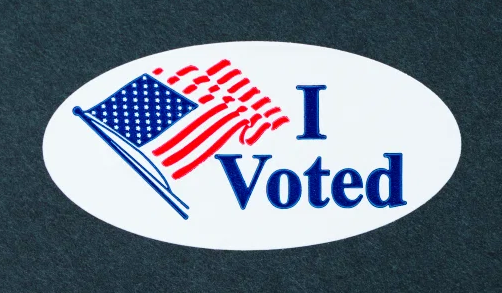
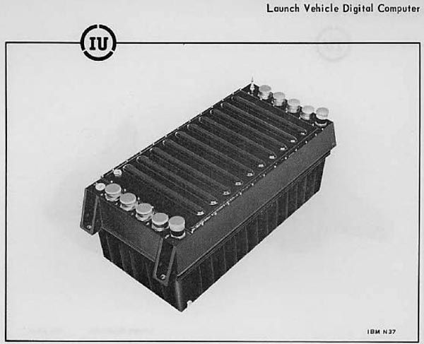

---
tags:
  - posts
  - output/newsletter
id: 65ac4ceb0e7c79000119abbe
title: Election Day 2020
feature_image:
description: Hello friend,
date: 2020-11-03
full-date: 2020-11-03T11:39:41.000-05:00
slug: election-day-2020
type: post
draft: false
episode: 12
---

Hello friend,

Today is Election Day in the United States in the middle of a pandemic. Citizens will participate in a presidential election that will be a crucible for the American form of Democracy.

Photo by [Tiffany Tertipes](https://unsplash.com/@tiffanytertipes?utm_source=unsplash&utm_medium=referral&utm_content=creditCopyText)

President Donald J. Trump has spent the last four years characterizing the election process in the United States as [illegitimate and "rigged."](https://www.npr.org/2020/09/25/916820887/despite-white-house-statement-trump-casts-doubt-on-election-again?ref=davidnunez.com) He has said, out loud, that he will disregard any result of this election other than his overwhelming victory. There is concern about what will happen _after_ the election:

> "The worst case, however, is not that Trump rejects the election outcome. The worst case is that he uses his power to prevent a decisive outcome against him. If Trump sheds all restraint, and if his Republican allies play the parts he assigns them, he could obstruct the emergence of a legally unambiguous victory for Biden in the Electoral College and then in Congress. He could prevent the formation of consensus about whether there is any outcome at all. He could seize on that un­certainty to hold on to power." — [Barton Gellman, The Atlantic, November 2020](https://www.theatlantic.com/magazine/archive/2020/11/what-if-trump-refuses-concede/616424/?ref=davidnunez.com)

Most reputable polls show that former Vice President Joe Biden will be the likely winner of this election. However, he will probably need to rely on ballots that have been submitted as part of early voting to come out ahead, especially in the so-called "battleground states."

Elections officials expect that many of the [almost 100 million votes](https://www.nytimes.com/live/2020/11/02/us/trump-biden-election?ref=davidnunez.com) that the American people have cast ahead of Election day will require additional time to properly count alongside votes cast at polling stations around the country. Democrats are more likely to have taken advantage of early voting, with those votes tallied throughout the upcoming week. Many Republicans will vote in person today, and their votes will be counted more quickly. Trump has already hinted that [he will declare victory early](https://www.vox.com/2020/11/2/21545670/trump-may-declare-early-election-victory-legal-challenge?ref=davidnunez.com) before all votes can be counted. Both Republicans and Democrats are preparing for a [protracted challenge of any potential voter suppression](https://www.nytimes.com/2020/11/02/us/politics/election-day-ballot-counting.html?ref=davidnunez.com).

Even if there is a landslide result, I would be surprised if either candidate will concede the election anytime soon. We should expect weeks of legal maneuvering, continued campaigning, and social anxiety. Americans are already [stressed out](https://www.nbcnews.com/politics/2020-election/election-eve-country-just-unbelievably-stressed-out-n1245841?ref=davidnunez.com) by this election. People are [anticipating civil unrest](https://www.npr.org/2020/11/02/930464598/election-2020-cities-and-businesses-prepare-for-post-election-unrest-violence?ref=davidnunez.com).

There is no Constitutional requirement that a winner is declared today. In fact, we technically won't have a ratified "winner" until the Electoral College officially votes in December (more on that below).

This is a newsletter about Soulful Computation and not politics. There are myriad other sources you could explore to try to make sense of what's about to come and its impact on the globe.

However, we are going to be hearing a lot about the legitimacy of polling procedures over the next 3 months until inauguration in January. In particular, almost all jurisdictions rely on electronic voting machines at their polling stations. It is worth understanding why we use them, how they work, and to what degree we can trust them.

## How do Presidential Elections work in the United States?

](./images/fantasymap-introanim_20200608.gif)

Via ABC News [Interactive Election Map](https://abcnews.go.com/Politics/2020-Electoral-Interactive-Map?ref=davidnunez.com)

Each of the 50 states (plus Washington DC) is in charge of maintaining their distinct elections processes and laws. Today, Americans are not directly voting for a presidential candidate. Instead, we are electing the Electors, our state's representatives in the United States Electoral College.

With some exceptions, Electors pledge their vote to a given candidate. In December, the Electoral College elects the President on the population's behalf. An Elector might choose to vote for a different candidate, making them a [Faithless Elector](https://en.wikipedia.org/wiki/Faithless_elector?ref=davidnunez.com); few states have enforceable laws to prevent this.

It is also conceivable that a state legislature might choose to discard the votes cast by the citizens and [choose electors arbitrarily, ignoring the will of the people](https://www.theatlantic.com/ideas/archive/2020/03/coronavirus-election/608989/?ref=davidnunez.com).

> The danger begins with the fact that, regardless of what people believe, the Constitution does not give Americans the right to vote for their president. Rather, the Constitution says that a college of electors votes for the president, and Article II of the Constitution gives states nearly unlimited power to decide how these electors are chosen

There was early chatter that Trump-supporting Republicans would attempt to win the election this way. This strategy would most likely carry severe [political consequences](https://www.independent.co.uk/news/world/americas/us-politics/electoral-college-trump-popular-vote-president-michael-baca-a9074406.html?ref=davidnunez.com).

States have different numbers of electors based on census counts of their population every ten years. This count also determines the number of state congressional districts, each with its Congressperson in the House of Representatives.

Trump or Biden will need 270 of the 538 electoral votes to be elected President.

The US government [has a resource that lays all this out](https://www.usa.gov/election.?ref=davidnunez.com).

During a presidential election, except for Maine and Nebraska, states have a "winner-take-all" approach where all the electoral votes go to the winner of each state's popular vote. Some states, like California or Arkansas, have such a strong base of voters for one of the two major political parties (i.e., Republican or Democrat) that their electoral votes are assumed mainly as a given for the respective candidate.

Therefore, candidates identify in which states their campaigning might cause the popular vote of the state to swing in one direction or another. This attention gives excessive weight to the concerns of a handful of so-called "[Battleground States](https://davidnunez.com/p/4cd7ac1a-f095-4f24-9089-2c8278434c8d/[https://www.wsj.com/articles/the-battleground-states-that-will-likely-decide-the-election-11604282330])." Pennsylvania, North Carolina, Georgia, and Ohio are among these.

We should expect intense scrutiny of the vote count in these states.

Pennsylvania, Georgia and Texas, in particular, are shaping up to be hot spots for a protracted fight over election legitimacy involving electronic voting machines.

## What are electronic voting machines?

Since state election commissions will define their state's voting procedures, they are free to choose whatever voting mechanisms they deem appropriate for their citizens. Ballotpedia maintains a [directory of tabulation methods by state](https://ballotpedia.org/Voting_methods_and_equipment_by_state?ref=davidnunez.com).

The states use a mix of electronic voting devices from a variety of vendors. Every voting district within the state might have its flavor of the machines. The devices fall into a few categories:

* **Optical/Digital Scan** systems require the voter to mark a ballot using a pencil or pen. Sometimes they indicate their vote by punching out holes on the card. In some jurisdictions, the voter inserts the ballot into a scanning machine at the polling station. In other places, voters deposit ballots into a collection box. The paper gets fed through a high-speed scanning machine at the polling stations or in some central location. The counting device uses either infrared sensors or digital cameras to image the ballot and determine the voters' choices. If a voter incorrectly marks a ballot (ex. indicating more than one candidate) or the machine can't make a determination (ex. a marking is too faint), then the ballot gets sorted into a pile for potential further human examination.
* **Direct-Recording Electronic (DRE)** systems allow the voter to cast their vote directly on the device, using a touchscreen, buttons, dials, or some other computer interface. The machine stores the vote in its memory and prints out the totals at the end of the day. Sometimes the apparatus transmits its vote count to a central computer for aggregate tallying. Most of these systems also print out paper receipts as voters mark their selections to provide a paper trail in case audits are necessary. Some systems still do not do this.
* **Ballot-marking Devices (BMD)** accept paper ballots and use some electronic means to query the voter's intent and place a mark onto the ballot. These systems can be used by people with disabilities to vote, usually without the assistance of other people. Many states offer BMDs for all voters, as the default. These devices don't store the results of the vote.

Most states require that electronic voting machines are [certified by national commissions](https://en.wikipedia.org/wiki/Certification_of_voting_machines?ref=davidnunez.com), which purport to validate that the devices are usable, secure, and accurate.

## What are the virtues of electronic voting machines?

Electronic voting machines contribute to the automation of ballot counting, making the process more efficient. This computation dramatically speeds up the delivery of results. On the surface, they help improve the accuracy of the count by reducing human error.

Voting machines can make voting more accessible for people that have disabilities. Due to the [curb-cut effect,](https://medium.com/@mosaicofminds/the-curb-cut-effect-how-making-public-spaces-accessible-to-people-with-disabilities-helps-everyone-d69f24c58785?ref=davidnunez.com) this means voting machines can be more universally usable. Since President George W. Bush enacted the [Help America Vote Act](https://www.eac.gov/about_the_eac/help_america_vote_act.aspx?ref=davidnunez.com) in 2002, all polling stations require at least one device to be accessible to people with disabilities like blindness. DRE voting machines can have capabilities like voice assist, high contrast displays, or more accessible tangible controls.

I should note that the increased emphasis on mail-in voting in 2020 can potentially [disenfranchise voters with disabilities](https://www.wgbh.org/news/local-news/2020/10/27/blind-and-visually-impaired-mass-voters-worry-about-disenfranchisement-due-to-mail-in-voting?ref=davidnunez.com).

> Even for blind voters who decide to go in-person to the polls, precautions against the coronavirus make navigating the voting experience more challenging. People lined up 6 feet apart make it difficult to locate the end of the line with a cane, and masks can obscure spoken directions. Before the pandemic, poll workers might take a blind person’s elbow to guide them to the voting machine. Now, they must maintain proper social distancing.

The electronic records can offer data more readily to help validate the legitimacy of an election. For example, eVoting helped uncover a [truly rigged election in Venezuela](https://webrootsdemocracy.org/2017/08/03/venezuela-a-rigged-election-uncovered/?ref=davidnunez.com).

## What are the concerns with electronic voting machines?

Only a handful of vendors, like [Hart InterCivic and VotingWorks,](https://www.eac.gov/voting-equipment/registered-manufacturers?ref=davidnunez.com) manufacture electronic voting machines. They do not tend to publish the proprietary source code for their systems. Therefore, independent experts in the public cannot scrutinize the technology for potential defects. As the systems start to rely on internet connectivity and other complexities, they become more error-prone and even open to explicit vectors of attack.

All it takes is a single bad actor to tamper with an individual machine. Security enthusiasts have already shown, on [multiple occasions](http://www.computerworld.com/s/article/9220356/Argonne_researchers_hack_Diebold_e_voting_system_?ref=davidnunez.com), how easy it is to alter commonly used machines to generate inaccurate results. At DefCon last year, cybersecurity researchers demonstrated that they could hack into over [100 electronic voting machines](https://www.motherjones.com/politics/2019/09/defcon-2019-hacking-village/?ref=davidnunez.com). Some exploits were as simple as machines using weak, default administrative passwords. Professor of Computer Science, Dan Wallach, testified in front of the Houston, Texas city council about [voting safety](https://csweb.rice.edu/news/wallach-shares-security-expertise-2020-election-coverage?ref=davidnunez.com):

> During his testimony, Wallach stood up, crossed the hearing room, and opened a voting machine's hatch, pulling out its PCMCIA memory card. “This is where the votes are,” he said, waving the card while cameras clicked. “This can be attacked.”

Voting system hacks are not just hypothetical situations. During the United States 2016 Presidential election, [an unauthorized actor had access](https://www.politico.com/magazine/story/2018/07/18/mueller-indictments-georgia-voting-infrastructure-219018?ref=davidnunez.com) to the central computer that programmed the state's voting machines. The United States Cyber Command is actively monitoring for interference from foreign cyberattacks on the [election infrastructure](https://www.nytimes.com/2020/11/02/us/politics/cyber-command-hackers-russia.html?ref=davidnunez.com).

Even when there is no tampering involved, systems can still introduce errors in counting votes or malfunction during an election day, as they did in California earlier [this year](https://www.independent.co.uk/news/world/americas/us-election/super-tuesday-california-electronic-voting-malfunction-bernie-sanders-joe-biden-2020-a9373696.html?ref=davidnunez.com). The Electronic Frontier Foundation, a cyberrights advocacy group, recommends that any electronic voting machine to have paper records for every vote along with automated statistical sampling to audit results as the election is happening rather than wait for recounts triggered by potential discrepancies. Their [issue page](https://www.eff.org/issues/e-voting?ref=davidnunez.com) states:

> In 2018, several senators introduced the Protecting American Votes and Elections (PAVE) Act. This proposal mandates the use of paper ballots and risk-limiting audits in every federal election, which will assure that our democratic process isn’t hijacked by hackers or foreign powers. It’s a great step forward, and we hope Congress considers a similar bill in a future session.

Of course, paper ballots can also be prone to problems during recounts. Don't forget the [infamous hanging chads](https://en.wikipedia.org/wiki/2000_United_States_presidential_election_recount_in_Florida?ref=davidnunez.com) of the Bush vs. Gore election in the 2000.

Photo via [NPR](https://www.npr.org/2018/11/12/666812854/the-florida-recount-of-2000-a-nightmare-that-goes-on-haunting?ref=davidnunez.com)

## Why not online voting?

Due to the COVID-19 pandemic, it may seem like online voting or voting by mobile phones might be a reasonable approach. There is precedent. For example, Estonia national elections are held entirely online. However, [security experts are consistent](https://www.politico.com/news/2020/06/08/online-voting-304013?ref=davidnunez.com) in arguing that having an election purely online would be riddled with security issues.

> “Even though there are companies that sell products in this space, absolutely no computer security expert will tell you that they are secure, because we simply don’t know how to build secure online voting yet,” — [Dan Wallach](https://www.cnbc.com/2020/09/23/why-us-cant-vote-online-in-2020-presidential-election-trump-biden.html?ref=davidnunez.com).

An independent team of researchers evaluated the Estonian system and [discovered many alarming problems](https://estoniaevoting.org/?ref=davidnunez.com). Nevertheless, some districts in the United States use [online voting in limited cases](https://www.marieclaire.com/politics/a34452932/can-you-vote-online-presidential-election/?ref=davidnunez.com) where overseas access to mail-in voting is limited. MIT researchers discovered [severe issues with Voatz](https://www.nbcnews.com/tech/security/voatz-smartphone-voting-app-has-significant-security-flaws-mit-researchers-n1136546?ref=davidnunez.com), a smartphone-based voting app used in West Virginia.

Unlike online banking, where individuals using an app are validated and authenticated, most of the significant issues with online voting stem from the necessity to [assure anonymity in elections](https://arstechnica.com/tech-policy/2020/09/why-online-voting-is-harder-than-online-banking/?ref=davidnunez.com). Using current internet technology, like websites, means accessing an online voting system requires centralized computer servers. These can be prone to overt tampering and even [denial-of-service](https://us-cert.cisa.gov/ncas/tips/ST04-015?ref=davidnunez.com) attacks.

## What's going on in Pennsylvania, Georgia, and Texas?

Pennsylvania and Georgia will be a brutal contest for either Trump or Biden to declare a decisive victory. The candidates' surrogates, lawyers and on-the-ground activists, are already positioning themselves to contest or defend results. We should expect to hear a lot about those states in the upcoming days.

During the mid-term elections in 2018, Pennsylvania used electronic voting machines that did not have paper backups of votes, which they replaced. Some new machines malfunctioned in [spectacular ways](https://www.nytimes.com/2019/11/30/us/politics/pennsylvania-voting-machines.html?ref=davidnunez.com), but luckily these new devices had paper-based auditing. They have since upgraded to BMD devices. However, in some precincts, these machines will be set up in a mode that generates a paper ballot but then immediately scans the paper while still inside the machine. The voter can't touch or validate the paper before the vote is cast, leading some people to distrust the results. In Georgia, earlier this year, new BMD voting machines caused a "[hot, flaming mess](https://www.politico.com/news/2020/06/09/georgia-primary-election-voting-309066?ref=davidnunez.com)" where electronic voting was fraught with issues, and there weren't measures in place to provide for backups. These states' election commissions will be tested over the next 24 hours.

Of course, the cases of electronic voting machines’ vulnerability are anecdotal. The vast majority of polling places will accomplish their role with no problems and complete legitimacy. The real risk is that one or two incidents will degrade general voter confidence in the entire election, especially in critical battleground states. Attacking the process and inducing distrust in the election appears to be [Trump's strategy](https://www.washingtonpost.com/opinions/2020/11/02/we-can-have-confidence-election-results-if-we-have-patience/?ref=davidnunez.com).

We can have higher confidence in the election machines used in 2020 because [95% of the votes will have paper backups](https://www.nytimes.com/2020/10/18/us/elections/voting-machines-paper-ballots.html?ref=davidnunez.com) (either mailed-in ballots or via the machines that produce them alongside the electronic vote). If there are suspected discrepancies, we can look at the ballots directly. This auditing doesn't mean that we will avoid shenanigans. In the state of Texas, we've already seen brazen attempts to [throw away early votes](https://www.texastribune.org/2020/11/02/texas-drive-thru-votes-harris-county/?ref=davidnunez.com). Texas is also a battleground state in 2020. It is one of eight states that still use [paperless voting machines](https://thehill.com/policy/cybersecurity/457168-report-says-eight-states-to-use-paperless-voting-in-2020-despite?ref=davidnunez.com); we cannot audit its results.

Unless things go even more wrong than people predict over the next 78 days, we'll hold more national elections, the first as soon as 2022. We can use what we've learned to fight to improve voting safety and legitimacy. Here are a few groups to check out.

* [FairVote](https://www.fairvote.org/?ref=davidnunez.com)
* [Brennan Center for Justice](https://www.brennancenter.org/issues/ensure-every-american-can-vote/voting-reform?ref=davidnunez.com)
* [Common Cause](https://www.commoncause.org/?ref=davidnunez.com)
* [Equal Citizens](https://equalcitizens.us/?ref=davidnunez.com)

One more thing:

David Nuñez

## Coda

* You may notice this newsletter looks a bit different from prior episodes. I have quietly relaunched my [personal website](https://davidnunez.com/) and newsletter provider on [Ghost](https://ghost.org/?ref=davidnunez.com). I've been working on this over the past week or two. It's part of the reason this newsletter is a bit tardy (though I'll just say I planned on it coming out on Election day, anyway). I _believe_ this should also help out with my newsletter avoiding spam buckets of colleagues. Let me know what you think!
* I have all the previous newsletters in an [archive on my site](https://davidnunez.com/newsletter).
* ProCon offers a fantastic [Historical Timeline of Electronic Voting Machines and Related Voting Technology](https://votingmachines.procon.org/historical-timeline/?ref=davidnunez.com)
* Astronauts can [vote from space](https://www.nasa.gov/feature/astronauts-to-vote-in-space?ref=davidnunez.com).
* Speaking of NASA... In my last newsletter, [Error 1202](https://davidnunez.com/error-1202/), I talked about the two flight computers in the Apollo spacecraft. An astute reader pointed out that there was a [third computer in the spacecraft](https://en.wikipedia.org/wiki/Launch_Vehicle_Digital_Computer?ref=davidnunez.com), attached to the Saturn V launch vehicle. The rocket used this computer for autopilot, and there wasn't any sort of human accessible interface to the machine.  

* * *

_I was listening to_ [_"Vote for Me" by The Specials_](https://open.spotify.com/track/6oIufAxaFzhmBLg547FaMq?si=hz7rwI4RQqW-y-OZhT-bEw&ref=davidnunez.com) _on repeat while writing this newsletter._
