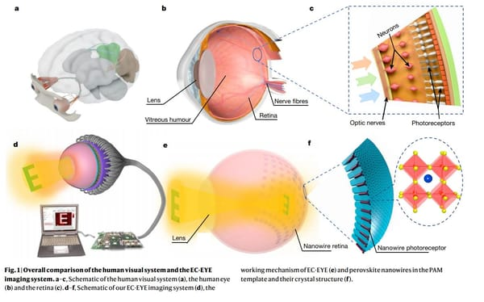
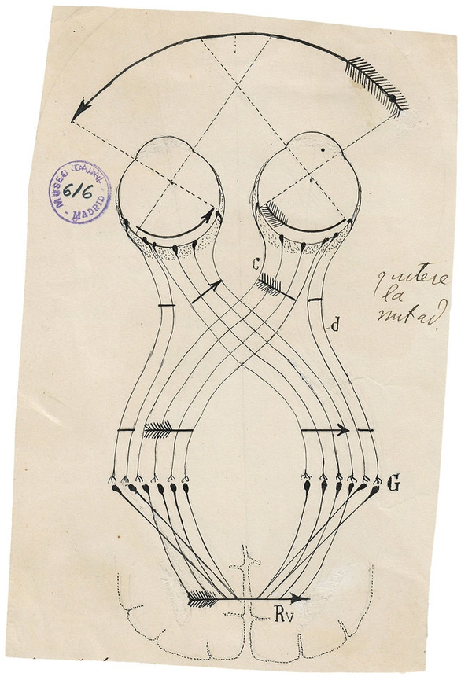
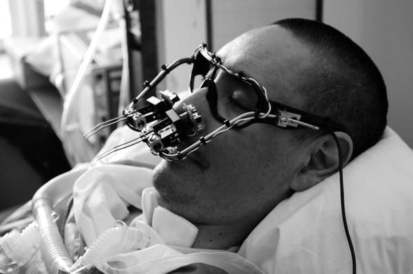

---
tags:
  - posts
  - output/newsletter
id: 65ac4ceb0e7c79000119abbf
title: Bricolage 002
feature_image:
description: Hello friend,
date: 2020-11-06
full-date: 2020-11-06T10:58:14.000-05:00
slug: bricolage-002
type: post
draft: false
episode: 13
---

Hello friend,

This is another Bricolage episode of the newsletter. From the [first Bricolage](https://davidnunez.com/newsletter/bricolage-001/):

> I made a plan for weeks like this, where an extended essay on a single theme is a bit out of reach for me. Every once in a while, I will publish a much shorter, skimmable (but hopefully still surprising and joyful) email.  
> 
> These smaller newsletters will contain one or two quick thoughts and links about Soulful Computing that I may have found over the past week. Sometimes I'll use this opportunity to provide updates on topics covered in a prior email. These letters might exist in that taxonomic space somewhere between a Twitter post and a short blog article.

If you're enjoying these newsletters or if you have any feedback, I'd love to hear from you.

Please do share these letters with anyone you think might be interested. You can also point people to the subscription page on my website ([https://davidnunez.com/subscribe](https://davidnunez.com/newsletter/)), where I have posted [the newsletters' past issues](https://davidnunez.com/newsletter/).

Meanwhile, I hope your weekend is filled with wonder and treats.

David Nuñez

## 1\. Eyes

In episode 8 of this newsletter, [Eye to Eye](https://davidnunez.com/newsletter/eye-to-eye/), I discussed eye contact through screens.

I needed new contact lenses earlier this year and was surprised that I could do the entire process online, including a nominal eye exam where I stood back from my screen and read letters out loud as the computer recorded my voice. I also had to take a close up picture of my eye for what, I presume, was a human to validate. Though for all I know, it might have been some machine learning or computer vision algorithm was looking for abnormalities.

Of course, online examinations are no substitute for comprehensive in-person exams. Human ophthalmologists undertake procedures like tonometry (eye pressure) tests and pupil dilations. However, during a pandemic, I'm curious about how many routine procedures we might feel more comfortable outsourcing to robotic surrogates, only escalating to humans when there are signs of disease or other abnormal results.

If a drone flew to your front door to administer a COVID-19 vaccine, would you take it?

* * *

Here is a robot that makes literal eye contact to help people insert contact lenses.

The device is going through medical trials in Boston. Craig Hershoff created the machine to help people rely on larger contact lenses that sit on the eye's sclera (i.e., the white part). The robot is voice-controlled by the patient who uses their other eye to watch a video feed of the insertion, which they have full control over.

This reminds me of why you should never poke a hardboiled egg after you put it in the microwave.

* * *

In 2016, surgeons at the University of Oxford performed the [first eye operation using robots](https://www.ox.ac.uk/news/2016-09-12-world-first-robot-eye-operation?ref=davidnunez.com). The Robotic Retinal Dissection Device (R2D2) inserts itself inside an eyeball through a hole less than 1 mm in diameter.

> The device is designed to eliminate unwanted tremors in the surgeon’s hand — such as through their pulse — so tiny surgical manipulations can be safely carried out within the eye.  
> 
> The robot acts like a mechanical hand with seven independent computer-controlled motors resulting in movements as precise as 1000th of a millimetre in scale.

* * *

Ramesh Raskar at MIT developed an inexpensive clip-on device for mobile phone cameras in 2011 that could help [detect cataracts in patients](https://news.mit.edu/2011/netra-cataracts-app-0701?ref=davidnunez.com).

* * *

Earlier this year, researchers in Hong Kong developed a technique to arrange a densely packed array of [photosensors on a hemispherical surface](https://www.nature.com/articles/s41586-020-2285-x?ref=davidnunez.com). This shell mimics the curve of an eyeball, allowing for a widened field of view. They also created a matching shell with a lens in the middle to complete the eyeball and filled the insides with sticky goo like the virtuous humor in our eyes.

Gu, L., Poddar, S., Lin, Y. et al. A biomimetic eye with a hemispherical perovskite nanowire array retina. Nature 581, 278–282 (2020).

Specifically, the researchers grew perovskite nanowires from a "garden" of nanoscopic holes in an aluminum oxide shell. Perovskite is a photosensitive material used in solar cells. This field of tiny wires is denser than the photoreceptors in our human eyes. However, the liquid metal connections to wire up the photoreceptors to a computer are relatively coarse compared to the individual nanowires, so the eye could only register about 100 pixels of light.

Nevertheless, in the paper, the researchers showed that the eyeball had high enough resolution to recognize letters.

* * *

Last year at the MIT Museum, we showed the drawings of [Santiago Ramón y Cajal](https://www.nobelprize.org/prizes/medicine/1906/cajal/article/?ref=davidnunez.com), the Spanish renaissance man who pioneered the field of neuroscience by deeply studying the anatomy of the brain in the 1800s. One of his drawings shows how eyeballs [process light inverted](https://www.mentalfloss.com/article/91177/how-our-eyes-see-everything-upside-down?ref=davidnunez.com) and reconstruct the image in the brain.  

Illustration by Santiago Ramón y Cajal from "The Beautiful Brain"

* * *

Free Art and Technology (FAT), OpenFrameworks, and the Graffiti Research Lab collaborated in 2010 with a graffiti artist named TEMPT1. He had ALS and was paralyzed by the illness, though he could still move his eyes. The [EyeWriter project](http://www.eyewriter.org/?ref=davidnunez.com) created "a low-cost, open source eye-tracking system that will allow ALS patients to draw using just their eyes."  

* * *

In January, MIT researchers [introduced a brain implant into a 57-year-old woman](https://www.technologyreview.com/2020/02/06/844908/a-new-implant-for-blind-people-jacks-directly-into-the-brain/?ref=davidnunez.com) with blindness to give her a rudimentary sense of vision.

> This was possible thanks to a modified pair of glasses, blacked out and fitted with a tiny camera. The contraption is hooked up to a computer that processes a live video feed, turning it into electronic signals. A cable suspended from the ceiling links the system to a port embedded in the back of Gómez’s skull that is wired to a 100-electrode implant in the visual cortex in the rear of her brain.

* * *

Here's a poem I wrote in 2003 about migraines:  

> **My Eyes are Going to Explode**  
> 
> I thought I ought to warn you  
> That my Eyes are About to Explode.  
> 
> I've not found a way to relieve them  
> They grow from behind.  
> 
> Pulse and pound  
> Pulse and pound  
> Like kettle drums for my brains.  
> 
> I really ought to warn you  
> That my Eyes are About to Explode.  
> 
> But if I did,  
> You'd miss the milky goo.

## 2\. Election Day 2020 Followup

Here is some followup for my newsletter I [published earlier this week](https://davidnunez.com/newsletter/election-day-2020/).

* We still don't know the results of Georgia's voting. It's very close. Elections officials blamed "[software glitches](https://www.wsbtv.com/news/politics/software-issue-gwinnett-county-delaying-up-80000-mail-in-ballots/66J4YIPG2NCH3JNCHRKCQOVVPE/?ref=davidnunez.com)" to have slowed down the vote count.
* Scientific American describes how [voting machines work](https://www.scientificamerican.com/article/an-expert-on-voting-machines-explains-how-they-work/?ref=davidnunez.com).
* Vox/recode [published an opinion piece](https://www.vox.com/recode/2020/11/3/21548057/voting-machine-broken-2020-elections-hacking-cybersecurity?ref=davidnunez.com) with many helpful links that put into perspective technical voting machine glitches and suggests cyberattacks are unlikely culprits for election day hiccups.
* From Inverse, more about [why voting machines "break."](https://www.inverse.com/innovation/why-do-voting-machines-break-on-election-day?ref=davidnunez.com) (tldr; human error).
* [Tom Scott](https://www.tomscott.com/?ref=davidnunez.com) argues convincingly why electronic voting still has problems.
* Flash drives. It always comes down to hand-delivering data around on flash drives via the "[sneakernet](https://www.wsj.com/articles/sneakernet-helps-election-officials-process-results-11604440573?ref=davidnunez.com)."

* * *

## 3\. Soup Recommendation  

I made tantanmen last Friday.

I used the Francis's recipe. I would highly recommend giving it a shot this weekend.
