---
tags:
  - posts
  - output/newsletter
id: 65ac4ceb0e7c79000119abc0
title: Choose Your Own Adventure
feature_image:
description: Hello friend,
date: 2020-11-13
full-date: 2020-11-13T12:45:36.000-05:00
slug: choose-your-own-adventure
type: post
---

Hello friend,

Due to my choices, I died many, many times when I was a child. Luckily, I kept my fingers inside the pages and could always undo my mistakes.

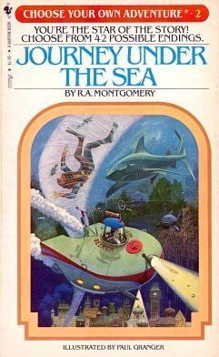

My brothers and I grew up with a shared library of [Choose Your Own Adventure](https://en.wikipedia.org/wiki/Choose_Your_Own_Adventure?ref=davidnunez.com) (CYOA) books. These non-linear stories put the reader in charge of the narrative by introducing a decision tree. You start reading on the first page, and the soon book confronts you with a series of choices where you flip to a different page depending on what you want to happen next.

> "If you decide to fight the squid with your spear gun, hoping to scare it off, turn to page 17.  
> 
> If you decide to signal Maray to pull you up at top speed, knowing you will get the bends, turn to page 19." -- CYOA #2, "Journey Under the Sea"

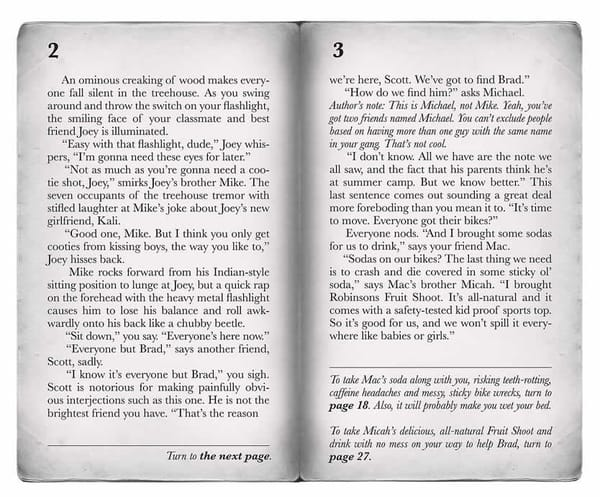

Pages from the Choose Your Own Adventure book

Initially conceived by Edward Packard and now owned by [Chooseco](https://www.cyoa.com/?ref=davidnunez.com), these books were revolutionary in form and content.

The books, written in a genderless second-person, would often have dozens of different endings, and not all of them were happy. It was pretty easy to die, sometimes unexpectedly and often illogically.

Like real life.

From Grady Hendrix's [interview with Packard](http://www.gradyhendrix.com/edward-packard-interview?ref=davidnunez.com):

> “I didn’t want it to be a random lottery but I didn’t want it to be didactic so that if you always did the smart thing you always succeeded. I tried to balance it.”

Each book had a preface:

> "BEWARE and WARNING! This book is different from other books. You and YOU ALONE are in charge of what happens in this story. There are dangers, choices, adventures and consequences. YOU must use all of your numerous talents and much of your enormous intelligence. The wrong decision could end in disaster — even death. But, don't despair. At anytime, YOU can go back and make another choice, alter the path of your story, and change its result" — CYOA #2: Journey Under the Sea.

Clearly, a lot was depending on my successful reading of these books. I got very skilled at keeping my fingers inside the pages as I flipped back and forth, just in case I chose poorly and needed to "undo." There were some gruesome, nightmare-inducing outcomes in some of these stories. I'm confident I was forever traumatized by this maudlin ending from "Inside UFO 54-40"

> The hours stretch into days; the days stretch into weeks. Now you have waited so long that the computer tells you your chances of surviving hibernation are nearly zero. You can only hope that somehow your crystal ship will reach the new planet before you grow old and die ... But the months go by and nothing changes. You grow more and more depressed as you sit and wait, and finally, disoriented by the incredible loneliness of outer space, you lose all will to survive.  
> 
> The End

Because CYOA books can be represented as directed graphs (i.e., pages are nodes, and the directions to turn to a different page are the edges), we can visualize and analyze them using computational techniques.

For example, this is [Andrew Stern's sketch](https://web.archive.org/web/20191012101539/https://grandtextauto.soe.ucsc.edu/2003/09/02/choose-one-of-four-deep-paths/) of "Night of a Thousand Boyfriends" from the CYOA copycat "Date With Destiny Adventures" series.

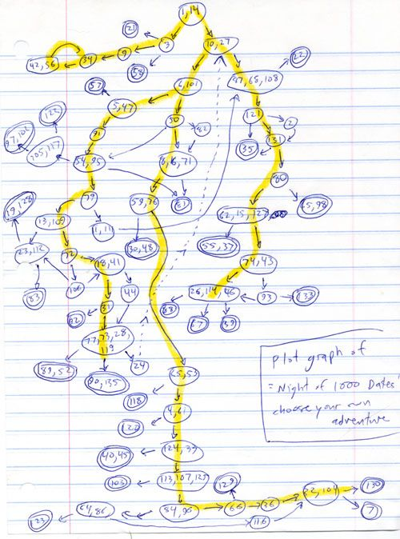

"Night of a Thousand Boyfriends" sketch

This kind of exercise has been assigned in digital humanities and computer science classes at schools like [George Mason University](https://www.samplereality.com/gmu/fall2008/343/guidelines/media-inquiry-1-cyoa/?ref=davidnunez.com), [Rensselaer Polytechnic Institute](https://tactical.wp.rpi.edu/projects/862-2/draft-assignments/loop-if-statements-and-string-manipulation-homework/choose-your-own-adventure-game-analysis/?ref=davidnunez.com), and the [University of Maryland](https://web.archive.org/web/20130518181453/http://otal.umd.edu/~mgk/courses/spring2004/467/archives/000265.php). A student named Greg Lord created an [interactive map of The Third Planet from Altair](https://web.archive.org/web/20171129001528/http://www.ethblue.com/cyoa/altairlarge.html) with [analysis](https://web.archive.org/web/20171022014832/http://www.ethblue.com/cyoa/essay.html). He [categorizes the pages of the story and the routes through them](https://web.archive.org/web/20171012231300/http://www.ethblue.com/cyoa/routes.html) using terms like "decision," "cliffhanger," and, of course, "death."

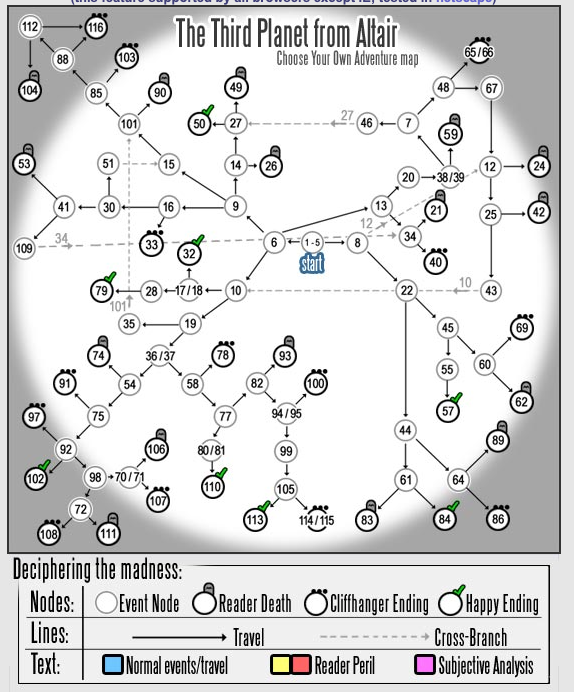

Greg Lord's CYOA visualization of "The Third Planet from Altair"

He writes:

> In a text with only six favorable outcomes amid some thirty-eight possible conclusions, indeed the reader seems intensely vulnerable — even doomed perhaps — if he were to travel only a single path. The odds, quite simply, are against him. It requires luck and a certain clever anticipation to properly guide one's character to a successful completion when faced with the seemingly infinite paths of the book.

Sean Ragan [wrote a graphviz program](http://www.seanmichaelragan.com/html/%5B2008-03-07%5D_Choose_Your_Own_Adventure_book_as_directed_graph.shtml?ref=davidnunez.com) to describe and analyze "The Mystery of Chimney Rock." Here's a snippet from pages 10 to 28:

```html
10 -> 16
10 -> 17
11 -> 22
11 -> 21
12 -> 19
12 -> 20
14 -> 24
14 -> 25
15 -> 26
15 -> 28
16 -> 27
16 -> 31
17 -> 32
17 -> 34
18
19 -> 35
19 -> 36
20 -> 37
20 -> 38
21 -> 42
21 -> 41
22 -> 23
23 -> 39
23 -> 40
24 -> 44
24 -> 46
25 -> 48
25 -> 49
26 -> 54
26 -> 50
27 -> 56
27 -> 57
28 -> 52
28 -> 55
```

[Christian Swinehart](https://samizdat.co/?ref=davidnunez.com) created a series of beautiful visualizations and an [interactive essay about CYOA](https://samizdat.co/cyoa/?ref=davidnunez.com#/). (sadly, as I write this, it appears the animations are not working on his site, but it's still worth a read).

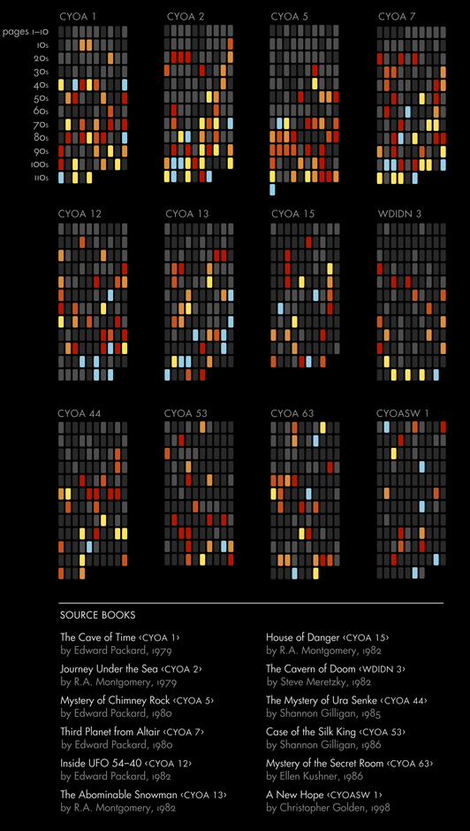

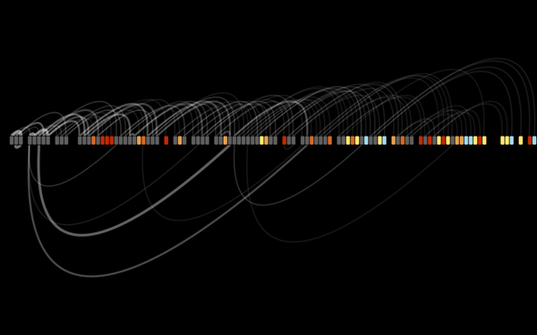

Comparison of 12 CYOA books & All the paths of Journey Under the Sea by Christian Swinehart

Chooseco has [created maps of their books](https://www.atlasobscura.com/articles/cyoa-choose-your-own-adventure-maps?ref=davidnunez.com) which it includes in recent editions.

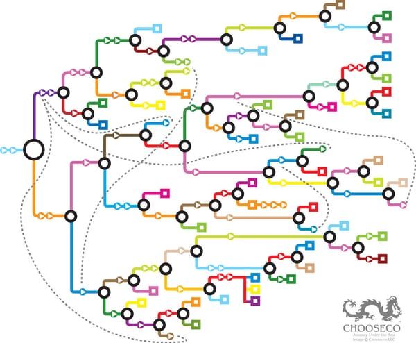

Journey Under the Sea story map, Chooseco

When you lay out the stories in these formats, you start to discover surprising features.

> Nick Montfort, a poet and professor at the Massachusetts Institute of Technology who studies interactive fiction, has a habit of asking people what they know about “Choose Your Own Adventure” books. “They often say, ‘You have two choices after every page,’” he says. “That’s not true. Sometimes you have one choice. Sometimes you have more than two. When you show the maps, you can see that these books don’t look exactly the same.” — from Atlas Obscura, [These Maps Reveal the Hidden Structures of 'Choose Your Own Adventure' Books](https://www.atlasobscura.com/articles/cyoa-choose-your-own-adventure-maps?ref=davidnunez.com)

For example, in "#1 Cave of Time," you can make choices that will put you on a circular loop, rereading the same pages until you make a different choice. As the hero of "Inside UFO 54-40," you learn about the paradise planet of _Ultima._ In the book, there is a written happy ending where you land on _Ultima_. However, there exists no path to this page. No matter what choices you make, you'll never turn to page 101. This ending is an isolated island in the graph with no arrows pointing to it.

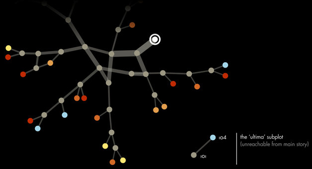

The Ultima subplot, Chrstian Swinehart

The only way to get to that ending is to "cheat" and flip to that page without following the book's usual branching instructions.

> "You did not make a choice, or follow any direction, but now, somehow, you are descending from space ... 'No one can _choose_ to visit _Ultima_, says Elinka. "Nor can you get here by following directions. It was a miracle you got here, but that is perfectly logical, because _Ultima_ is a miracle itself.'" — Inside UFO 54-40

This meta and self-aware nature of these books continue to inspire generations of readers. The format inspired other series like [Time Machine](https://en.wikipedia.org/wiki/Time_Machine_%28novel_series%29?ref=davidnunez.com) and [Choose Your Path.](https://www.goodreads.com/shelf/show/choose-your-path-story?ref=davidnunez.com) Of course, there have been spinoff ideas like a CYOA [movie](https://www.hollywoodreporter.com/heat-vision/choose-your-own-adventure-movie-566228?ref=davidnunez.com) and [board games](https://www.mentalfloss.com/article/625942/choose-your-own-adventure-books-board-games?ref=davidnunez.com). Chooseco and Oni-Lion Forge Publishing Group are creating the first CYOA book rendered as a graphic novel, "[Eighth Grade Witch](https://www.gamesradar.com/official-choose-your-own-adventure-comic-books-coming-from-oni-lion-forge/?ref=davidnunez.com)" to be launched next Fall.

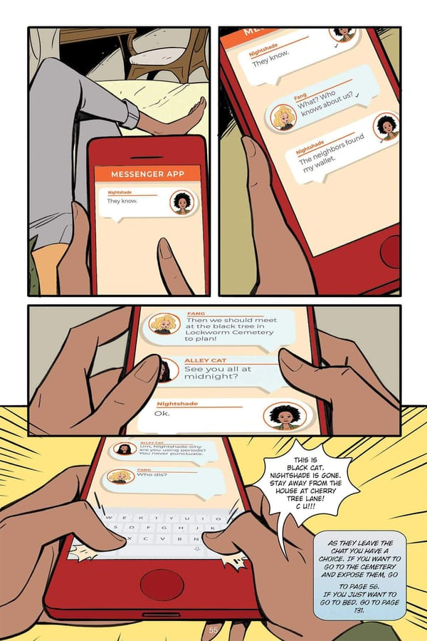

Page from "Eighth Grade Witch", Chooseco

Netflix produced a feature-length episode of the Black Mirror anthology called [Bandersnatch](https://www.npr.org/2018/12/28/680671691/black-mirror-bandersnatch-makes-you-choose-your-own-adventure?ref=davidnunez.com), which uses a technology called [CtrlMovie](https://www.ctrlmovie.com/?ref=davidnunez.com) to give viewers an interactive experience while watching movies. Throughout the film, viewers make multiple-choice decisions for the characters that ultimately affect which ending gets shown. Chooseco [promptly sued Netflix](https://deadline.com/2019/01/netflixs-black-mirror-bandersnatch-subject-of-suit-over-use-of-choose-your-own-adventure-1202533643/?ref=davidnunez.com) for trademark infringement.

I'm nostalgic for Choose Your Own Adventure books. They remind me of my childhood, a time when choices were straightforward. Page 14, defeat the squid. Page 48, get sucked out an airlock. Either way, the story ends.

In the books, I had agency over my fate, but not really. The storylines wrapped around the nodes of a graph. As we get older, the choices we make are never so simple, and they certainly aren't always undoable, no matter how many fingers we keep in the pages.

Our story graphs are dense and complicated. We jump from node to node as the heroes of our own journey. Some paths are more comfortable and more pleasant than others. There are some gruesome, illogical endings. There are unreachable islands in our graph. That's ok.

Nobody's promising there will ever be a happy ending, but we get to experience the miracle of turning the pages ourselves. _Ultima_ might be out there somewhere, and it's OK to go looking for it. Just don't forget to enjoy the words on your current page.

Turning to Page 101,

David Nuñez

* * *

## Coda

* This newsletter is especially short and sweet as I've been attending the [MCN 2020 Virtual](https://mcn.edu/conferences/mcn-2020-virtual/?ref=davidnunez.com) conference, and am a bit brain-fried this morning. The sessions have been incredible and I'll have some observations to share about some of the virtual conference experiments we are conducting.
* For a COVID-hobby as the weather gets colder here's [How to Write a CYOA story.](https://medium.com/swlh/how-to-write-a-choose-your-own-adventure-story-9d353fa84ce4?ref=davidnunez.com)
* A [collection](https://electricliterature.com/7-choose-your-own-escapade-books/?ref=davidnunez.com) of branching narrative books suited for adults. "Choose Your Own Misery, The Holidays" in particular seems timely.

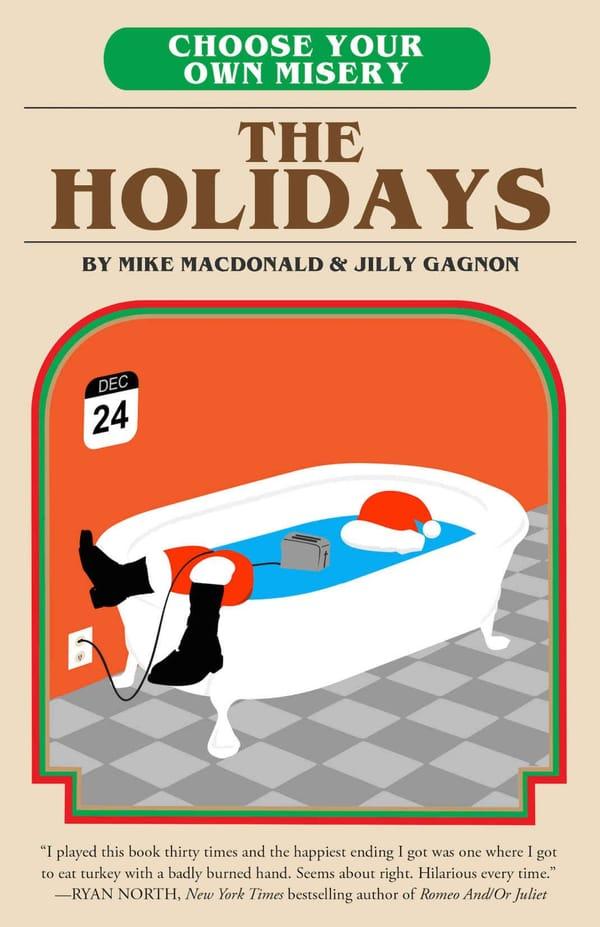

* [Nik Montfort](https://nickm.com/?ref=davidnunez.com) at MIT maintains [The Trope Tank](https://nickm.com/trope_tank/?ref=davidnunez.com), a studio and laboratory for researchers and students to explore digital literature such as interactive fiction.

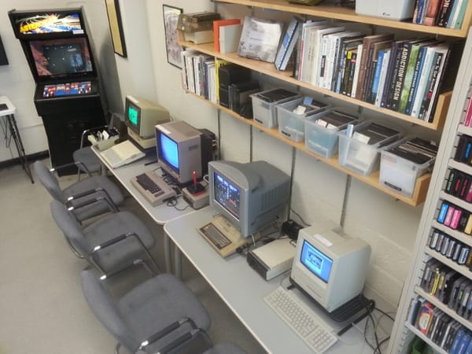

* * *

_I was listening to [Choose Your Battles by Katy Perry](https://open.spotify.com/track/3rHUpjfq9JjrfaTsEAmQBC?si=Jaabp3SyT8291LjaB5mpHg&ref=davidnunez.com) on repeat while writing this newsletter._
