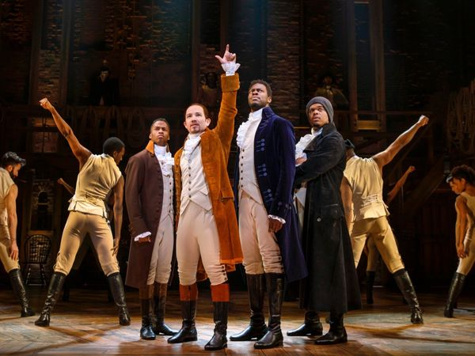
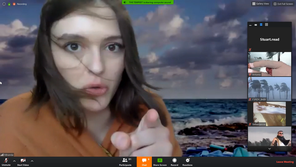
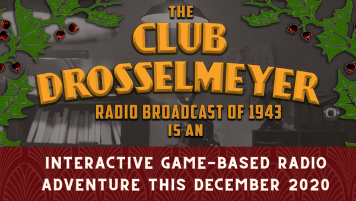
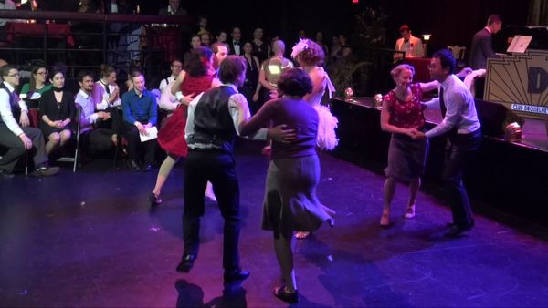
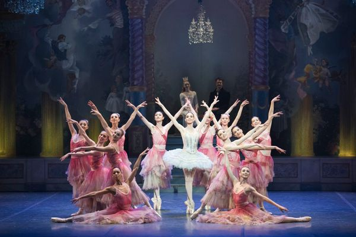
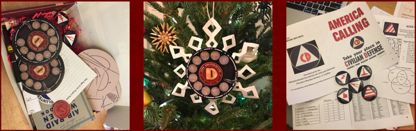
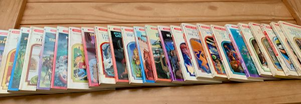

---
tags:
  - posts
  - output/newsletter
id: 65ac4ceb0e7c79000119abc1
title: The Show Must Go On(line)
feature_image:
description: I have a confession.
date: 2020-12-07
full-date: 2020-12-07T14:46:04.000-05:00
slug: the-show-must-go-online
type: post
---

I have a confession.

Somewhere in middle of Act II of Hamilton, I think between "_The Adams Administration_" and "_We Know_," I fell fast asleep. This was the original cast on Broadway, mind you, and I was sitting in some of the best seats in the house. I was so close that I could see the actors' sweat and King George's spittle fly across the stage.

Apparently I was snoring quite loudly, disturbing other people around me. However, Lin-Manuel Miranda, the commensurate professional that he is, didn't seem to notice and the show continued flawlessly. I woke up during the curtain call as someone next to me stood up.

Still from Hamilton on Disney Plus

I should clarify. When I say, "best seats in the house," I mean the "best seats in **my** house." I was watching the [filmed performance](https://en.wikipedia.org/wiki/Hamilton_\(2020_film\)?ref=davidnunez.com) released on the Disney Plus streaming service. To be fair, what I did see of the show was great.

I've never seen the musical in person, but I could get a sense of what the hype was about. My falling asleep had less to do with the performance than with the comfiness of my couch. Though, to be honest, if I had [paid $3000 for a ticket](https://www.cheatsheet.com/entertainment/hamilton-tickets-are-still-ridiculously-expensive-but-why.html/?ref=davidnunez.com), I would have sprung an extra $20 on 5 cups of coffee to make sure I didn't miss a second.

However, since this was a recorded and edited film, I also knew that the element of risk was not there. It was a Disney production; there weren't going to be any rough edges. (Side note: here's [a paper I co-authored](https://www.sciencedirect.com/science/article/abs/pii/S0921889016305358?ref=davidnunez.com) about the balancing between sequence and risk with entertainment robots). Furthermore, in a non-live performance, it would be impossible for the audience to [entrain with each other or the actors](https://www.nature.com/articles/s41598-020-60832-7?ref=davidnunez.com), making a truly shared experience difficult.

As theaters remain closed around the world, and live performances in physical space are non-existent or staged in socially distant venues like [drive-in movie theaters](https://eno.org/news/eno-is-launching-eno-drive-live-a-series-of-live-opera-performances-that-audiences-can-safely-drive-to-and-stay-in-their-cars-for-the-experience/?ref=davidnunez.com) and [outdoor spaces](http://exeuntmagazine.com/reviews/the-white-whale/?ref=davidnunez.com), theatre is necessarily evolving.

The cast of Hamilton gave a performance over Zoom for Aubrey, a 9-year-old fan. Without any of the costumes, sets, and lighting, I guarantee you this little girl still had an unforgettable once-in-a-lifetime experience.

Earlier this year, [Creation Theatre](https://www.creationtheatre.co.uk/?ref=davidnunez.com) and [Big Telly Theatre Company](https://www.big-telly.com/?ref=davidnunez.com) staged Shakespeare's _The Tempest_ via Zoom. The play, at its core, is about loneliness, making it a poignant work for our pixelated 2020. The company took advantage of the format and played with this notion of disconnection and reconnection using the chat window and encouraging audience participation during key moments. To recreate the titular storm, for example, viewers all turned on their microphones and cameras, snapping their fingers to recreate rainfall.

Still from The Tempest, as staged by Creation Theatre and Big Telly Theatre Company

During the proposal scene between Ferdinand and Miranda, the audience sees the actors on a split screen. Using a bit of well-practice choreography, Ferdinand seemingly reaches across the screen to touch his future bride. This is a striking and painful reminder to the audience how [precious and rare physical human contact can be in 2020](https://davidnunez.com/newsletter/touching-a-heartbeat/). Caliban's description of the noisy island is bittersweet, when the audience knows that he is actually alone online somewhere, hearing nothing, “Sounds, and sweet airs that give delight and hurt not.”

In a famous theatrical breaking of the fourth wall, Prospero delivers the epilogue ("Now my charms are all o'erthrown") to the camera as all the other actors begin dismantling their at-home sets and green screen background. As Prospero suggests the audience is holding him captive, the rest of the cast changes their zoom names to their real names. The audience sees them, now just like us, alone in their homes. The spell is broken and nobody but Prospero remains on the island, and yet everyone is in socially distant isolation.

Prospero asks the audience to free him with their applause using their "good hands" and "gentle breath." We know, by now, there can be no real applause on a Zoom call.

The spell holds.

* * *

## 1943

My friend, [Kellian Adams](https://twitter.com/museumninja?ref=davidnunez.com), is an innovator in performance art, theater, and gaming. For several years, she has produced [Club Drosselmeyer](https://www.clubdrosselmeyer.com/?ref=davidnunez.com), a live happening at a quirky performance space in Harvard Square. She creates an alternate universe loosely based on the framework of Tchaikovsky's The Nutcracker Suite set in a mid-century WWII-era nightclub, complete with a live swing band and variety acts.

The audience doesn't come to passively observe; they become players and characters in this interactive experience, solving puzzles, dancing the Lindy Hop, and interacting with actors to ultimately affect how the evening plays out. The evening's proceedings involve dance performances alongside robots, magicians, and acrobats.

Kellian is very adamant that if you come to the show, you can engage at whatever level you find most comfortable.

Due to the COVID-19 pandemic, she has had to rethink how to create the Club Drosselmeyer experience remotely while still maintaining the sense of audience agency and participation. I had a conversation with her about her plans.

_Edited for clarity._

**Why did you create Club Drosselmeyer?**

There's this really wonderful book that I read recently called "[Dancing in the Streets](https://www.amazon.com/Dancing-Streets-History-Collective-Joy/dp/0805057242?ref=davidnunez.com)" that talks about joy and how little in the world we get to do things like yelling, cheer, and dance and laugh out loud. That's not part of our modern consciousness in the sense of a festival or a parade. These days, it's mostly like you sit and you watch things.

I'm an obsessed swing dancer. This really sort of defined my adulthood in a way that nothing else has really. I would say that really sort of changed the trajectory of what became as a grownup. My friends are swing dancers... my husband's a swing dancer.

When the pandemic hit, that was the biggest blow to me because Mondays we go to practice and Wednesdays we teach and Fridays is the dance with the live band. I'm not a person who stays home.

Swing dancing was something that brought ecstatic joy to people. There's sort of a quietness and a sadness, and then you bring people somewhere with this rebellious joy. This music was created during one of the worst times in modern history, and we will not let the times get us down.

Stanford Dancers in Club Drosselmeyer

I loved that concept of housing behavioral expectations in harmless media that Douglas Rushkoff writes about in [Media Virus](https://www.amazon.com/Media-Virus-Douglas-Rushkoff/dp/0345382765?ref=davidnunez.com). I think that swing is such a good example of that. We want you to respond, "These things are acceptable. These things are not acceptable." None of it is spoken, but all of it is very described.

This is our proof of it, created by the most oppressed community during the most oppressed time... an FAQ to fate, which I love so much. It's just such a wonderful response to to despair, you know, like a defiance of despair.

I really think that there's a sad part of our generation in that there's a there's almost a loss of how to celebrate, like, "what do we do at a party. How do we have fun? How do we get that sense of joy?"

People self medicate to get there because they don't know what else to do.

I think that movement and music get us there. The fact that dance is not part of our everyday culture is such a heartbreak. Everybody always overstates the things that are near and dear to them, of course. I do think that if we saw more music and social dancing in our culture than we would see reduced levels of depression.

I wanted to see that we can innovate on this tradition that I've been so lucky to inherit. That's been kicking around in my brain for maybe 10 years. I wanted to give back to that community, somehow. I wanted to do more to bring the spirit of this defiance into our generation, and I know that it's available to weirdos like me.

**How does Club Drosselmeyer relate to The Nutcracker Suite?**

I wanted to do something immersive and interactive and then I realized that the Nutcracker was kind of the perfect environment to be able to build this world and bring it out to people. It works because it has an existing context. We've got an existing tradition. People are always looking for variations on it.

The great thing about a Nutcracker is that you can get local communities all to put their energy into one act. So, this tap dance group is going to do something... this group of acrobats is going to do something... and it's replicable across cities. This is the game designer me. You build an idea that accomplishes the task that you want at hand, but with the structure that will let it scale if it ever needs to. Create a small thing with the idea that we can produce this show in every city in America.

It's not like Hamilton where we've got our all-star cast and you have to travel to New York to see the authentic version of the show.

The Nutcracker tradition is that every town can have their own variation with their own local heroes. When I saw that that was a thing, I wanted Club Drosselmeyer to be loosely associated to Nutcracker because every town that we build it in someday can have its own influence.

We have the pattern of The Nutcracker. You know, first it's the overture and eventually the Military Dolls dance, etc. So with with that structure that everybody has seen ad nauseam we could just do a lot of different things.

Boston Ballet's The Nutcracker via [The Boston Globe](https://www.bostonglobe.com/2019/11/30/arts/boston-ballets-nutcracker-keeps-faith/?ref=davidnunez.com)

How do we make it flexible enough so that can happen? We have a loosely associated group of characters and stories. The stories sort of melded a little bit, according to the available resources. Like, I've got this one guy, and he's the real charmer, so he's in the role of a scientist, and he's looking for a date. Here's a book of manners. Have him talk to people about it to give him suggestions on how to get a date, and he loves it. It works really nicely and it has every year.

It's similar to jazz and swing. It's something that has a very solid structure so you can always innovate on it can be very flexible.

**How do you think about the universe of Club Drosselmeyer and its historical context?**

The 1940s was a really interesting time. I always love playing with the past because there's the actual past right and then there's the past that everybody has in their head. The nightclub that we created was the imaginary space that people have in their heads when they think of 1942. It wasn't actually like that; we're just being true to people's impression of the past.

Games are good at this. They give you a door into imaginary realities. But games are not good at giving a ton of content right away. We wanted to build an interaction that you could deal with at multiple levels. If you really want to get into the story, every single character has a historical corollary. In Club Drosselmeyer 1939 we talked about the creation of radar at MIT. So, Russell Meyer industries is headquartered on Vassar Street, and they have a secret lab with brand new technology.

Not very many people really go into that backstory, but it's there if they want it. Historically, there was continuity between each year's production, but within the story there wasn't because it was a game where the players have affected the ending.

**What strategies did you use to pull audiences into the physical world you were building?**

We really try to create varied levels of entry. So, I designed Club Drosselmeyer so that a serious puzzler could play it. If you want to come in just to dance, you can do that. Even if you don't even know that there's a game, that's ok. I want all of those people to feel like they have a place there.

Nonverbal communication means so much. There was this great article by Nina Simon about the [Magic Vest Phenomenon](http://museumtwo.blogspot.com/2009/02/magic-vest-phenomenon-and-other.html?ref=davidnunez.com). She was talking about the Acton Science Discovery Museum. She wore a vest, and this vest meant that she was somebody that strangers could talk to about science. While she had that vest on, people would approach her, and then she could talk about the things she loved, and they were happy to hear about it.

She said that sometimes that would bleed into a regular life. She'd be at the grocery store, there'd be a kid there and start talking to them, but of course you know that's not that's not really acceptable to talk to children in public. She didn't have the magic vest. When people don an item of clothing, they have bought in. They can't pretend they didn't mean to be there anymore.

We told our audience in advance, "this is how you're dressed like it's 1938. Wear suspenders and a bow tie and shiny shoes." We also had a big trunk of clothes for people to put on when they arrived, just in case. It's this physical thing that you wear to say like I am part of this world now. You can't pretend that you're too cool for this anymore because you're in it. That really made a big difference.

Herr Drosselmeyer from Club Drosselmeyer

I also made sure that all my vintage friends showed up. I call it "the power of five." If you have five people who are together who are part of a community who are modeling a certain behavior, then it's easier to get other people to join them because five is two pairs and a spare. There's there's always an empty chair when there are five people there. So, that's just enough people to make people want to join.

Vintage people were there dressed to the nines. Our dancers were there, also dressed up. But, you know, they were also dressed to sweat. Every once in a while, somebody would show up wearing jeans and a t-shirt, and they would come directly to me and sheepishly apologize. They never did it again. Nobody has ever done that two years in a row.

**In 2020, you don't have a box of have clothes to give people... you can't create sets or put actors in the same space as the audience. Now, how are you thinking about world building with this year's production?**

This has been really a challenge. During the first year of Club Drosselmeyer we were just kind of hanging on. There were holes everywhere. So many things fell through the cracks because it was so new. People still loved it because they've never seen anything like that before it was just so weird and novel. I feel like I'm there again.

The two things I always try and spend money on are sound and artists. People don't realize how important sound is when you're constructing an environment. It's like a smell; people don't even realize that it's there, but it changes their behavior.

I have great inter-actors, and they know how to engage people, but they can't right now. I've got an excellent set designer, and he knows how to create a world, but he can't right now.

Some of the strongest tools in our toolbox are just not available. That's really frustrating.

**I know Zoom didn't exist in 1943, but I'm curious why you didn't consider using it as part of your production.**

Zoom calls are like watching a movie. I remember thinking about this when I was watching like Saving Private Ryan and its horrible Omaha Beach scene.

It makes you think about what must have been like. I think the difference between movie tragedy and real tragedy is that if you were on Omaha Beach, you can look up, you can look around, and you can look in the distance. When you're looking at a movie you really like just driving right into that director's vision. I feel that way about zoom interactions, you know, like when we're in person, I've got a cup of coffee and there are other things happening. I can look over there and I hear that. Oh, that's a song that I like. And there's just a lot of things to buffer the interaction. So, it doesn't feel quite as stressful. Now in the world of zoom, everything is very directed. You have nothing to do but stare at me.

We're tired after these zoom interactions.

I've seen puzzling give people a third space in the digital world. Something where they can be together but focus on something else. It's one of the few things that I've seen that can do this. It reminded me of when we were preparing the Drosselboxes (_kits that will be sent out to the audience containing the puzzles and other swag related to the experience)_. We had a folding party and I realized this is another thing that creates a third space. There were six or eight of us for two hours, we were folding stuff and just chatting about absolutely nothing because we had a task. Everyone was like, "wow this is the most pleasant call we've ever had."

So, this year we'll have much more puzzling than usual. Puzzles are an interaction that I've seen work really well in this distant environment.

**How did you design puzzles in this year's Drosselmeyer universe?**

This year I really wanted people to win the game by being collaborative rather than competitive. So, we're in 1943 and the Civil Defense Corps were the neighborhood watch team that would get together and prepare in case we were bombed. I have this wonderful board and handbook from the era. We pored through the whole thing to find everybody's civilian logos. There's an emergency food and beverage person, the bomb reconnaissance person, or utility repair person. They all have their logos, and they'll have the things that they're supposed to do. We created puzzles where you needed information from all of these different people in order to complete it. Everybody will have different roles.

Puzzles from Club Drosselmeyer Interactive Radio Adventure of 1943

I looked at games like "Space Team," "Keep Talking and Nobody Explodes," and "Don't Get Got" to find variations that are good for a group to model this collaborative gameplay.

We tested the hell out of it, but I'm really, really curious to see how people play.

**What will the experience be like?**

We created a radio broadcast using the recordings of the live band from Club Drosselmeyer 1941. I listened to a lot of Jack Benny, and we created this sort of old-timey radio show with our band playing between all of the different skits.

You can play if you don't want to touch anything that you can just sit listen to the radio show. We do radio magic. We have live animals. We shoot somebody out of a cannon. It's pretty entertaining.

Then it gets kind of interesting because we created a choose your own adventure phone system that will drive what audio track you listen. There are maybe 20 different audio tracks, but you only have two hours. So, you're only getting maybe seven to 10 of them in between the music, the phone calls that you make, and the puzzles that you solve.

There's replay as well, so after you get to an ending, if you want to go back to the beginning and try it again with different puzzles in different pathways, you can do that too.

We encourage people to play in groups of two to five. If you want, you can just play it on your own. The whole thing is automated. There are several different endings.

If you want to play the live version that is also it has, you know, these automated directions, but hen at the end of these different pathways, you get to talk to a real person. If you have any questions or you want to talk to a person or you want live tech support you know and like you'll get calls, maybe two or three times over the course of the evening.

We'll also host after party on [Gather](https://gather.town/?ref=davidnunez.com), so everybody can get together and go over their puzzles and talk to the actors. Because everybody will go down different pathways, you won't really know what the other endings are unless you talk to other the players.

_Tickets for Club Drosselmeyer 1943 are selling out, but I think there are still a few slots available: [https://www.clubdrosselmeyer.com/1943tickets](https://www.clubdrosselmeyer.com/1943tickets?ref=davidnunez.com)_

* * *

## All the world is now an online stage

When Zoom windows act as pixelated proscenium frames, we all become set designers, lighting directors, and actors for our own digital audiences. Virtual meetings and family gatherings take on a sense of performance and our camera sense improves. Microsoft's Together mode puts [meeting participants in theater seats](https://techcommunity.microsoft.com/t5/microsoft-teams-blog/how-to-get-the-most-from-together-mode/ba-p/1509496?ref=davidnunez.com). This creates a shared sense of space and perhaps increases the give and take between performer and audience.

> People in Together mode know where others are in a shared virtual space. That means your brain can keep track of what other people are signaling or emoting in a natural way, relying on social/spatial perception; people can intuitively signal each other nonverbally. In a grid, you don’t know where other people are on the screen, relative to you, from their point of view, so natural glances and other subtle cues are impossible.

Screenshot of Microsoft Teams Together Mode

Some people have taken at-home production seriously and decorate their living rooms with an eye towards compositional balance and flattering angles. Real Estate agents are emphasizing [zoom-appropriate home offices](https://www.realtor.com/advice/home-improvement/what-is-a-zoom-room-tips/?ref=davidnunez.com). I've seen [multi-camera](https://www.youtube.com/watch?v=NBdXCk58UxU&ab_channel=LensProToGo&ref=davidnunez.com) setups and elaborate [studio lighting](https://nymag.com/strategist/article/best-lighting-for-video-calls-zoom.html?ref=davidnunez.com) starting to show up in some of my Zoom meetings. Tools like [mmhmm](https://www.mmhmm.app/?ref=davidnunez.com) help people produce at-home talk shows during presentations. Production value is a new signal of power dynamics and competitive advantage as cinematography is yet another new skill we'll need to remain relevant in the 21st century.

MIT has indicated that people like me, who can effectively work from home, should continue working from home at least through the end of the academic year in Summer 2021, extending the run of my own work-from-home performances to 1.5 years. I'm starting to rethink how my home office is set up and am seriously considering investing in better cameras and lighting setups, so I can put my best face forward.

I'd be curious if you think of yourself as an actor when you are on a Zoom meeting. Do hit reply on this email and let me know!

Until Then...

Break a leg,

David Nuñez

* * *

## Coda

* I missed a few weeks of newsletters. I can blame one of those on Thanksgiving. However, I'm also participating in [Ali Abdaal's Part Time YouTuber Academy](https://academy.aliabdaal.com/?ref=davidnunez.com). It's been a surprisingly intense and very interesting course. To me, the real valuable section has been an overview of systematic production of content; he's showing his techniques for [streamlining productive creative output](https://www.youtube.com/watch?v=uJgv0XQOehs&t=8s&ab_channel=AliAbdaal&ref=davidnunez.com) and minimizing friction. It's made me rethink my whole approach on Twitter, my website, and even this newsletter. Especially If I decide to throw YouTube in the mix, then I'm going to need to optimize my workflows (this is not my full time job, after all). I'll probably spend my holiday break doing a lot of thinking and planning about this. I'll say this for now: I'm more energized than ever to be making stuff for you.
* Here are a couple of my YouTube homework assignments. I'd love your feedback. As they say, "Don't forget to subscribe!"
* The Stay Inn's _Midsummer Night's Stream_
* After reading [Episode #14 of my newsletter about Choose Your Own Adventure](https://davidnunez.com/newsletter/choose-your-own-adventure/), my mom dug out some books from the old collection.  

Collection of Choose Your Own Adventure books from Mom

* * *

_I was listening to Queen's [The Show Must Go On](https://open.spotify.com/track/7hGNdtKkwsH4vUgmTo5Wbw?ref=davidnunez.com) on repeat while writing this newsletter._
