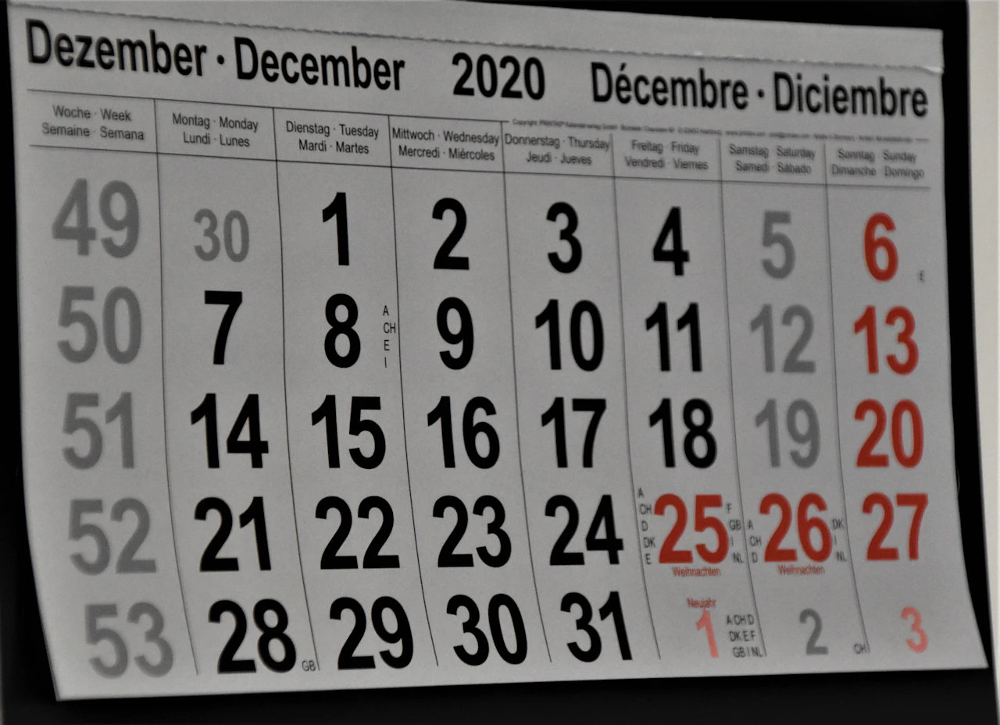
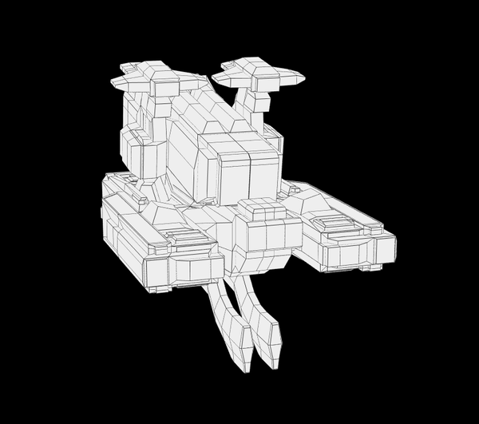

---
tags:
  - posts
  - output/newsletter
id: 65ac4ceb0e7c79000119abc2
title: Patience
feature_image:
description: There's something about December that sends me into a frenzy of trying to wrap up projects as if I'm trying to make up for not being as…
date: 2020-12-18
full-date: 2020-12-18T15:32:28.000-05:00
slug: patience
type: post
---

There's something about December that sends me into a frenzy of trying to wrap up projects as if I'm trying to make up for not being as productive as I could have been all year.

Resolutions are unmet. Projects are incomplete. Life is still in disarray.

Obviously, it's all in my head, but Decembers tend to be a terrifically unhealthy mix of holiday slowdown and productivity fiction. Of course, it's 2020, and I think there are probably even more reasons to go easier on myself this year.

I wrote a tweet earlier this month.

> I have this habit of making a list in early December of all the wonderful projects I will complete during my holiday break.  
> 
> I usually never fully accomplish any of them and make people around me miserable as I refuse to take a break.  
> 
> Perhaps I need a new strategy for 2020?
>
> — David Nuñez (@davidnunez) [December 7, 2020](https://twitter.com/davidnunez/status/1335941065220747266?ref_src=twsrc%5Etfw&ref=davidnunez.com)

I don't think it's likely I'm going to remodel our kitchen, finish writing that short story collection, thoroughly redesign and build out my home office, become an expert on Adobe Premiere Pro, organize the millions of files in my hard drive, read that stack of 20 books queued up in my Kindle app, implement my backlog esoteric programming language ideas, launch an iPhone app, go into the museum to get a jump start on next year's work _and_ watch the entire [Marvel Universe movies in chronological order](https://www.techradar.com/how-to/how-to-watch-the-marvel-movies-in-order?ref=davidnunez.com).

Certainly, I can't get that all done before Christmas. So, I'll adjust my expectations and finish that all by New Year's Eve. That'll give me a day or two to be lazy before work starts again next year.

I'm kidding.

But only barely and through gritted teeth.

Of course, time means [nothing these days](https://davidnunez.com/newsletter/time-is-weird-in-2020-2/), so it's especially absurd to assign arbitrary dates on calendars to sweep away the past and start afresh. That said, it'll be nice to get 2020 behind us, wouldn't you agree?

Everything's been a load of chaos and movement this year, and I haven't had the chance to stop and breathe. There's not been time to ask the more significant, existential questions. So, I am excited to spend some quality downtime over the next couple of weeks to do some strategic thinking about these things I am making, like this newsletter.

Someone asked me recently why I'm writing these emails and what I hope to accomplish. Sure, I suppose I have a vague notion of wanting to build up a "platform" and "establish thought leadership." (Yuck. 🤮)

Though I have nothing in mind right now, it's not outside the realm of possibility that in the very distant future, I'd use this newsletter to try to market something like an "information product." (Gross. 🤮)

Hopefully, whenever that time comes, it will make perfect sense to both of us. The value would be obvious, and you won't take too much offense. You'd just unsubscribe if I take myself too seriously, anyway.

My Twitter friend, [Alli Hartley-Kong](https://twitter.com/AlliHartley1?ref=davidnunez.com), wrote a staggeringly honest essay that she read aloud at this year's [MCN conference](https://mcn.edu/conferences/mcn-2020-virtual/?ref=davidnunez.com). During this challenging year for museum workers, talented people like her lost their jobs in a downsizing bloodbath all across the field. In her story of resilience, Alli gave thanks to _writing_ as a means to refocus. It helped her find meaning and work through the confusion and pain of 2020. Through it all, she found herself returning to one of her earliest passions, playwriting.

(_Note: Certain sessions at MCN were following the_ [_Chatham House Rule_](https://en.wikipedia.org/wiki/Chatham_House_Rule?ref=davidnunez.com)_: discussions are closed-door and off-the-record. This included the session on_ [_Stories of Resilience and Resistance_](https://mcn2020virtual.sched.com/event/dfXT/stories-of-resilience-and-resistance-what-happens-when-cyclical-work-becomes-sisyphean?ref=davidnunez.com)_, where Alli read her essay. I got her permission to mention her story here, and she has plans to publish the piece online soon. I'll point to it when it's up._)

In her essay, she captured the "why" for writing in a way that resonated strongly with me.

> "If there's a moment where you're not feeling particularly resilient, I invite you to write with me. I hope you'll find in words more resilience than you can imagine."

This newsletter has been a way for me to exercise resilience. It is helping me work through 2020. I see them as love letters to my friends. Unexpectedly, I've benefited from the generosity of so many people responding with overwhelmingly encouraging feedback and helpful critique. Just dopamine hits, probably, but it also just _feels good_ to reach out to human beings when an authentic connection is so rare in 2020.

All of this makes me want to take "content creation" more seriously.

I felt a twinge of guilt when I missed a week or two of newsletters recently. I broke my promise to myself that I'd send something out weekly, no matter what. I don't think anyone but me actually cares though.

My most recent letters don't include the ethereal, [speculative fictions of the earlier episodes](https://davidnunez.com/newsletter/happy-upgrade-day/). Those stories are just genuinely fun to write, though they take an unsustainably long time to craft. I have a day job that makes significant demands on my energy. (I'm grateful for this, by the way.) Still, I'd like to find a way to explore that world building style a bit more.

People with [large followings](https://www.youtube.com/user/Sepharoth64?ref=davidnunez.com) say that consistency and longevity are the secrets of success, "Publish 2-3 videos on YouTube per week for a few years and your life will change." While there's a severe [survival bias](https://en.wikipedia.org/wiki/Survivorship_bias?ref=davidnunez.com) among these experts, I can appreciate that creative pursuits are a long, plodding pursuit.

I'm not too proud to admit that the so-called **Influencers**™ sometimes make me jealous with their prolific production and related fame and fortune. However, through observing them, I've realized that there's some merit in building tools and workflows that turn creation into a habit. Their overnight successes are 10 years of constant, professional production. They're a Big Deal because they just kept showing up with reasonably good stuff, beyond the point where most people just quit because they don't find traction.

Successful content creators treat their work seriously. There is machinary around what they do. They hire teams guided by standard operating procedures. They batch tasks and optimize their limited time to take advantage of their unique value propositions. They spend countless hours studying their platforms and each other. It's a lot of work to make it look so easy.

A calculated and crafted approach appeals to the system builder in me. It soothes me to set up calendars and flowcharts so that all creation friction is gone, and all I need to do is just show up to put ideas down on digital paper. It's fun to entertain the fantasy of optimizing away some of the inevitable drudgeries that come alongside making things. Tedium and pain always come, anyway.

It'll take time. I'm not fooling myself.

However, it is hard to be patient when the world moves at the speed of the internet. Watching people find success pumping out mediocre noise to flood social media algorithms is both disheartening ("doesn't anyone have any taste anymore?") and inspiring ("it'll be so easy to rise above the fray because I can do better").

This is hubris, on my part, naturally. I'm as much a noisemaker as anyone else.

No hack or expensive course will substitute for the long, slow effort of just making more things. _Many_ more things over a long time. That's the trick. It's difficulty lies within its simplicity.

I wonder, though, if this emphasis on prolific production and growth-hacking conflicts with my goal to soulfully connect with other humans through this technology. How can I truly learn or grow if I'm just pumping out content without giving myself space to breathe?

It'd be like a neverending December.

> A lot of rhetoric around people building their "personal content factories" or "engines" or "generators" or "gardens" seems to revolve around "prolific, efficient output" as the primary objective.  
> 
> I wish for more talk more about sitting still in the pain of making  
> 
> Also, poetry.
>
> — David Nuñez (@davidnunez) [December 16, 2020](https://twitter.com/davidnunez/status/1339147331858554883?ref_src=twsrc%5Etfw&ref=davidnunez.com)

"Quantity" vs. "Quality" is likely a false dichotomy, though, and the reality lies somewhere on a spectrum. It's all probably a matter of purpose. It's about figuring out the "Why?"

I have an aim to make more stuff in 2021, but next year also promises to be intense at the museum due to a major project we'll be completing. To that end, I'll be spending some time over the next couple of weeks interrogating and reaffirming what I'm trying to accomplish with my "platform."

Yes, I will also gleefully design my systems and plan out cadence and content calendars. I will put on my "Digital Strategy" hat for my channels. I'll set out a reasonable plan so that I might sustain my enthusiasm through it all. This newsletter may look different on the other side, but my hope is I'll have a better idea of where I'm going with it.

Or not.

There's actually no rush to figure any this out. I feel no real pressure. I'm just writing this for friends, after all.

Indeed, if I'm going to have a New Year's Resolution, it's probably somewhere around the theme of "practice patience."

Either way, I'd love to hear your thoughts about this.

Patiently yours,

David Nunez

* * *

## Coda

* Here is a reading of the first play Alli Hartley-Kong wrote during the COVID-19 pandemic:
* The American Natural History Museum was planning an exhibition about pandemics before COVID-19 caused them and many other museums to shutter for a time. Now they are collecting artifacts of the present to help [tell the story of 2020](https://www.newyorker.com/news/annals-of-communications/how-will-we-tell-the-story-of-the-coronavirus?ref=davidnunez.com).
* I spent way too much time with this [procedural spaceship builder](https://ship.shapewright.com/?ref=davidnunez.com). Here's the _Mighty DavidNunez_:

<https://ship.shapewright.com/>

_I was listening to [Sabali by Amadou & Mariam](https://open.spotify.com/track/0jHZ5yXOZNKvtwPGSgL0gX?si=_QjgC-boR_a_4yEBov1iyg&ref=davidnunez.com) on repeat while writing this newsletter. The song features in an especially manipulative, but admittedly poignant, [Coca-Cola commercial](https://www.youtube.com/watch?v=vUMQeNw2QDA&ab_channel=Coca-Cola&ref=davidnunez.com). "Sabali" in the Malian Bambara language means "Patience."_

* * *

_This was issue #16 of Soulful Computing by David Nuñez. Past issues can be [found on my website](https://davidnunez.com/newsletter)._
