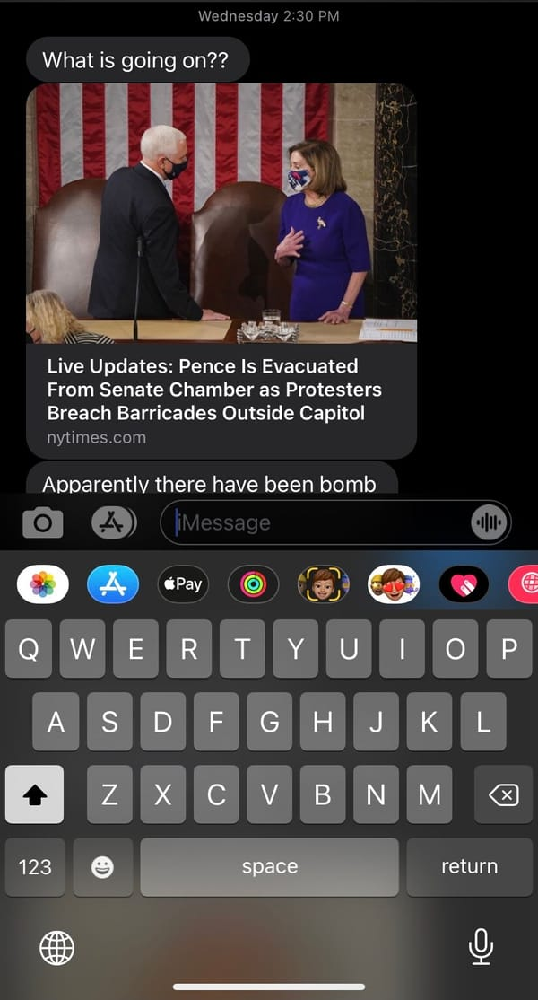

---
tags:
  - posts
  - output/newsletter
id: 65ac4ceb0e7c79000119abc5
title: Happy New Year? If you say so.
feature_image:
description: Hello friend,
date: 2021-01-08
full-date: 2021-01-08T12:56:58.000-05:00
slug: happy-new-year-if-you-say-so
type: post
---

Hello friend,  

Uhhhmmm… Happy New Year?  

This week, we watched unprecedented events unfold at the United States Capitol, and as I am writing this, we don’t know how many more twists remain in this Shakespearean drama.  

I regret my jokes at the end of last year about how “it couldn’t get any worse than 2020.” At the very least, to the extent that this country is relevant to the rest of the world anymore, we have a lot of explaining to do in 2021 and beyond.  

Wednesday was a particularly meeting-heavy day for me. I first got a sense something was happening when I recieved a text from my partner while I was on a Zoom meeting asking, “What's going on??” However, since I was in back-to-back calls, I didn’t stop to sample the avalanche of incoming news.

It wasn’t until one of my colleagues opened up yet another meeting with an acknowledgment of the “extraordinary moment” that I opened up a web browser; I didn't hear another word she said after that.  

It didn’t take long for me to excuse myself from that meeting and cancel all my other commitments for the rest of the afternoon. I got under a blanket on the couch, holding hands with the only other human being who I’ve been able to reliably touch since the start of the COVID-19, and we turned on the television.  

A coup unfolded through screens and Twitter feeds in front of our eyes. We stared at the flashing pixels for hours until they blurred when it didn’t seem like “anything new was happening.”  When we couldn't take it anymore, those same points of light eventually morphed into a Netflix show about people in a [pottery-making competition](https://en.wikipedia.org/wiki/The_Great_Pottery_Throw_Down?ref=davidnunez.com).  

We watched a television series that people unironically refer to as “reality television” through the same panes of glass we watched the horror of attempted insurrection. Our brains really aren't designed to make sense of any of that.  

It reminded me of the feeling I had last year when there was a significant explosion in Beirut. I learned about that catastrophe during an afternoon Zoom call, as well. As a response, I wrote an essay about what I call “[The Global Derealization](https://davidnunez.com/blog/the-global-derealization/).”  

> Our brains are rewiring themselves over the last months to regard every face on our screens as roughly equal. Our friends, families, and coworkers all visit us in our homes as small-headed maquettes through a limited set of pixels on these cold pieces of glass sitting on our desks.

> …

> Our reality bubbles have closed in on us as we hunker down in our homes, peeking out at the world through pixels in a glass portal. It's not normal. We're not wired for this. I empathize with people who desperately and recklessly ignore socially distancing and stay-at-home orders.

> This isn't how we evolved. Our animal instinct to forget and ground ourselves in reality is too strong. We need each other in to know that we are real.

> We are experiencing a global derealization.  

The New Year is supposed to be a chance to clear the decks and reset. The final weeks of December are slow times where we can sequester and dream.  This year we didn't have the luxury of a _real_ break, though. To be honest, the holidays just felt like any other week of 2020, except with a bit more home baking. I’m nervous that 2021 is starting to feel like an extension of 2020, also.

We set ambitious, fickle resolutions. We draft detailed annual plans in Notion workspaces. We earnestly stick to those goals for a couple of days. If we’re extraordinarily disciplined, we honor our pledges for two or three additional weeks, even.

Then we get bored.

Instead of goals, I asked on Twitter if anybody had any theme words for the year.

> Do you have personal "theme words" for the year (in the context of new year resolutions / planning)?  
> 
> Pick the \_one\_ word or phrase that will be your north star for 2021.  
> 
> A thread ⬇️
>
> — David Nuñez (@davidnunez) [December 22, 2020](https://twitter.com/davidnunez/status/1341403937103110148?ref_src=twsrc%5Etfw&ref=davidnunez.com)

A lot of responses were very much about "_survival"_ and "_resilience_." People were permitting themselves to embrace "_stability"_ and "_perseverance_."  There is no right answer, of course. A theme word is perfectly valid as soon as you pick it for yourself.  

I chose “Velocity.”

I felt like 2020 was a year of stagnation. Sure, I got a few things done, but I also had an overwhelming sense of being stuck. The continuous lockdown has something to do with that. These days, I’m a bit sick of hunkering down and putting up the shields. Shelter-in-place, metaphorically, isn't doing it for me lately. At least the next little while, I want to be in motion. Ideally, I'd be moving forward. However, I'd even settle for backward motion. I just want to hop into a new node to give myself a shake. “Let’s just make the wheels turn,” I told myself with hubris on January 1.  

And then this week happened.  

“**_Velocity_**.”  

Thank you, universe. That’s not exactly what I meant.  

What’s your theme word?  

In the meantime, stay safe,

David Nuñez  
	
# Coda  

As I hinted at in my last email, I managed to get some thinking and planning over the holiday break. I’m excited about where I’m going to be taking this newsletter and all the other things I’m making.  

In particular, in 2021, I’m going to be putting a little more emphasis on my website, where I’d like to post long-form and evergreen writing without the artificial pressure of the newsletter “deadline.” I’ve realized I need to give my essays a bit more research effort with proper time to marinate and evolve the words rather than rush to send. More speculative fiction will show up there as well.

This weekly newsletter will point to those longer works as they are published, but I will tend to be more casual and current in these letters. For example, as I research a longer written piece about the fringes of emerging technology, I’ll share resources that I discover or insights I derive, early and unfiltered. We can talk about these things through these letters to each other.

I’m also taking YouTube more seriously in 2021. I have a bunch of scripts written and footage recorded that I’m in the process of pushing through a production pipeline.  More on that soon.  

* * *

_I was listening to [Velocity Girl](https://open.spotify.com/track/1sfI921cOH7r6HXGcJ7FnJ?si=eut6j96NTgmADNUxd2gZZw&ref=davidnunez.com) by Snow Patrol on repeat while writing this newsletter._

_This was episode #17 of Soulful Computing by David Nuñez. Past issues can be [found on my website](https://davidnunez.com/newsletter)._
