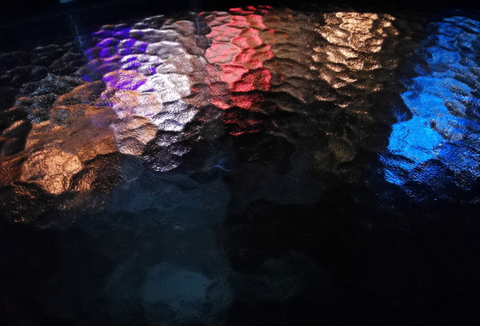

---
tags:
  - posts
  - output/newsletter
id:
title: The Grief Multiplier and Gratitude
feature_image:
description: Thank you for the overwhelming feedback on this essay. I had a couple of good cries while writing it and I'm crying as I read all of your…
date: 2021-03-19
full-date: 2021-03-19T17:23:00.000-04:00
slug: the-grief-multiplier-and-gratitude
type: post
status: done
draft: false
episode: 18
---

_Thank you for the overwhelming feedback on this essay. I had a couple of good cries while writing it and I'm crying as I read all of your kind words in return. I'm doing my best to write back to every one of your letters. It is truly a gift to know you are on the other side of the screen._

_If you're coming here for the first time, I write about the human touch inside of computers in **[my free newsletter](https://davidnunez.com/newsletter/)**._

_It would mean the world to me if you let me know how your own relationships with people and technology have evolved over the past year in a pandemic; I'm on twitter [@davidnunez](https://twitter.com/@davidnunez?ref=davidnunez.com)._

* * *

# Miracle of Science

I'm cramped around the corner table with my MIT Museum colleagues at the nearby pub, [Miracle of Science](http://www.miracleofscience.us/?ref=davidnunez.com). We're speculating about the next few months, hopeful that as everything starts to reopen again, we'll return to some sense of normalcy. Or "new normal" or whatever we end up calling it.

I say out loud that I don't think we'll be out of the woods until sometime after the summer. They all laugh and offer some contorted reasoning about how vaccinations will make everything better. "It won't take that long," they insist. I stare into my drink, hoping my pessimism is just a side effect of my ongoing, general malaise.

Each of us exists in our version of denial.

We speculate about what it would feel like to be overcome by the disease. Someone says that severe coronavirus cases make you cough so much that it feels like being stuck in place, drowning. We think that would be an awful way to go.

We face the fear with a round of, "how would you like to die?" I joke that I'd like death by a meteor that takes out the entire planet at once. No survivors. I wouldn't want to miss out on anything after I'm gone! It'd be an instant antidote to [FOMO](https://en.wikipedia.org/wiki/Fear_of_missing_out?ref=davidnunez.com) on a global scale. Everyone laughs. We then comfort ourselves by imagining being very old, surrounded by loved ones, and just drifting away.

Not one person dares to say, "Alone. Hooked up to a ventilator. Loud machines beeping our last heartbeats. Strapped to a gurney, surrounded by exhausted people in hazmat suits. Coughing up blood until we drown. Our bodies stacked like firewood with all the others afterward." That would be just too unimaginable.

Massachusetts Avenue is now quiet and empty. None of us realize that this is the last time we would ever be together. It's March 13, 2020, just two days after President Trump reluctantly admitted that this thing that had been raging wild for months might be worth a look. It is the last day our museum would be open to the public.

The following 365 days will be pixelated realities. Protests, politics, and pandemics will intermingle with Netflix trivialities on glass screens in our homes. Many people will lose their jobs, and others will fade away into their early retirements. We will also make new friends from around the world on something called "Zoom." The matrix of faces in a window will become our new coworkers. Our tethers to each other will become digital and renewed. It will be weird.

At some point, the disease will start murdering people we love.

The old version of ourselves will cease to exist as we form new habits that will make it impossible to behave like humans when we are within 6 feet of each other again. All of our naked biases will stack themselves up, and then we will begin to lose trust and faith in each other. Indeed, humanity's worst instincts will run wild alongside the virus. Some people will pretend there is nothing to worry about. Other people will shun the rule-breakers. Everyone will spit in each others' faces.

We will all exist in our version of denial.

A year of cocooning will lead to a rebirth. We will become some form of post-human that will perform simulations of interactions we once experienced but have long forgotten how to execute. The full impact of this trauma won't reveal itself for years to come. All of us will feel pain, exhaustion, and visceral hate. We will also scratch out moments of joy and connection among the chaos.

Everyone will struggle to find something online to simulate the normalcy from before. We will fool ourselves into thinking we can persist completely online, and thus, technology will have succeeded in its global infection.

On the most challenging days, we will count our blessings on one finger: the middle one. That's how the virus will eventually murder us all. Nobody gets a pass.

"New normal?" That fiction is about to die. Indeed, the old version of us is about to die. No, nothing will be "normal" anymore.

Then my colleagues and I all laugh, stand up to go our separate ways.

We hug goodbye for the last time.

# The Bereavement Multiplier

As I write this, about 540,000 people have died from COVID-19 in the United States. A sociologist has come up with an idea called the "[bereavement multiplier](https://www.pnas.org/content/117/30/17695.abstract?ref=davidnunez.com)." It says, on average, there are about nine close mourners for every person that dies (i.e., immediate family, grandchildren, etc.). This metric means that on top of the 540,000 casualties, COVID-19 death directly impacted an additional 4,860,000 people.

People are still dying by the thousands. Many more people are crying for the dead, and I am one of them. `#TouchedByCOVID` is not a club I ever wanted to join.

Earlier this year, I watched with relief as we persevered through an ugly stain in my country's history, and adults finally moved back into the White House. For the first time in a long time, I felt a small glimpse of calm and reason. I had hope, finally, that serious people would pay respect to the miracles of science. I might get through this thing with just a couple of bumps and bruises.

Hubris. The universe has a shitty way of putting things in perspective.

At the end of January, my brother Robert tested positive for COVID-19 and died a week later. My brother, Mark, called in the early hours of a Sunday morning, "he's gone." I felt stuck to my bed. It was difficult to breathe, and I had a tingling sense of water pouring all over me.

By that afternoon, I had abandoned almost a year of pandemic precautions and left my Boston safe space to be in Texas with my family. The 2-second rule relegated masked hugs. I was _among_ my family but couldn't be _with_ them the same way as before.

I can never be with them again, like before the pandemic. One of us is now missing.

That night I posted a tweet about my brother. I'm not sure why I did this. I think it was out of a desperate need for some faint hint of normalcy. It turns out in a pandemic, Twitter and Zoom have become my new normal. (I will need to interrogate this eventually).

https://twitter.com/davidnunez/status/1356062440551809024?ref_src=twsrc%5Etfw&ref=davidnunez.com

I was quickly overwhelmed with "like" notifications from internet friends and strangers. People from around the world were quick to offer support in the replies. Friends I had just barely met during the pandemic were reaching out privately and doing everything they could to cheer me up. It was such a comfort to scroll through the thread while adding my own "likes" in return, one tweet after another. For the first time, I understood and appreciated Twitter's decision to represent "likes" with little hearts. ♥️

Back in August, I wrote about [watching my Uncle's funeral through a Facebook stream](https://davidnunez.com/newsletter/touching-a-heartbeat/).

> I watched the broadcast live from the funeral home on a public Facebook page. Facebook, mind you, now has this video in its data stores. We navigate among beautiful and complicated times.  
> 
> I saw uncles and distant cousins bumping elbows and bowing to each other. There is no hugging in 2020. Aunts in masks rearranged themselves like Voronoi diagrams to maintain optimal distances from each other, always beyond arm's length.  
> 
> "Social distance at a funeral." I don't even know how to parse that.  
> 
> ...  
> 
> I touched my family through the screen. They didn't know I was with them. I hope they felt my touch, anyway.

Never in my wildest dreams did I anticipate I would be on the other side of the camera, delivering words about my brother to a Facebook audience, just six months later. At the start of my eulogy, I made sure to look into the cameras at the back of the church. I thanked the online streamers for "being there."

I attempted to make one-way eye contact with the invisible, distant, and [derealized](davidnunez.com/the-global-derealization/) people that might be on the other side of the screen. I couldn't be sure they were out there, but at the moment, it was enough to know they were a possibility.

Because the entire service is now online, my mother is rewatching the funeral again and again. I have rewatched it also. Instead of these ceremonies being an essential step towards finding closure and saying goodbye, they persist in the aether. It takes just a few clicks to reopen the wounds. We get to relive the suffering, far beyond what is humane. That day lives on, stored neatly in redundant backup servers. The grief gets copied and pasted over and over again. The bits persist, thanks to the benevolent dispassion of Mark Zuckerberg.

Images and videos of my brother's smiling face get shared, repurposed, and remixed. He hugs his children in digital perpetuity, and people add their likes and comments. They try to bring comfort, or maybe they all just yearn for a connection to something real in an endless stream of the unreal. The comments are tagged and stored away, also.

All of this emotion plays right into the algorithm, which salivates over this raw, unfettered data. Our grief is aggregated and analyzed by advertising technology companies. A few months from now, on a sunny day when I'm starting to feel good about the world again, Facebook will open the wounds, and my brother will appear in my feed. At precisely that moment, some company will try to sell me pain relief. I might buy it. My click will satiate the algorithm. Deep reinforcement learning is a feedback loop between the machine and my memory.

I watch myself deliver the eulogy until it feels like it's someone else. I know that I will watch it many more times in the years to come as I genuinely become someone else. I wonder if it will still feel as potent after the thousandth copy, or will the bits degrade over time?

No. As long as I continue to look at these pixels, they become reinvigorated. The neurons tie together more tightly. These bits will live on as long as I do.

All of this is digital preservation taken to its natural conclusion.

"Bereavement Multiplier," indeed.

# The Gift of Sorrow

Spring is arriving, and there is a sense that we're about to emerge from the longest winter. Vaccines seem imminent for so many, and we just might get a summer do-over. MIT declared an intent to return to full levels of students and researchers on campus in the Fall. People are making plans to travel and get married and finally hold all the in-person memorial services to move on with their lives. It's going to be a bonanza for flower shops.

I, too, have a bit of hope for a return to normalcy, though bittersweet. I can't help but hold anger as I reflect on the lack of empathy, competence, and respect for science that ultimately led to my brother's death. If only vaccines came just a few months earlier... what if?

> I miss walking to the movie theater on a hot summer day and ordering a cold drink to sip while watching superheroes save the world.  
> 
> I miss eating at pretentious restaurants, ordering foods I would otherwise never try.  
> 
> I miss my brother, who was killed by COVID-19, 45 days ago.
>
> — David Nuñez (@davidnunez) [March 18, 2021](https://twitter.com/davidnunez/status/1372369161754603520?ref_src=twsrc%5Etfw&ref=davidnunez.com)

https://twitter.com/davidnunez/status/1372369161754603520?ref_src=twsrc%5Etfw&ref=davidnunez.com

I'm in pain, of course, and I know I will be for a very long time. People tell me that it will be like a roller coaster. Some days will be better than others. It doesn't ever really go away, but I will learn to live with it. It will get better. I will adjust to the new normal.

I hear the same platitudes about COVID-19, I should point out.

For now, I've started a daily morning practice. It's simple, and it's been constructive. Maybe you might find it helpful, also. I was skeptical at first; it seemed so trivial, but now I can't imagine not doing it.

As soon as I wake up, I open up my phone or computer and type out the first three things that come to mind for which I am grateful. That's it. Three things. Gratitude. Every morning, the moment I wake up. It takes less than 15 seconds. Sometimes it's hard, but then I just write "I'm thankful for being awake right now" three times. Here are some others:

> I can take classes online; lauren picking up tacos for lunch; technological tools that can let me do my work anywhere. thankful for having a surplus of money to save for gifting; family; recipe book from aunt Pauline; cousin Sally who picked us up from the hotel in the ice storm; Lauren knowing exactly how to make me laugh; greek corner and french fries for lunch; running water; iPad; television shows via streaming services; eyesight; I can reach out to other people around the world; `#PTYA`; joggers; I can make chocolate chip cookies with minimal effort; Lauren; a good cup of coffee; I can choose to hide or show my grumpiness; autonomy in my day job; heat in our condo; trying to make gorditas; being able to take long hot showers; daily walks; I know how to read; sunshine; rabbit holes

This regular gratitude reminder feels like building a safety net. It's becoming a well of hope I can dip into to practice moving forward. In that way, it also is like a prayer or a touchstone. The notes continue to compound as I write more of them. It will be my recovery and healing multiplier.

I wrote this in my brother's eulogy.

> God, in His divine wisdom and mercy, gives us the great gift of sorrow. We cry for Robert because we loved him. It hurts us to know that he is gone. We are in pain because we mourn the loss of a good man—a man who tried his best to walk in the path of Christ. So our tears are proof that Robert mattered to us. Robert's life mattered. What a blessed gift it is to know this.

As we enter the second year of the pandemic, we will continue to cry and experience new and unimaginable trauma in the wake of COVID. We will also feel relief and joy as we learn to reconcile with this disease and eventually pick up the remnants of experiences we left behind.

It turns out COVID-19 was not the meteor that ended the human experiment. Now the fear of missing out on yet another year is too unimaginable. So we must eventually reboot.

In the meantime, I also choose to be grateful for our collective sorrow.

It means the life we once knew mattered. It means being with each other does continue to matter. Our desperate hope means that when we emerge as the next version of humanity, we will yearn for and attempt to rebuild everything we lost. We will both succeed and fail in that endeavor in the most spectacular ways unimaginable.

So much that we loved will never return, no matter how many vaccines we distribute. It is sad, but it is also a gift.

I will hold onto the tears as a treasure.

They mean that everything that has come before matters.

They also mean that you matter, and so do I.

* * *

_This was episode #18 of Soulful Computing by David Nuñez. Past issues can be [found on my website](https://davidnunez.com/newsletter)._

_I was listening to Alanis Morissette's [Thank U as covered by Aurora](https://open.spotify.com/track/1w5J5CBuvT36kt2OtHa8ts?si=ZqMdnXWOST2ItNbv7BTFkg&ref=davidnunez.com) on repeat as I was writing this newsletter._
