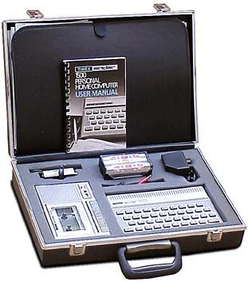
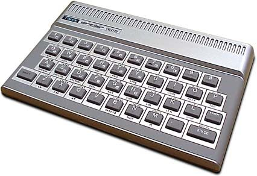
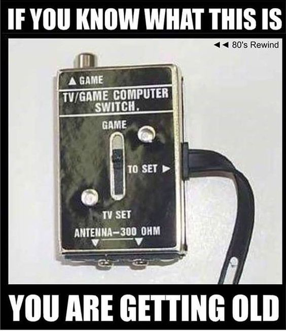

---
tags:
  - posts
  - output/newsletter
id:
title: That New Computer Smell
feature_image:
description: Do you remember the way your first computer smelled?
date: 2021-04-25
full-date: 2021-04-25T13:07:34.000-04:00
slug: that-new-computer-smell
type: post
episode: 20
draft: false
status: done
---

Do you remember the way your first computer smelled?

When I was quite young, maybe 7 or 8 years old, my dad came home one day with a plastic briefcase. Inside, ensconced in grey protective foam, was a device I couldn't quite comprehend when I first saw it.



It was the [Timex Sinclair 1500](http://oldcomputers.net/ts1500.html?ref=davidnunez.com) computer system. It hooked up to our television using a converter that screwed into the back of the television via some metal prongs where the antenna should go. This was way before cable television when there was such a thing as "unused channels." Channel 3 or sometimes 2 would play host to many countless hours of interactive experiences. The computer came with a cassette recorder and tapes used to load and store programs. It had a whopping 16 kilobytes of memory, and the whole kit cost my dad $295 (1980's dollars).

This computer was essentially the UK Sinclair ZX-81 dressed up for a North American market and wasn't nearly as popular as the Timex Sinclair 1000. Nevertheless, the computer and I became fast friends.

I would spend hours dutifully typing in the programs from the learning books that came with the system, character by character. This is how I learned [BASIC](https://en.wikipedia.org/wiki/Sinclair_BASIC?ref=davidnunez.com): through rote copying, the same way a student artist might copy a masterpiece in a gallery to _feel_ the strokes of a brush. I learned about line numbers and `GOTO`, and eventually, fancier concepts like variables and graphics. The keyboard was an ergonomic disaster, but it felt perfect in my child-sized hands. The keys had clever shortcuts and combinations that would help reduce the tedium of typing. If the computer turned off, you'd lose the program and have to start over. This is how I learned about the pain of catastrophic software failure.

My most vivid memory of this device was its new computer smell - chemical, electronic, my future.



Of course, computing itself had been around for decades before I was born. It certainly influenced my family's life in ways we couldn't perceive, churning away at global systems and economies. In our home, we had an [Atari 2600](https://en.wikipedia.org/wiki/Atari_2600?ref=davidnunez.com), and I think I was playing Breakout and Adventure from a very young age before the Sinclair showed up. However, this new device was the first time I could experience computing in such a direct way. My fingers could do more than drive an 8-bit tank around my television screen using an Atari joystick. In the distant future, this computer meant I would be able to _make_ the tank.

Eventually, as I grew older, the Timex Sinclair gave way to a rotating cast of newer computers from various forgotten manufacturers. I would pore over all the advertisements in [Computer Shopper](http://ascii.textfiles.com/archives/1835?ref=davidnunez.com) to find the parts I would need to assemble my own rigs. I'd make handwritten spreadsheets of all the specifications for the parts to find the best deals. I would use this to convince my parents to continue being the benevolent patrons of my deepening obsession. All these numbers and acronyms meant something to me at the time. They mean nothing now. They mean everything.

Rebecca Murphey [writes about her own experiences](https://onezero.medium.com/girl-computer-31ecd328bc53?ref=davidnunez.com) with computers (including the Timex Sinclair TS-1000) and how they influenced her life.

> I can barely remember a time when computers weren’t a part of my life, but I know with certainty that that time existed, and that when computers first entered my life, they were exceptional and special. These days, of course, they’re ubiquitous. There’s a staggering quantity of computing power in a bin in my closet. When I’m sufficiently tired, I swipe at the pages of a printed book, and wonder why they don’t turn.

Computing was a special occurrence. You would take the time out to sit with the keyboard, and everything was slow. You didn't know any better. You would compute _instead of_ other things, like going outside or hanging out with friends. Now we compute _in spite_ of things.

People are taking [digital vacations](https://en.wikipedia.org/wiki/Digital_detox?ref=davidnunez.com) because it's hard to imagine doing anything without a computer involved. In 2021, a day without a computer feels like an anomaly.

## Get off my lawn



In June 1948, the [ENIAC](https://en.wikipedia.org/wiki/ENIAC?ref=davidnunez.com) became the first programmable general-purpose electronic digital computer. There are millions of people alive today who, at some point in their life, existed in a universe where computers, as we currently understand them, did not exist. Because computers have evolved so quickly, it's possible to mark living generations of people by their first computing experiences.

Whenever I talk about my first computer, there's always someone, a generation ahead, who likes to tell me about their tales of [punch cards](https://en.wikipedia.org/wiki/Punched_card?ref=davidnunez.com), [woven copper memory](https://en.wikipedia.org/wiki/Core_rope_memory?ref=davidnunez.com), gears in the [difference engine](https://en.wikipedia.org/wiki/Difference_engine?ref=davidnunez.com), or inventing [boolean mathematics](https://en.wikipedia.org/wiki/Boolean_algebra?ref=davidnunez.com).

I get it. I wasn't alive when the first computer was invented. I doubt that makes my early computing experiences less legitimate. When I was younger, I remember feeling superior to adults who didn't understand computers. I would get exasperated having to explain how to do such simple things like formatting documents when I was flying around in Cyberspace™ with my [**1337**](https://en.wikipedia.org/wiki/Leet?ref=davidnunez.com) hacker friends I'd find on dial-up BBS's. I would grab the keyboard from the adults and do it for them instead of explaining because I could get back to my own programming faster. Computers were simpler then.

Computational nostalgia haunts me. I wish I still had my Timex Sinclair 1500. My mom sold it off in a garage sale. I sometimes look on eBay and see parts of the kit being sold as vintage electronics. I wish I could find a complete kit, with the briefcase and that new computer smell. I'd take it out and carefully work through the books again. I'd try to remember the joy of what it was like to write a program for the first time, feeling the membranes of those keys, breathing in the electronics, hoping to reboot my brain and unwind the subsequent decades of computational complexity.

I think about young people today who have never known a life without smartphones and instant access to the internet. I have to fight my instinct not to grump, "These kids these days don't know how easy they have it with all their TikToks and Snapchats!"

Of course, this is the fear manifesting. It's hard to keep up; I am starting to sense the eye-rolling whenever I engage a young person in some conversation about technology. It stings when they take the phone out of my hand because it's faster for them to do it for me rather than explain. I'll never forget the crushing blow when a teenage niece told me, "Twitter and Facebook are for old people." I try to hang on, I really do, but maybe this is just the natural order of things. Just like my parents weren't raised around personal computers, I was not born into high-speed internet. Our brains rewire themselves to interface with the current state-of-the-art.

I have become the vintage computer, someday soon to be sold off at a garage sale.

My question, then, to all the young technonauts: what comes after smartphones, and what will that smell like? And thus, the circle of life loops again.

```BASIC
10 PRINT "The computer is dead. Long live the computer."
20 GOTO 10
```

David Nuñez

* * *

## Coda

* In [Episode #4 of this newsletter](https://davidnunez.com/newsletter/happy-upgrade-day/), I wrote a short story about brain implants as a response to Elon Musk's Neuralink project. He's still at it. Earlier this month, he claimed a [monkey with a brain implant is now playing video games](https://www.theverge.com/2021/4/8/22374749/elon-musk-neuralink-monkey-pong-brain-interface?ref=davidnunez.com) using just the neural interface.
* There is a [browser-based emulator for the Timex Sinclair 1000](http://www.vavasour.ca/jeff/ts1000/?ref=davidnunez.com) online, so you can get a sense of how it was like to program on one of these devices. (Java support required. Smell not included)
* Here is a [teardown of the Timex Sinclair 1000](https://www.youtube.com/watch?v=1Jr7Q1yJOUM&ab_channel=The8-BitGuy&ref=davidnunez.com) by The 8-Bit Guy on YouTube.

* * *

_I listened to_ [_Timex Sinclair_](https://open.spotify.com/track/02N57KdcRXVQHxZdICqTVK?si=jaPfg51HRDqBJbuug2-VFw&ref=davidnunez.com) _by The Remote Access Service on repeat as I was writing this newsletter._

_This was issue #20 of Soulful Computing by David Nuñez. You can find past issues_ [_on my website_](https://davidnunez.com/newsletter)_._
