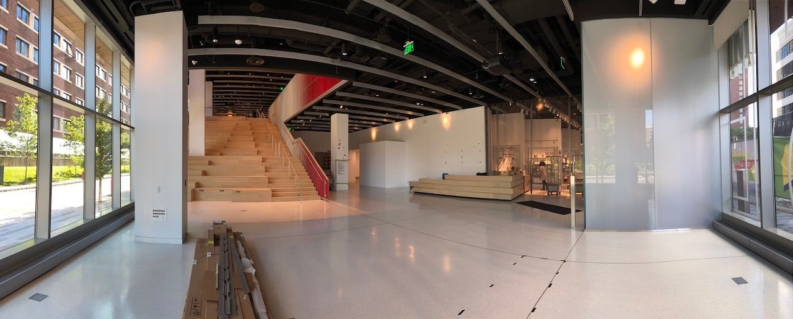

---
tags:
  - posts
  - output/newsletter
id: 65ac4ceb0e7c79000119abcb
title: 100 Days and a Restart
feature_image:
description: Today we launched a new MIT Museum website, and started our 100 day countdown to the opening of the Museum in its new building at Kendall…
date: 2022-06-24
full-date: 2022-06-24T17:48:37.000-04:00
slug: 100-days-and-a-restart
type: post
status:
draft:
---

Today we launched a new [MIT Museum website](https://mitmuseum.mit.edu/?ref=davidnunez.com), and started our 100 day countdown to the opening of the Museum in its new building at Kendall Square in Cambridge, MA (October 2! If you're in Boston around that time, hit me up and I'll make sure you have a ticket waiting). The team has been working hard on this for many years, remotely through a pandemic, I might add.

It doesn't seem right to call the next few months at the Museum "the homestretch" because there is still an unending list of projects that need to be completed before we are ready for the public. Sometimes it feels like we're just beginning. Getting these systems up and running will be the dominant focus of my work life from now until October.

In many ways, this final push inspired me to reinvigorate my newsletter. I've been doing most of my writing on Twitter since the beginning of the year. I've watched my follower count rapidly grow there, but I've also watched myself cater to the The Twitter Algorithm™. The Algorithm™ rewards platitudes and headlines. The Algorithm™ does not appreciate nuance and depth or whatever it is that I think I'm doing in this newsletter.

Algorithm™ Algorithm™ Algorithm™

I miss longer form, _difficult_ writing like I used to put in this newsletter. That's not to say Twitter is "easy." It's far from it - it takes skill to craft like a copywriter. Every tweet must be an eye-catching headline in a river of trash posts and memes.

I've just been itching to spend more time writing _deeper_ and more creatively. I love the satisfaction of pushing "publish" after a lot of research and learning. I get fired up knowing I'm delivering some small sense of value out of respect to your time and attention. The Museum is a long term project. Writing is my immediate feedback loop among friends.

That said, I don't think I can sustain writing the 5000 word essays on single topics like I was [sending around previously](https://davidnunez.com/newsletter/freediving-into-a-spreadsheet/). Not for nothing, but my letters shouldn't feel like homework to you, either, for that matter!

I'm going to optimize for less friction and more consistent delivery on Fridays. I'll be experimenting with a few structures that I might work on throughout the week, not in a marathon session on Thursday night.

Don't get me wrong, I still intend to do some well researched essays and short stories in the coming weeks. However, I'll likely post those on my website and  
point to them from these emails.

So:

My newsletter is about the intersection of human beings and technology. I'll  
share what I've been learning and thinking about on this topic. I've also been  
dabbling in the "creator economy" over the past year (taking courses, learning  
new techniques, etc.), so I'll talk about some of that too. I might share  
behind the scenes of opening a museum now and again, if that'd be interesting.

As always, I love to hear your feedback. Just hit "reply" on this email, and  
your response will go straight into my inbox.

Lots of fun stuff on its way.

Until then, have a great weekend!  
David

_I was listening to "_[_Starting Over_](https://open.spotify.com/track/5buZvve8ZyqcZWNzWeJ9zI?si=530f2461bd2a407b&ref=davidnunez.com)_" by Chris Stapleton on repeat as I wrote this newsletter._

https://open.spotify.com/track/3TNSVsiFngfe68UJpMq1oS