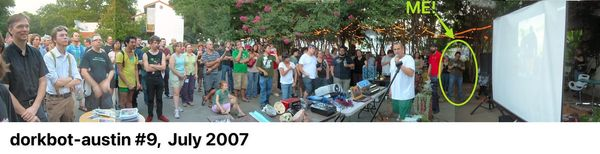

---
tags:
  - posts
  - output/newsletter
id: 65ac4ceb0e7c79000119abcc
title: "Austin, TX: Progress & Nostalgia"
feature_image:
description: I'm in Austin over the 4th of July weekend to visit family. Every time I come back to Texas I have incredibly mixed feelings about how this…
date: 2022-07-01
full-date: 2022-07-01T13:50:00.000-04:00
slug: austin-tx-progress-and-nostalgia
type: post
---

I'm in Austin over the 4th of July weekend to visit family. Every time I come back to Texas I have incredibly mixed feelings about how this town is metastasizing away from Richard Florida's utopian vision of a "[Creative Class rising](https://www.google.com/books/edition/The_Rise_of_the_Creative_Class/BsaCDwAAQBAJ?ref=davidnunez.com)."

He predicted Austin was going to be a melting pot of young technologists & artists enjoying music, culture, and creative experimentation while they were building new companies together. The future would be invented in these intellectual crucibles. Area code 512 was to be an idyllic sleepaway camp funded by venture capitalists and unicorn startups. Talent from around the world would pull up their roots and flock to Texas to experience tacos and the "Live Music Capital of the World".

Invest in hipster coffee shops instead of sports stadiums and economic prosperity will follow.

Everyone profits.

And It worked. It worked too well.

## Progress

Austin is now a playground for Joe Rogan, Elon Musk, Crypto Bros, and Social Media Gurus. Technologists and technology parasites have spent the last decade fleeing the increased taxation and high cost of living in places like California and New York.

A grand migration is well underway and the cost of living in Austin is on an unsustainable upward trajectory as a result. The local economy is all too eager to gulp up the influx of disposable income. Young people live paycheck-to-paycheck as they chomp down their income on overwrought breakfast tacos and mimosas. They have no hope of affording a home purchase nor building _real_ wealth in Austin, anymore.

Well. Actually, They can buy their luxury condo if they give up their passion projects and work for a big tech firm like Google™ for 80 hours a week.

Thus, creative risk gives way to the lure of stock options.

Now, the Austin downtown skyline is sterile and rectangular, as it continues to pixelate into condo highrises. The condopolis structures adorn themselves with unintentionally ironic names like "The Independent." Their obscene forms erupt from the Texas soil like Jack's beanstalk, and the Californian ex-patriots climb them, despite all their Faustian implications.

The motto of the place seems to be "Gentrify or Die" and that young, creative class Richard Florida imagined is squeezed further out to rural places where no public transportation will ever reach.

Subways? It's Texas. It doesn't need no stinkin' subways when it can have pickup trucks and SUVs bellowing out carbon monoxide to choke up I-35 to death.

Austin. It's getting better and better, right?

## Nostalgia

I lived in Austin from around 2000-2008 when [Courtney Rosenthal](https://www.crosenthal.com/?ref=davidnunez.com) maintained a comprehensive (and short) list of **all** of the [bloggers in Austin](https://www.austinbloggers.org/?ref=davidnunez.com). We'd meet together every month to plot against the Austin LiveJournalists, another club of people writing online. In those early days of [Moveable Type](https://www.movabletype.org/?ref=davidnunez.com) and artisanal blogrolls, we considered the journalers different from us, for some reason. We eventually all hung out together, anyway.

[FOMO](https://en.wikipedia.org/wiki/Fear_of_missing_out?ref=davidnunez.com) didn't seem to exist then. All it took to go viral at [SXSW Interactive](https://www.sxsw.com/category/interactive/?ref=davidnunez.com) was $3.99 in [orange smiley face stickers](https://web.archive.org/web/20050328090329/https://www.davidnunez.com/sxsw). With an email, I could summon a cohort of 100 of my fellow [dorks](https://dorkbot.org/?ref=davidnunez.com) to the parking lot of Cafe Mundi. There we'd show off the robots we were building, make Tesla coils sing, and turn pickles into lightbulbs. Fire-breathing machines were involved, often.

_Image by_ [_Jon Lebkowsky_](https://www.weblogsky.com/?ref=davidnunez.com)_, in a time where you had to manually stitch panoramic photos together_

So I'm having many reactions to David Perell's essay this week about this city, [What’s Up with Austin?](https://perell.com/essay/whats-up-with-austin/?ref=davidnunez.com). He's writing from the perspective of a newcomer. He's experiencing Austin as it exists, today. I can appreciate that. Austin is a series of imported opinions.

Respectfully, it's always going to be "Town Lake" to me. That "[hippie 24/7 breakfast spot](https://www.magnoliacafeaustin.com/?ref=davidnunez.com)" he refers to? Every Sunday morning, I'd meet there with fellow techno-culturalists to discuss what it will take to encourage the city council to create more public, open WiFi spots. We'd defend the virtue of open-source voting machines and other [EFF-Austin](https://effaustin.org/?ref=davidnunez.com) talking points. We'd share weird internet phenomena (on our laptops... good connectivity on smartphones wasn't as much of a thing, yet).

Perell talks about "Keep Austin Weird" as some kind of marketing slogan instead of the late Red Wassenich's flippant comment when asked why he was donating to the KOOP's [The Lounge Show](https://koop.org/programs/the-lounge-show/?ref=davidnunez.com):

> ‘I don’t know. It helps keep Austin weird.’ - Red Wassenich, 2000

I actually met Red. ["Keep Austin Weird" got away from him](https://www.nytimes.com/2002/12/08/us/austin-journal-a-slogan-battle-keeps-austin-weird.html?ref=davidnunez.com) just like this city got away from its earliest Web 1.0 roots.

As I drive around this town shaking my head at the condo blight and food truck infestations in East Austin (where I lived for a while), I feel like the old man sitting on my porch, "git off my lawn." Except it's a lawn I haven't occupied for the past 15 years.

Am I allowed to complain, or do squatter's rights take over here?

I now realize how the oldtimers were rolling their eyes at me as I was inserting myself into their long-held conversations. In 15 years, today's TikTok influencers are going to be shaking their fists at the kids who ruined the good thing they had in the early 2020s.

Progress. Nostalgia.

Two sides of the same coin.

This comes to mind:

* * *

_I was listening to_ [_Progress by Ever So Blue_](https://open.spotify.com/track/6oJIMUBDopuFljMNBFrq9Z?si=b2b4999bc7984a87&ref=davidnunez.com) _and_ [_Nostalgia by Melosense_](https://open.spotify.com/track/0Vtwa1eRykSFTGXbDBq7d2?si=923ed0c4952848ea&ref=davidnunez.com) _on repeat as I was writing this newsletter._
