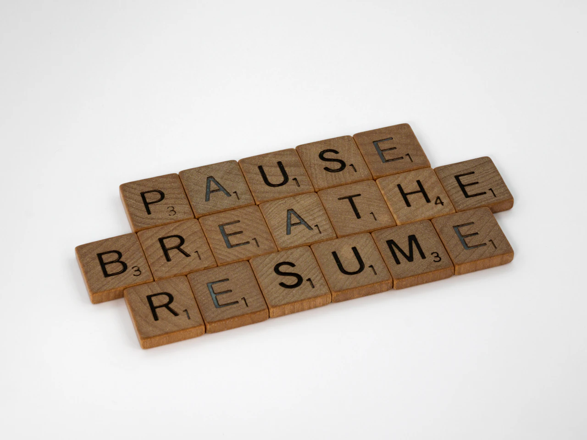

---
tags:
  - posts
id: 65ad93800e7c79000119bbdc
title: Weeknotes 2417 - Start of mini-sabbatical
feature_image:
description: So, today marks the end of my first week of a month-long break between gigs.
date: 2024-01-21
full-date: 2024-01-21T17:36:16.000-05:00
slug: weeknotes-2417
type: post
---

Photo by [Brett Jordan](https://unsplash.com/@brett_jordan?utm_source=ghost&utm_medium=referral&utm_campaign=api-credit) / [Unsplash](https://unsplash.com/?utm_source=ghost&utm_medium=referral&utm_campaign=api-credit)

So, today marks the end of my first week of a month-long break between gigs.

I'll have more to say about my job transition in the coming days, but for now, I'll leave it as it is: I exist in a liminal space.

I'm torn between wanting to take a real break for the first time in a long time vs. not squandering the opportunity to reset productively. My instinct was to create an unachievable list of 50 projects "now that I have time." I only have three more weeks. I won't have the time.

If you "win" a break, does that mean you actually didn't break at all?

By the way, I'm deciding for myself; 2024 actually begins on Monday, January 22. I have reasons.

Happy New Year!

* Essentially experimented with being lazy this past week. I used the word "puddle" to describe how I felt after a day of just watching Netflix on the couch. It was ok to do for a day or two. Not a habit I would want to pick up.
* I worked on clearing out Omnifocus; it felt nice to cancel projects from my previous gig that I knew I would not have to finish.
* I reconnected with my friend Som, who runs [CLIP](https://clip.bike/?ref=davidnunez.com); we chatted briefly about taking breaks and his company's progress.
* Met up with a former colleague and noted the vacuum that [EYEO](https://eyeofestival.com/?ref=davidnunez.com) left for creative technology gatherings (at least in the States). We pondered what it would take to fill that gap.
* Reconnected with some friends I had ghosted last year due to "being too busy." I used to participate in a weekly mastermind with them, and they welcomed me back with open arms. "Reconnection" with people, _including myself_, seems as good a theme as any for 2024.
* Participating in Shawn Blanc's [Focus Course](https://thefocuscourse.com/?ref=davidnunez.com), mostly paying attention to the format and delivery. There's nothing especially new in the material so far, but it is notable that the forcing function of "being in a class" compels you to do the work.
* Spent some time resetting davidnunez.com. I have an ambition to pick the writing back up.

The next three weeks will be about clearing out the environment, tools, and infrastructure (ex., planning for a home office upgrade, clearing notes in Obsidian, etc.). I have a lot of clutter that's been physically, digitally, and mentally choking me up. I want to wipe the slate clean... or at least shove a lot of stuff into a contained shoebox.

I hope if I exit this mini-sabbatical with a clean (metaphorical) desk, I'll be in a better place to approach the upcoming challenges of 2024.
