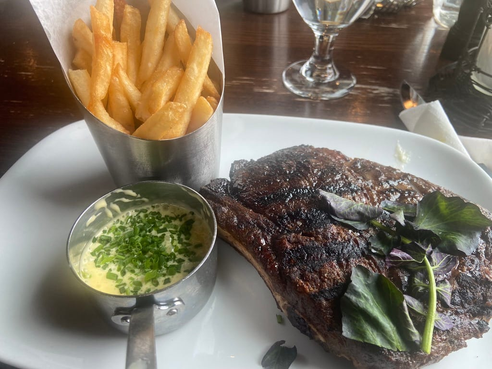

---
tags:
  - posts
  - weeknotes
id:
title: Weeknotes 2418
feature_image:
description: "The week (i.e., week 2 of my mini-sabbatical) was low-key. Spent a little time working on organizing and setting up goals via OKRIER:"
date: 2024-01-30
full-date: 2024-01-30T11:52:54.000-05:00
slug: weeknotes-2418
type: post
status: done
---

The week (i.e., week 2 of my mini-sabbatical) was low-key. Spent a little time working on organizing and setting up goals via OKRIER:

https://twitter.com/davidnunez/status/1547932057170350082

Generally, there is little to report. Most relevant: I met with my new boss, gearing up for the grand adventure at HBS! We dove into a mixed bag of goodies, chatting about everything from orientation and logistics to hybrid workspaces and hardware. We covered a couple of HR topics and brainstormed a bit about projects in flight and the need to make appropriate connections to other groups at the school and on campus. Bodes well.

Had a nice outing with friends at [Gibbet Hill Grill](https://www.gibbethillgrill.com/?ref=davidnunez.com).

Otherwise, now turning my attention to more structured resetting.
