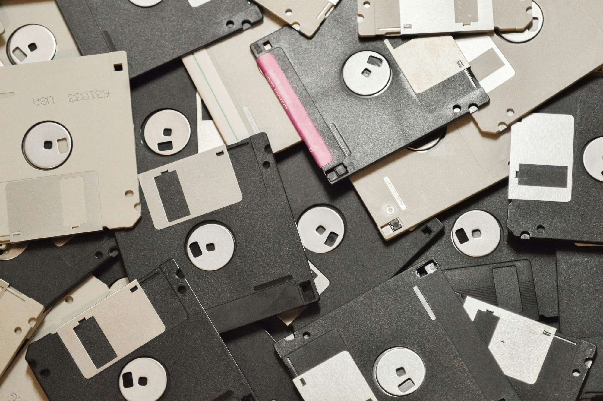
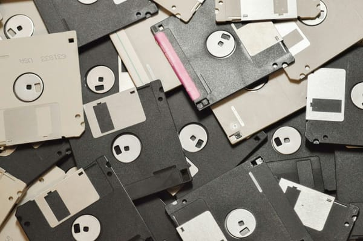

---
tags:
  - posts
id:
title: Select All. Delete. Breathe.
feature_image:
description: I’ve accumulated a mountain of digital clutter. We’re talking hundreds of thousands of files scattered across old hard drives, floppy…
date: 2025-08-05
full-date: 2025-08-05T18:47:00.000-04:00
slug: select-all-delete-breathe
type: post
status: done
draft: false
---

I’ve accumulated a mountain of digital clutter. We’re talking hundreds of thousands of files scattered across old hard drives, floppy disks, and even tape reels. As I poke my head out from under this digital avalanche, I stare up into the cloud accounts with their endless storage vistas.

I can’t even open these files anymore (wait, what was a `.ram` file, again?). I no longer recognize myself in these drives.

[Bitrot](https://en.wikipedia.org/wiki/Data_degradation?ref=davidnunez.com) has turned my data lake into brackish bloat. It’s like a digital attic full of obsolete software and half-finished documents. Even if I could get these hard drives to turn on, the files they hold no longer [spark joy](https://www.amazon.com/Spark-Joy-Illustrated-Organizing-Changing/dp/1607749726?ref=davidnunez.com), just ambient dread.

So with a little help from AI and a lot of willpower, I’ve been slowly sifting through my data albatros. Each file I rename, folder I archive, or duplicate file I trash feels like a small but meaningful reset. I’m not just organizing data. I’m reclaiming a bit of mental space.

And it turns out there’s real science behind that feeling. [Studies show](https://www.sciencedirect.com/science/article/abs/pii/S0747563218301365?ref=davidnunez.com) that digital clutter can be just as stressful as physical clutter. It overloads our attention, triggers anxiety, and contributes to decision fatigue. Similarly, research from [UCLA](https://newsroom.ucla.edu/magazine/center-everyday-lives-families-suburban-america?ref=davidnunez.com) links cluttered environments to higher cortisol levels, reduced focus, and even poorer sleep.

There’s something ritualistic about it, too. Like clearing off a messy desk, organizing your digital workspace can feel like sweeping away distractions and giving your mind permission to focus. [According to behavioral psychologists](https://www1.racgp.org.au/newsgp/clinical/what-does-clutter-do-to-your-brain-and-body?ref=davidnunez.com), even the presence of visual or digital clutter can tax your working memory and make tasks feel harder than they are.

For me, these little rituals serve as mental palette cleansers. Five minutes of decluttering can act as a micro-reset between meetings or creative blocks. It's just enough time to delete the detritus of a chaotic day and return to something a little more intentional.

And in a world where most of our creative and professional lives unfold on screens, that kind of clarity is impossibly sacrosanct.

Deleting unnecessary downloads or organizing your screenshots become part of a larger rhythm. It’s a signal to your brain that you’re making space for what matters. [Minimalist Thinkers](https://www.sapiens.org/culture/simplicity-minimalism/?ref=davidnunez.com) have long argued that [simplicity in our environments](https://www.homesandgardens.com/solved/beneficial-ways-minimalism-resets-brain?ref=davidnunez.com) (digital or physical), helps restore focus, calm, and a sense of control.

We’re not just battling overstuffed disk drives. We’re searching for signal in the noise.

Let’s not forget the weight of all those files.

[Digital hoarding](https://en.wikipedia.org/wiki/Digital_hoarding?ref=davidnunez.com) is real. It stems from the same psychological loops that make it hard to throw away an old T-shirt: the fear we might need it someday, the anxiety of parting with the past.

But letting go can be its own kind of remembering.

So go ahead. Archive that cluttered desktop. Clear out those forgotten folders. Delete that unread PDF from 2007.

These little acts of digital tidying help remind us that our work isn’t just about output. It’s about presence, attention, and care... especially in the quiet moments when no one is watching.

* * *

### 💡 Digital Decluttering Tips

_If you're ready to do a little digital decluttering of your own, here are a few small ways to begin — and maybe find a bit of calm along the way:_

* **Start Small and Reflective**  
		Pick just one folder — your desktop or downloads, for example. Spend five minutes cleaning it up. As you go, ask yourself: _Do I really need this? Does it serve me now?_ and, of course, [_Does it spark joy_](https://www.youtube.com/watch?v=9AvWs2X-bEA&ref=davidnunez.com)_?_
* **Use Simple Tools, But Stay Present**  
		Let apps help you identify duplicates or old files, but don't zone out. These moments can be oddly intimate rediscovering old projects, remembering what mattered to you when you saved that file. (though you probably don't need to keep all 20 copies of _`prj_version_1_32_final_final_no_REALLY_the_final_one.docx`_)
* **Establish a Gentle Ritual**  
		Build a small weekly or monthly practice of digital tidying. Treat it like sweeping the floor:Not exactly glamorous, but grounding.Maybe emotional. Maybe fun.Sometimes sweeping can feel like dancing with the broom.
* **Curate, Don’t Just Purge**  
		Decluttering isn’t just deletion. It’s an act of curation. Choose to keep the things that reflect who you were, and more imporantly, who you **are** and where you're going.
