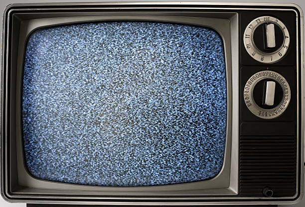
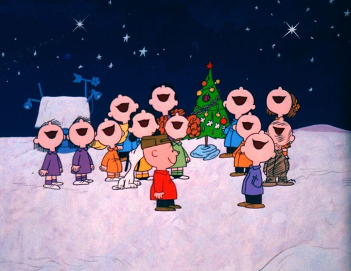
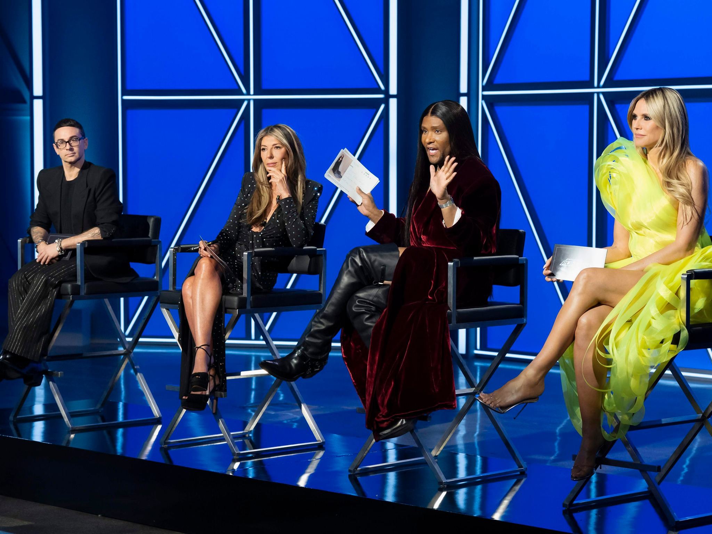
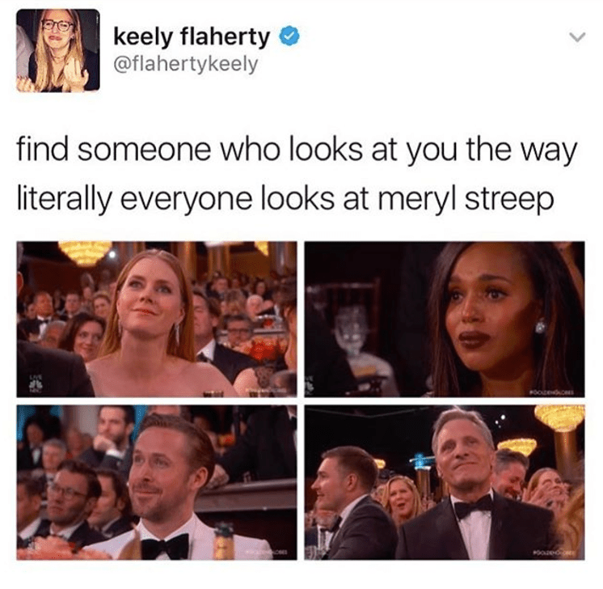
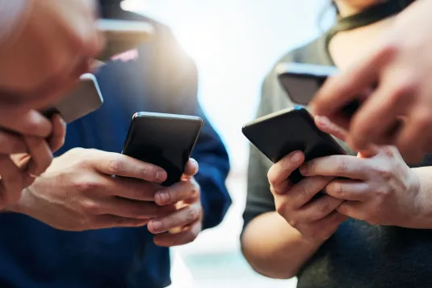

---
tags:
  - posts
id: 68a725a2cf3e94000109e74f
title: "Hearthless: How Streaming Stole Our Shared Fires"
feature_image:
description: Late at night, at a time predestined by the newspaper's printed TV Guide, the station would sign off.
date: 2025-08-21
full-date: 2025-08-21T10:07:23.000-04:00
slug: hearthless-how-streaming-stole-our-shared-fires
type: post
---

Late at night, at a time predestined by the newspaper's printed TV Guide, the station would sign off.

Except it didn't, really. The screen would transform into something else even more captivating: white hot snow.

I have vivid memories of waking up before dawn on Saturday mornings with my brothers, rushing to the television. We poured milk into the bowls of sugar that advertisers laughingly referred to as "part of a complete breakfast."

There was a distinct snap, crackle, and high-pitched hum as we flicked the mechanical switch and waited impatiently for the first cartoons to be forged from the glowing static.

The electronic embers were mesmerizing. If you stared at them long enough, patterns seemed to snap into place, like an [autostereogram](https://en.wikipedia.org/wiki/Autostereogram?ref=davidnunez.com). But instead of a 3D shark, the image resolved into an ephemeral promise: soon we would join the community of children around the country watching Hot Wheels commercials interrupted by scenes of Bugs Bunny and Voltron.

Media scholars Daniel Dayan and Elihu Katz once described live broadcasts as “[world rituals](https://www.google.com/books/edition/Media_Events/Z64eoZiik5wC?hl=en&ref=davidnunez.com)," synchronizing a society or even a planet. Television finales, holiday specials, and moon landings were not just programs; they were appointments with a collective consciousness.

And they waited for no one. If you wandered to the kitchen for a snack during the yearly broadcast of [A Charlie Brown Christmas](https://en.wikipedia.org/wiki/A_Charlie_Brown_Christmas?ref=davidnunez.com), you returned to find Snoopy mid-dance, the moment already happening.

Frame from __A Charlie Brown Christmas__

When the whole country tuned in together, a show could feel like a holiday. Scarcity gave those hours a kind of warmth; they were communal and fleeting, woven into memory not because they were permanent but because they could not be repeated.

Sometimes those shared flames [burned us all at once](https://www.youtube.com/watch?v=6PXORQE5-CY&ab_channel=CBSSundayMorning&ref=davidnunez.com), and they left deep scars.

Today, we casually drop endless sparks into our pockets. Our iPhones conjure shows and films, waiting to light on demand with a flick of our thumb. Streaming platforms, like Netflix, are the accelerant. By June 2025, streaming accounted for nearly half of all U.S. television viewing, while broadcast dropped to a historic low of 18.5% ([Nielsen](https://cordcuttersnews.com/broadcast-tv-viewership-hits-record-low-18-5-as-streaming-grows-nielsen-reports?ref=davidnunez.com)). The library seems infinite, the archive bottomless.

We can return to Charlie Brown any night of the year. It's truly a Christmas miracle!

In theory, nothing is ever lost. Yet abundance is never free.

The very permanence of streaming changes the way we experience these stories alone and together. When we know the flame will never extinguish, we stop tending to it. [Psychologists studying ephemeral media](https://journals.sagepub.com/doi/abs/10.1016/j.intmar.2021.06.001?ref=davidnunez.com) find that when people believe something will disappear, they pay closer attention and remember it better. Streaming reverses that equation. Nothing ever feels urgent. Everything can be put off until tomorrow. We play with that box of matches until it becomes a burden. "I can't find anything to watch!"

Then Netflix threatens to suck away all the oxygen.

We stay up until two a.m. binge-watching, suffocating on the smoke of episode after episode, instead of pacing out the drama over a season. This is a defining habit of the streaming age. Nearly [88% of U.S. adults](https://aasm.org/sleep-survey-binge-watching-results?ref=davidnunez.com) admit they’ve lost sleep because they couldn’t stop at “just one more."

[Researchers warn](https://jcsm.aasm.org/doi/10.5664/jcsm.6704?ref=davidnunez.com) that this modern viewing style “may pose a threat to sleep,” with the cognitive arousal of cliffhangers keeping us restless long after the screen burns us out.

Platforms are desperately employing fire-management techniques to keep us warm and fixated without smothering our attention. For example, they dole out episodes weekly instead of dropping a whole season at once.

I've noticed Project Runway this season isn't revealing results of the week's competition at the end of each show, "Tune in next week to see who's eliminated!" ([Angelo](https://www.instagram.com/angelorosany/?hl=en&ref=davidnunez.com) was snuffed out way too soon, by the way!)

It turns out cliffhangers are the original and perhaps most effective social media strategy.

Shows are quenched from catalogs with little warning or our favorites sometimes just flit away to another fire pit. Disney+ deleted _Willow_ months after its debut; HBO Max removed _Westworld_, only to reappear on a free ad-supported channel where [you have to tune in at a set time](https://archive.ph/4wUhK?ref=davidnunez.com). A weekly release can generate [33% more engagement](https://archive.ph/9WkIk?ref=davidnunez.com) and keep fans buzzing nearly twice as long as a full-season dump.

Anthropologists once argued that the fire hearth was the center of human dwelling. [Claude Lévi-Strauss](https://en.wikipedia.org/wiki/The_Raw_and_the_Cooked?ref=davidnunez.com) called it the “natural expression of the difference between nature and culture." In the digital age, the hearth has splintered into sparks, each carried privately.

Of course, some flames still burn in the old way. Step into a movie theater and you enter something closer to a temple of fire: the hush, the ritual of tickets and popcorn, the giant screen and booming speakers that demand you surrender to the experience. The film begins, and for two hours you sit in the dark, among strangers bound by light. Unlike those tiny streaming sparks in your pocket, the theater holds you completely in its fingers. Nicole Kidman reminds us that "[somehow, heartbreak feels good in a place like this](https://en.wikipedia.org/wiki/Nicole_Kidman_AMC_Theatres_commercial?ref=davidnunez.com)." We sit in awestruck communion and truly believe this.

By [AMC Theatres](https://www.ign.com/articles/viral-nicole-kidman-amc-ad-is-getting-a-sequel?ref=davidnunez.com), [Fair use](https://en.wikipedia.org/w/index.php?curid=71675216&ref=davidnunez.com)

You cannot pause a movie theater. You cannot rewind. The bonfire rages in that cathedral, engulfing us with its overwhelming ferocity. It enraptures us all at once, in a supernova of imagery, narrative, and emotion.

Then it is gone forever.

The living room furniture, meanwhile, has drifted away from the home altar. Once, sofas and chairs oriented around the glowing center. Now the radiance comes from everywhere: a tablet by the bed, a phone in hand, a laptop on the counter. In one house, four people may watch four different shows in four different rooms or maybe two people watch four shows, alongside Instagram reels, WhatsApp chats, and TikToks.

The digital sparks scatter us.

And yet the flickers sometimes reassemble into something larger. A season finale aired weekly still sends millions rushing online to share reactions. A meme from the Golden Globes spreads across continents overnight, a fleeting global campfire that burns for 24 hours before cooling into ash.

Streaming hasn’t killed communal viewing; it has fractured it into smaller, faster, more volatile flames.

We once had a single fire that demanded our attention, fleeting but shared. Now we live in a world of sparks: abundant, portable, permanent, but often solitary. The question is not whether the fire is gone, but how we will choose to gather around it again. The sparks in our pockets are endless, but the deepest heat still comes from the rare fires we light together.

Perhaps the warmth was never in the screen itself, but in the simple act of turning toward one another in its glow.

* * *

### 🔥 How to Rebuild the Hearth

_In the age of endless sparks in our pockets, here are a few ways to bring back the warmth of shared fires._

* __Make it a ritual__: choose one night a week for “appointment viewing” with family or friends. The routine itself creates anticipation and memory.
* __Cap the binge__: decide in advance how many episodes you’ll watch in one sitting. Leaving a story unfinished keeps the fire alive for tomorrow.
* __Share the spark__: host a movie night at home or sync up with friends online. Even a chat thread can turn a solo watch into a communal fire.
* __Go ephemeral__: lean into live events, weekly releases, or one-time broadcasts. When something can’t be paused or replayed, it demands your attention.
* __Visit the temple__: theaters still hold the largest bonfires. A monthly trip restores the magic of being immersed, together, in the dark.
* __Step away from the flame__: sometimes the truest hearth is no screen at all... gathering with friends around a real campfire, telling stories, sharing music, or simply being present together in the glow.
